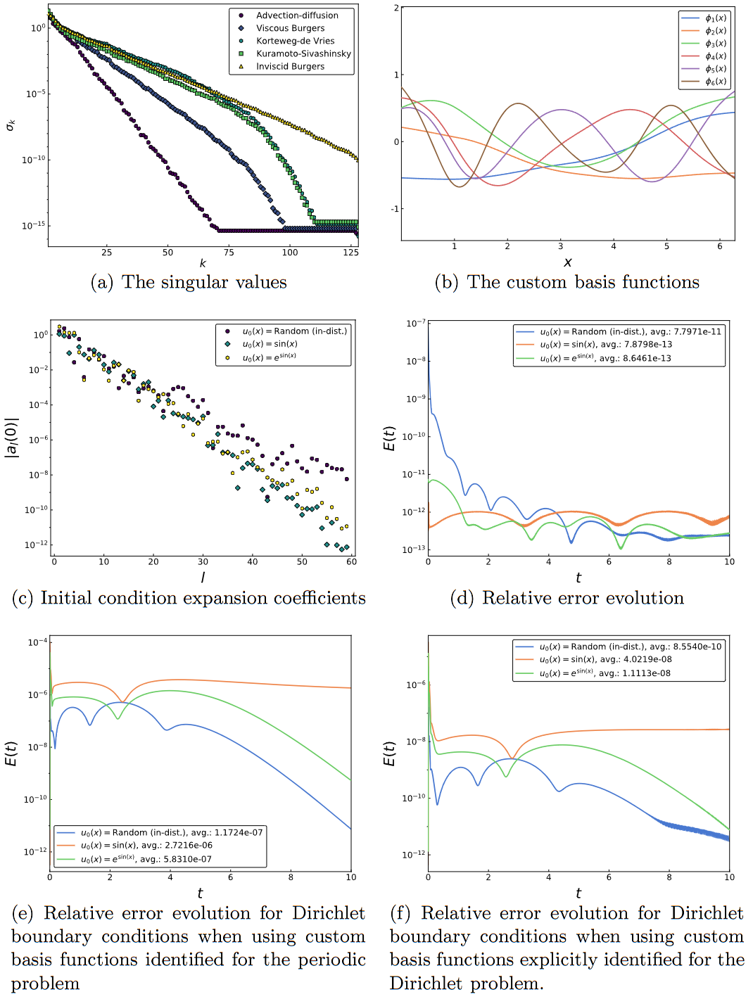
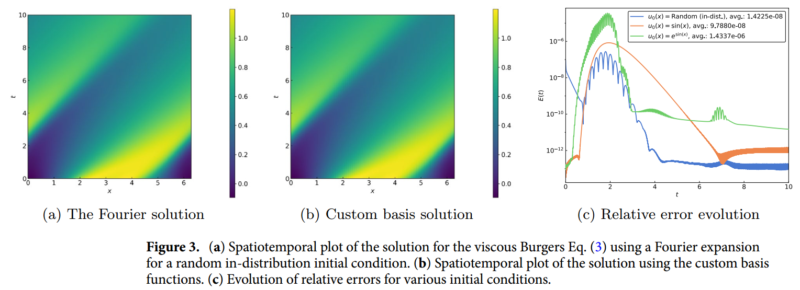
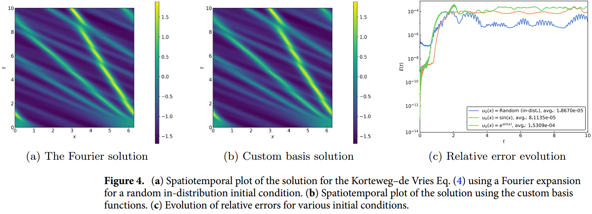

这是一篇使用谱元方法与 PINN（物理信息神经网络）相结合的论文。

# Machine‑learning‑based spectral methods for partial differential equations

## 摘要

**摘要原文：**

Spectral methods are an important part of scientific computing’s arsenal for solving partial differential equations (PDEs). However, their applicability and effectiveness depend crucially on the choice of basis functions used to expand the solution of a PDE. The last decade has seen the emergence of deep learning as a strong contender in providing efficient representations of complex functions. In the current work, we present an approach for combining deep neural networks with spectral methods to solve PDEs. In particular, we use a deep learning technique known as the Deep Operator Network (DeepONet) to identify candidate functions on which to expand the solution of PDEs. We have devised an approach that uses the candidate functions provided by the DeepONet as a starting point to construct a set of functions that have the following properties: (1) they constitute a basis, (2) they are orthonormal, and (3) they are hierarchical, i.e., akin to Fourier series or orthogonal polynomials. We have exploited the favorable properties of our custom-made basis functions to both study their approximation capability and use them to expand the solution of linear and nonlinear time-dependent PDEs. The proposed approach advances the state of the art and versatility of spectral methods and, more generally, promotes the synergy between traditional scientific computing and machine learning.

**摘要翻译：**

谱方法是科学计算用于求解偏微分方程 (PDE) 的重要工具。然而，它们的适用性和有效性在很大程度上取决于用于扩展偏微分方程解的基函数的选择。近十年来，深度学习异军突起，成为提供复杂函数高效表示的有力竞争者。在当前的工作中，我们提出了一种将深度神经网络与光谱方法相结合来求解 PDE 的方法。特别是，我们使用一种被称为深度算子网络（DeepONet）的深度学习技术来识别候选函数，并在此基础上扩展 PDE 的求解。我们设计了一种方法，以 DeepONet 提供的候选函数为起点，构建一组具有以下特性的函数：(1) 它们构成一个基础；(2) 它们是正交的；(3) 它们是分层的，即类似于傅里叶级数或正交多项式。我们利用定制基函数的有利特性，研究了它们的近似能力，并利用它们扩展了线性和非线性时变 PDE 的解。所提出的方法推进了频谱方法的技术水平和多功能性，更广泛地说，促进了传统科学计算与机器学习之间的协同作用。

其实只要细读了他的摘要就可以发现这篇论文的做法比较独特，他并不是把机器学习与谱方法相融合，而是采取了一种分阶段的模式，第一步是使用 DeepONet 去识别候选函数，再利用常规的谱方法来完成剩下的计算工作，他并不是一整块的模型而是耦合度低的分阶段模型。这种思想其实结合误差达到 $10^{-4}$ 到 $10^{-8}$ 就能够理解，不过也算是给机器学习融合谱方法提供了一种思路，接下来我们详细的阅读这篇文章的结果以及方法。

<!-- truncate -->

## 结果

该论文做了五个方程分别是具有 Dirichlet 边界条件的平流-扩散方程、粘性 Burgers 方程、Korteweg-de Vries 方程和 Kuramoto-Sivashinsky 方程，这个五个方程的结果表明使用该论文的方法与傅里叶变换的谱方法高度一致性。此外，对于带有 Dirichlet 边界条件的对流扩散方程，结果与整个时间域内的 Legendre 不连续 Galerkin 解具有良好一致性。时间上，在远超 DeepONet 之外仍旧保持非常良好误差有着非常良好的时间外推能力。

他们的主要问题是不能很好的解决不粘性 Burgers 方程的冲击问题，这一问题就连正常的谱方法也不能很好的处理，这是因为傅立叶展开会产生不准确的结果，不准确的原因是没有一种机制来喷射冲击所消耗的能量，所以不能视为该方法存在问题。这篇文章算是机器学习融合谱方法的比较前沿的研究，他说明了机器学习可以与谱方法进行融合，而且尝试了挺多的方程，融合效果都挺不错的。

## 实验

### 算例 1

考虑平流扩散问题

$$
u_t+\alpha u_x - vu_{xx}=0,
$$

将参数设置为 $\alpha = 1$ 和 $v=0.1$，通过这个小实验，作者得到了图 2，如下：

图中 b) 展示了通过 DeepONet 训练的基函数，随着 x 的增大的振荡行为不断增加。图中 c)则展示了一些平滑函数的指数衰减率，他证明了使用 DeepONet 训练的基函数与傅里叶的正交多项式的指数衰减率一样，这就表明这些基函数适合于频谱程序，图 d) 展示了以这些示例函数作为初始条件，使用 59 个自定义基函数求解上述式子的相对误差，图 e) 展示了使用为周期性平流扩散问题确定的 59 个自定义基函数来演化具有 Dirichlet 边界条件的平流扩散方程的相对误差，图 f)展示了使用为 Dirichlet 问题明确识别的 73 个自定义基函数演化具有 Dirichlet 边界条件的平流扩散方程的相对误差。

### 算例 2

接下来再考虑三个具有共同非线性项的 PDE，他们的不同点在于不同的正则化机制，例如，粘性伯格斯方程依靠扩散项来平滑任何冲击，结果是解最终接近恒定的稳定状态。

$$
u_t + uu_x -vu_{xx}=0,
$$

作者设定 $v=0.1$ ，使用了 91 个基函数得到了下图的结果，他们的数值计算程序准确捕捉到了平滑的冲击波和稀释波，而图 3c 中持续较低的相对误差则证明了其在训练机制之外的有效性。

### 算例 3

考虑一个 Korteweg–de Vries 方程：

$$
u_t + uu_x + \delta^2u_{xxx} = 0,
$$

设定 $\delta = 0.1$ 并使用 106 个基函数，我们得到了图 4 所示的结果。图 4a 和 b 时空图中的浅色条纹代表孤子；它们的交点描述了上述非线性相互作用，我们的数值方法准确地捕捉到了这些相互作用。请注意，对于远远超出训练区间的时间值，包括从训练分布之外抽取的两个初始条件，误差仍然保持良好。

### 算例 4

考虑一个 Kuramoto–Sivashinsky 方程：

$$
u_t + uu_x + u_{xx} +\beta u_{xxxx} = 0,
$$

上述方程包括一个不稳定的反扩散项，由四阶耗散抵消。该系统可表现出混沌行为，是前沿传播的常用模型。我们用频谱法的 105 个基函数计算了 $\beta = 0.085$ 时的结果。与之前的问题一样，我们的频谱方法忠实地捕捉到了复杂的动态变化，其演化误差远远超出了训练区间和分布范围。

## 总结

这篇文章提供了源代码 [https://github.com/brekmeuris/DrMZ.jl](https://github.com/brekmeuris/DrMZ.jl) 感兴趣的话可以把代码下载下来好好跑一下，如果想结合谱方法和机器学习可以试试这篇文章的做法。
