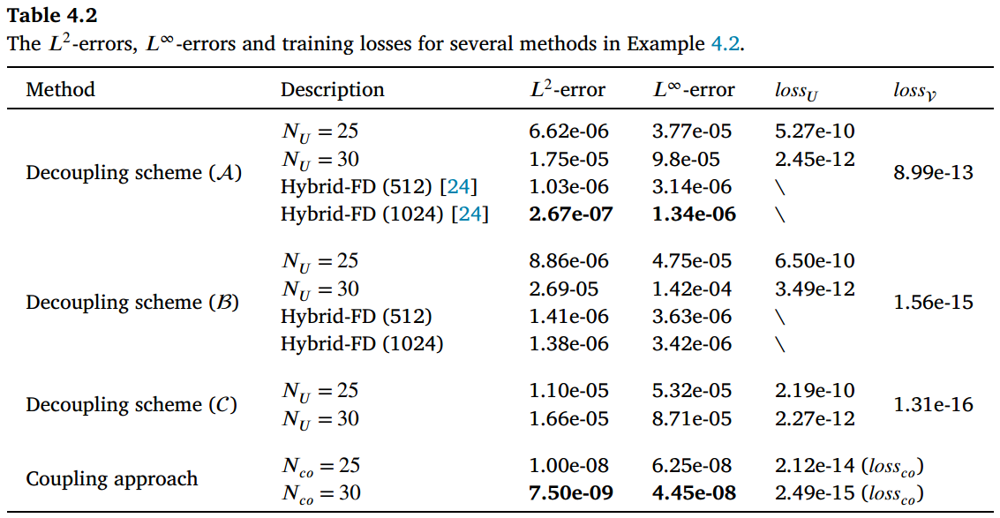
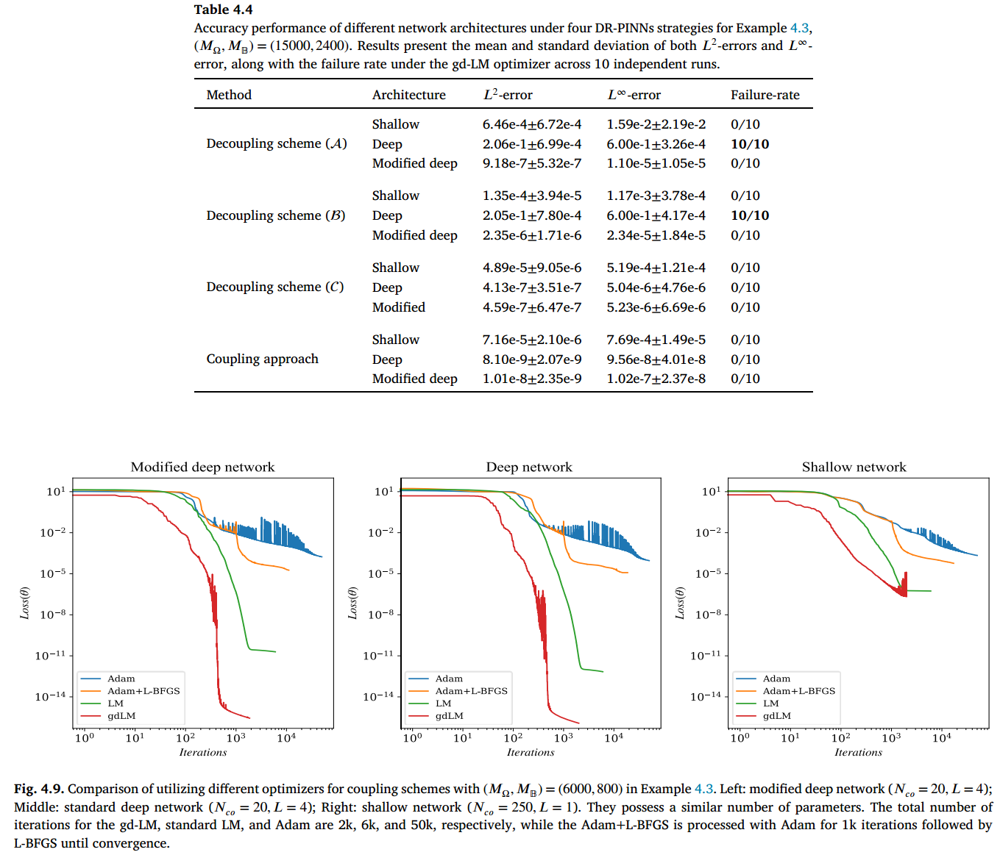

这是一篇关于处理变系数边界问题的 PINN 论文。

# Novel and general discontinuity-removing PINNs for elliptic interface problems

## 摘要

**摘要原文：**

This paper proposes a novel and general framework of the discontinuity-removing physicsinformed neural networks (DR-PINNs) for addressing elliptic interface problems. In the DR-PINNs, the solution is split into a smooth component and a non-smooth component, each represented by a separate network surrogate that can be trained either independently or together. The decoupling strategy involves training the two components sequentially. The first network handles the non-smooth part and pre-learns partial or full jumps to assist the second network in learning the complementary PDE conditions. Three decoupling strategies of handling interface problems are built by removing some jumps and incorporating cusp-capturing techniques. On the other hand, the decoupled approaches rely heavily on the cusp-enforced level-set function and are less efficient due to the need for two separate training stages. To overcome these limitations, a novel DR-PINN coupled approach is proposed in this work, where both components learn complementary conditions simultaneously in an integrated single network, eliminating the need for cusp-enforced level-set functions. Furthermore, the stability and accuracy of training are enhanced by an innovative architecture of the lightweight feedforward neural network (FNN) and a powerful geodesic acceleration Levenberg-Marquardt (gd-LM) optimizer. Several numerical experiments illustrate the effectiveness and great potential of the proposed method, with accuracy outperforming most deep neural network approaches and achieving the state-of-the-art results.

**摘要翻译：**

本文提出了一种新型且通用的断续性消除物理信息神经网络（DR-PINNs）框架，用于解决椭圆型界面问题。在 DR-PINNs 中，解被分解为光滑部分和非光滑部分，每个部分由独立的神经网络代理表示，这些代理可以单独训练或共同训练。解耦策略涉及依次训练这两个部分。第一个网络处理非光滑部分，并预先学习部分或全部跳跃，以协助第二个网络学习互补的偏微分方程（PDE）条件。通过去除部分跳跃并结合尖点捕获技术，构建了三种处理界面问题的解耦策略。另一方面，解耦方法高度依赖于尖点强制水平集函数，且由于需要两个独立的训练阶段而效率较低。为克服这些局限性，本文提出了一种新型 DR-PINN 耦合方法，其中两个组件在集成单一网络中同时学习互补条件，消除了对尖点强制水平集函数的需求。此外，通过轻量级前馈神经网络（FNN）的创新架构和强大的几何加速 Levenberg-Marquardt（gd-LM）优化器，训练的稳定性和准确性得到提升。多个数值实验验证了所提方法的有效性和巨大潜力，其精度显著优于现有方法。

<!-- truncate -->

## 讨论

我们提出了一种新型且通用的 DR-PINNs 框架，用于以高精度求解椭圆型界面问题。该框架将解分解为一个**光滑分量 𝑈**和一个**非光滑分量 𝑉**。这种分离使得我们设计了用于**DR-PINNs 的解耦和耦合策略**，利用**𝑈 和 𝑉 的互补特性**来解决传统神经网络难以处理的界面问题。在解耦策略中，预训练网络 $\mathcal{V}$ 用于处理非光滑组件界面上的跳变，而光滑组件则通过广义尖点捕获技术解决剩余的偏微分方程条件。另一方面，耦合方案通过耦合方式学习两个互补部分，消除了对水平集函数和两阶段训练的需求。实验结果表明，**耦合方案通常优于解耦方案**。此外，我们引入了一种改进的深度网络，结合了浅层网络和深度网络的优势，以实现更快的收敛速度并提升学习能力。

通过采用改进的 Levenberg-Marquardt 算法（即 gd-LM），我们的方法在性能和精度方面较先前神经网络技术实现了显著提升，达到了解决椭圆界面问题的新型最先进方法。此外，在相同实验条件下，研究结果表明，所提耦合方案在精度和计算效率方面均保持领先性能，优于针对复杂问题提出的增强型域分解基线方案。

如实验所示，解耦方案中训练的 $\mathcal{V}$ 能够有效减少界面误差，但在训练光滑部分时可能遇到挑战，尤其是在处理不规则水平集函数时。对水平集函数的依赖限制了解耦方案在复杂界面中的适用性。相比之下，耦合方案提供了一种更 robust 和灵活的方法来处理复杂界面，尽管与解耦方案相比，界面处的误差可能不太可忽略。因此，DR-PINNs 的耦合方案被推荐为各种应用的默认求解器。然而，与大多数现有基线相比，解耦方案在修改后的深度网络和强大的 gd-LM 优化器下仍具有有效性和实用性，并为未来研究提供了独特的技术贡献。提出解耦和耦合方案为研究人员提供了灵活且可行的方法来解决椭圆界面问题。尽管取得了令人鼓舞的结果，仍存在一些未解决的问题需要解决。例如，需要减少对水平集函数的依赖，以准确捕捉复杂界面几何中的不连续性。此外，设计用于具有不连续系数界面问题的解耦方案（$\mathcal{A}$）和（$\mathcal{B}$）是一项需要关注的挑战。此外，当前 LM 或 gd-LM 算法的计算效率也需要进一步优化。

这篇论文针对椭圆型界面问题提出了一种方法即 DR-PINN，这是利用两种变量 $U$ 和 $V$ 共同作用的结果，我们来看看是如何使用这两个变量的。

## 实验：常系数

他们使用了 Hammersley 序列技术在域中生成数据样本，低偏差序列（如 Hammersley 序列）相较于其他均匀采样方法（如等间隔网格、均匀随机采样或拉丁超立方采样（LHS）更为有效，尤其在全批量训练中，老规矩定义误差

$$
\left\|u_{\mathcal{N}}-u\right\|_{\infty}=\max _{1 \leq i \leq M_{\text {test }}}\left|u_{\mathcal{N}}\left(\boldsymbol{x}_{i}\right)-u\left(\boldsymbol{x}_{i}\right)\right|,\left\|u_{\mathcal{N}}-u\right\|_{2}=\sqrt{\frac{1}{M_{\text {test }}} \sum_{i=1}^{M_{\text {test }}}\left(u_{\mathcal{N}}\left(\boldsymbol{x}_{i}\right)-u\left(\boldsymbol{x}_{i}\right)\right)^{2}},
$$

实验设置中，二维实验设置为$M_{test}=10^4$，三维实验设置为$M_{test}=10^5$.在损失函数的权重上，作者并未浪费过多时间，全部设置为 1.

### 算例 4.1

该算例考虑常系数即($\beta_1=\beta_2=1.0$)的情况，计算域为正方形为 $\Omega=[-1,1]\times[-1,1],$ 其中包含一个浸没的圆形界面 $\Gamma$ ，该界面由光滑的水平集函数 $\varphi(x,y)=x^2+y^2-(1/2)^2$定义。

精确解为

$$
u(x,y)=\left\{\begin{matrix}
 exp(x^2+y^2),(x,y)\in\Omega_1,\\
 0.1(x^2+y^2)^2-0.01log(2\sqrt{x^2+y^2}),(x,y)\in\Omega_2.
\end{matrix}\right.
$$

本实验：i) 关于解耦方法：采用一个具有 $N_{\mathcal{V}}=30$ 个神经元的浅层神经网络用于 $\mathcal{V}$ ,以及一个经过修改的深度网络，该网络具有 $L=2$ 个隐藏层和 $N_{U}=20$ 个神经元每层用于 $U$ .
ii) 关于耦合方法，采用了一种修改后的深度神经网络，该网络具有 $𝐿 = 2$ 个隐藏层，每个层包含 $𝑁_{𝑐𝑜} = 25$ 个神经元。作为参考，还采用了一种标准的 PINNs 方法，该方法基于一个修改后的深度神经网络，其中 $𝐿 = 2$ 且 $𝑁_{𝑝𝑖𝑛𝑛𝑠} = 25$。我们使用 Hammersley 序列方法从域中生成 $𝑀_Ω = 900$ 个样本，此外还均匀采样 $𝑀_Γ = 120$ 个界面点和 $𝑀_𝔹 = 100$ 个边界点。需要注意的是，如果需要，$𝑈$ 和 $\mathcal{V}$ 的训练可以共享相同的界面样本。

下图展示了精确解以及四个 DR-PINNs 策略及其导数在切片 $𝑦 = 0$ 处的输出结果,由此可以验证 $V$ 能够有效消除解在不同层级界面上的跳变，形成一个相对平滑的分量 $U=u-V$. 所有的误差均达到 $\mathcal{O}(10^{-8}) \sim \mathcal{O}(10^{-9})$.

表 4.1 展示了 DR-PINNs 的 $𝐿^2-$ 和 $𝐿^∞-$ 误差以及训练损失，同时将标准 PINNs 及其直接实现（广义）尖点约束技术的变体作为参考。在缺乏形式为 $u=U+V$ 的解法（至少能处理界面上的零阶跳变）的情况下，即使配备了（广义）尖点捕获技术，标准 PINN 模型也无法解决界面问题。可以观察到，与训练 $𝑈$ 相比，训练 $\mathcal{V}$ 在解耦方法中要容易得多，这导致在学习跳跃条件时误差微乎其微，而学习其互补条件时的误差则较大。

如果应用尖点捕获技术使误差减少 $3 \sim 4$ 个数量级，图 4.6 就展示了这一技术，如图所示，采取该技术可以在界面处准确拟合连续但不光滑的 $f$。由极坐标方程

### 算例 4.2

相关设置与算例 4.1 一样，只是边界处不采用圆形，采用五瓣花形界面，该边界由极坐标方程 $r(\theta)=0.4+0.1sin(5\theta)$ 定义。水平集函数表示为 $\varphi=tanh(x^2+y^2-r^2(\theta))$ ,其中 $\theta=atan2(x,y)$.使用 tanh 函数有助于消除由于 $\theta=atan2(x,y)$ 的表示方式而在坐标系原点处可能出现的奇异性。

在解耦方案的代理模型选择中，我们采用一个浅层神经网络（$𝐿 = 1$），其第一个网络中 $𝑁_{\mathcal{V}} = 50$ 个神经元，以确保在界面处对 $\mathcal{V}$ 的指定跳变进行精确约束。因此，在第二个网络中，界面处 $𝑈$ 或其导数的 discontinuities 被准确去除。随后，我们引入了一个修改后的深度网络当 $𝐿 = 2$ 且 $𝑁_𝑈 = 25$ 或 30 时，对于 $𝑈$。为了提供比较依据，耦合网络还使用了一个修改后的深度网络，其中 $𝐿 = 2$ 且 $𝑁_{𝑐𝑜} = 25$ 或 30。采样过程涉及域内 $𝑀_Ω = 1600$ 个采样点、界面处 $𝑀_Γ = 120$ 个采样点以及边界沿线 $𝑀_{𝜕Ω} = 120$ 个采样点。此外，我们采用混合有限差分法（hybrid-FD method）来近似解耦方案（$\mathcal{A}$）和（$\mathcal{B}$）中的 $𝑈$ ，其方法与前例类似。

表 4.2 的结果证实，基于纯网络的解耦方法对水平集函数的质量高度敏感。另一方面，方案 ($\mathcal{A}$) 中的混合有限差分方法保持了二阶精度，展现出相较于纯网络逼近的有效性和鲁棒性。值得注意的是，耦合方法在精度上表现优异，$𝐿^∞$ 误差达到 $\mathcal{O}(10^{−8})$ 的量级，这展示了其在复杂界面问题中的鲁棒性。增加网络中的参数数量表明，对于耦合方法，随着损失函数整体减小，解的误差也如预期般减小。相比之下，解耦方法因过度拟合水平集函数的不规则性，导致误差停滞甚至增加。

图 4.7 显示了 DR-PINNs 网络近似中绝对误差的分布。在三种解耦技术的情况下，中心附近的误差盖过了界面处的误差。这一观察结果得到了解耦策略中  的损失值的支持，这些值始终低于 $10^{−13}$ 的阈值，表明界面处的误差可以忽略不计。相反，在耦合方法中，界面处的误差较为明显。由于 𝑈 和  的联合训练具有相似的损失幅度，界面处的 dominant 误差持续存在，且未像解耦方法那样得到有效消除。

### 算例 4.3（三维椭球面）

在本例中，我们考虑一个具有常系数的 3D 椭圆界面问题。计算域定义为 $[−1, 1]³$ 的立方体。该域中的嵌入界面呈椭球面形式，以原点为中心，其半主轴长度分别为 0.7、0.5 和 0.3。该椭球体由水平集函数 $𝜑 = (𝑥∕0.7)² + (𝑦∕0.5)² + (𝑧∕0.3)² − 1$ 表示。对于此特定问题，精确解被取为式 (4.1) 的三维形式。

为了训练 $\mathcal{V}$ 在解耦技术方面的能力，我们使用了一个经过修改的网络，该网络包含 2 个隐藏层，每个隐藏层有 20 个神经元（$𝑁_{\mathcal{V}} = 20$）。

至于训练 𝑈 进行解耦技术以及在耦合方法中进行协同训练的网络，我们选择了一个经过修改的网络，该网络包含 4 层，每层有 20 个神经元（$𝑁_𝑈 = 𝑁_{𝑐𝑜} = 20$）。我们使用 800 个数据点（𝑀Γ = 800），这些数据点是从界面采样获得的，数据源自通过 DistMesh [40]生成的网格节点。我们在域和边界上对不同采样密度下的结果进行了比较。此外，我们还引入了一个基于 1283 网格的混合有限差分求解器进行比较分析。

表 4.3 中的结果表明，耦合方法在整体上比解耦方法优越约 1 到 2 个数量级。在解耦方法中，解耦方案（$\mathcal{C}$）表现最佳。尽管在解耦方案（$\mathcal{A}$）下，有限差分计算比其网络对应方法快 119 倍（CPU 上 4.35 秒 vs. GPU 上 520.00 秒，$(𝑀_Ω,𝑀_𝔹) = (15000, 2400)$），但我们的方法在网格分辨率大幅降低时仍能实现显著更高的精度，尤其是耦合方案，其 L2 误差可达 $\mathcal{O}(10^{−9})$。显然，随着采样密度降低（即 $𝑀_Ω$ 和 $𝑀_𝔹$ 减小），解耦方案（$\mathcal{A}$）和（$\mathcal{B}$）在 $𝐿^∞$ 误差下的精度显著下降。相比之下，解耦方案（$\mathcal{A}$）和（$\mathcal{B}$）的精度对采样密度变化的敏感性较小。

表 4.3 所示的结果表明，耦合方法在整体性能上比解耦方法高出约 1 到 2 个数量级。在解耦方法中，解耦方案（）表现最佳。在解耦方案（）下，有限差分计算比其网络对应方法快 119 倍（CPU 上为 4.35 秒，GPU 上为 520.00 秒，$(𝑀_Ω,𝑀_𝔹) = (15000, 2400)$），但我们的方法在网格分辨率大幅降低时仍能实现显著更高的精度，尤其是耦合方案，其 L2 误差可达 (10−9)。显然，随着采样密度降低（即 $𝑀_Ω$ 和 $𝑀_𝔹$ 减小），解耦方案（$\mathcal{A}$）和（$\mathcal{B}$）在 $𝐿^∞$ 误差下的精度显著下降。相比之下，解耦方案($\mathcal{A}$)和耦合方案 ($\mathcal{B}$) 的精度对采样密度的变化表现出较小的敏感性。为了探究这种行为的根本原因，我们观察到在方案 ($\mathcal{A}$) 和 ($\mathcal{B}$) 中，当 $(𝑀_Ω,𝑀_𝔹) = (9000, 2400)$ 或 (6000, 800) 时，椭球体中央区域的误差变得显著。尽管在此未明确展示，但解耦方案（$\mathcal{A}$）和（$\mathcal{B}$）中学习到的函数  呈现出鞍形结构，这增加了学习互补函数 $𝑈$ 的难度。

这个文章还实现了对不连续成分 $\mathcal{V}$ 和 $U$ 自适应调整，而非依赖预先确定且可能次优的$\mathcal{V}$。

#### 网络架构的消融分析

我们在以下内容中探讨所选网络架构的影响，同时保持解耦方案中 $\mathcal{V}_N$ 的训练设置不变。图 4.8 通过比较 GD-LM 下训练 $𝑈$ 的损失曲线，展示了使用修改后的深度网络的必要性。该比较涉及在解耦方案（$\mathcal{A}$）下使用修改后的深度网络、浅层网络和标准深度网络，参数设置为 $（𝑀Ω,𝑀𝔹）=（15000, 2400）$ ，这可能代表示例中最具挑战性的情况。比较中使用的浅层网络包含 250 个隐藏神经元，而深度网络和修改后的网络均具有 $𝐿 = 4$ 和 $𝑁_𝑈 = 20$，导致可学习参数数量相似。显然，浅层网络难以有效学习，标准深度网络则出现早期停滞，而修改后的网络在 1250 次迭代内实现了最优学习效果。

#### 优化器的移除

图 4.9 展示了使用 gd-LM 作为主要优化器的优势。我们将它与标准 LM[23]、Adam[29]以及 Adam 与 L-BFGS 的组合[30]作为基准进行比较，并展示了它们在耦合方案 $(𝑀_Ω,𝑀_𝔹) = (6000, 800)$ 下的损失变化。实验采用三种网络架构（修改后的深度网络、深度网络和浅层网络），其可训练参数数量相当。为确保公平比较，所有模型均采用双精度全批量训练。

总体而言，LM 和 gd-LM 的损失幅度显著低于 Adam 或 L-BFGS，因为 LM 专门针对最小二乘问题进行优化，而 Adam 或 L-BFGS 则是通用优化器。值得注意的是，对于深度和修改后的深度网络，gd-LM 能在 1000 次迭代内将损失值有效降低至 $\mathcal{O}(10^{−16})$ 量级，而标准 LM 则需要约 3000 次迭代才能达到较小的损失值。相比之下，对于浅层架构，由于网络容量较低，LM 和 gd-LM 的损失值均达到 $\mathcal{O}(10^{−7})$ 的较高量级。在表 4.5 中，我们报告了不同优化器在四种 DR-PINN 方法下的 $𝐿^2$ 和 $𝐿^∞$误差，以及计算时间。对于解耦方案，仅替换训练 𝑈 的优化器，而第一阶段的设置保持不变。结果表明，gd-LM 优化器在准确性和训练效率方面均优于其他方法，尤其在轻量级训练中表现突出。

## 实验：连续性系数不连续的情况

### 算例 4.4(高对比度系数)

## 总结

这是一篇非常不错的深度学习识别函数的神经网络，值得利用这个框架去做一些别的问题。
