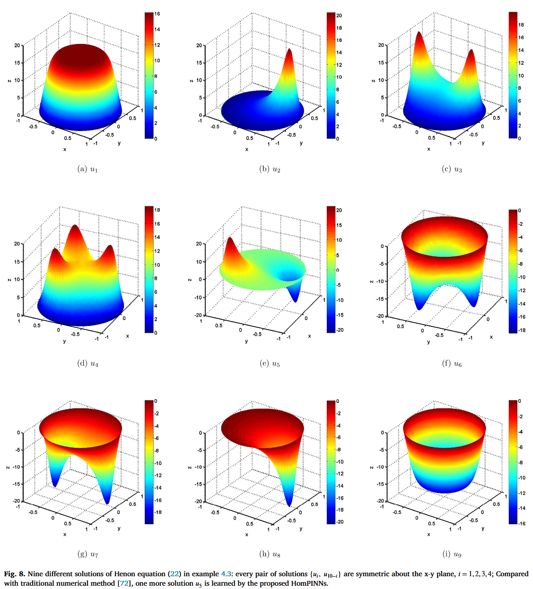
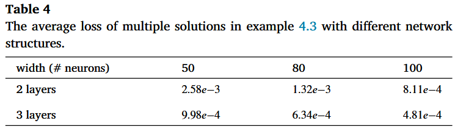
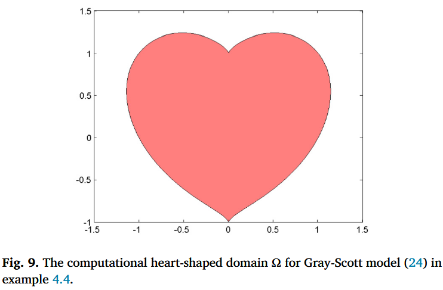
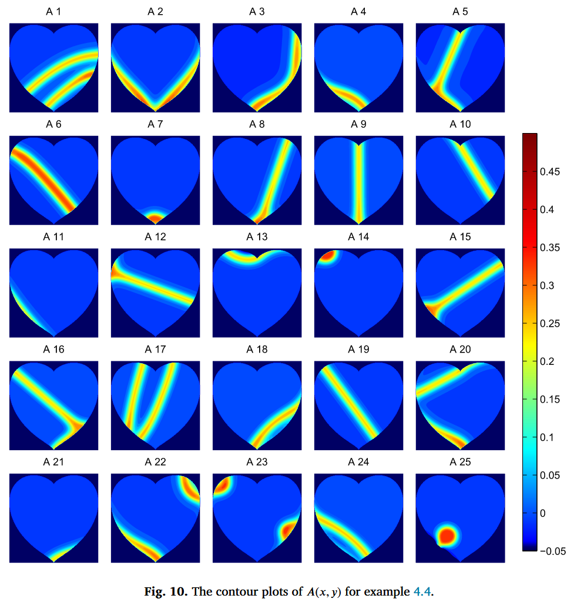
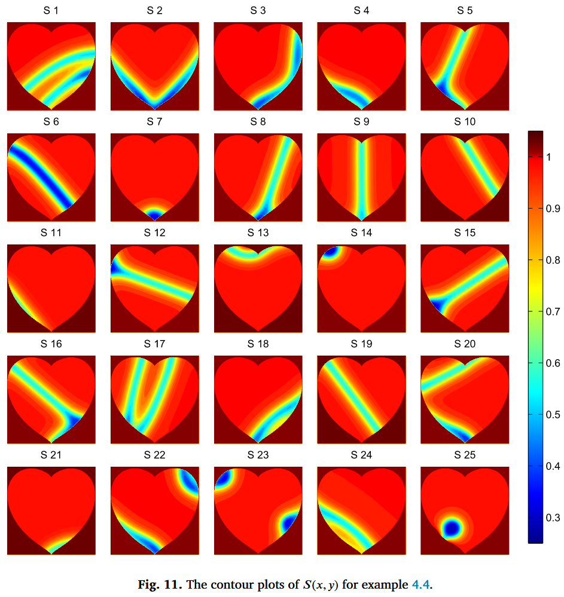
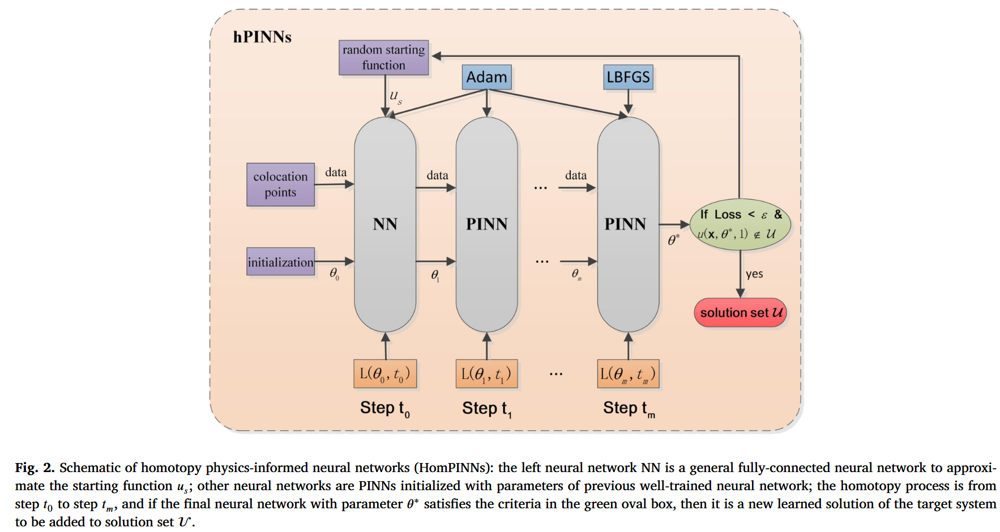
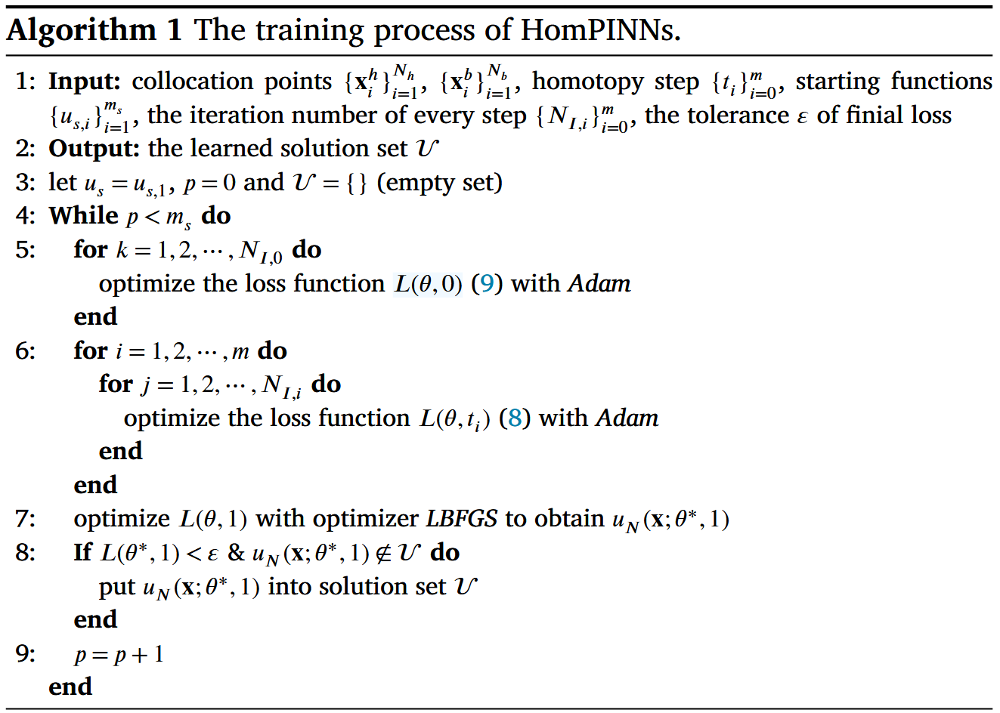
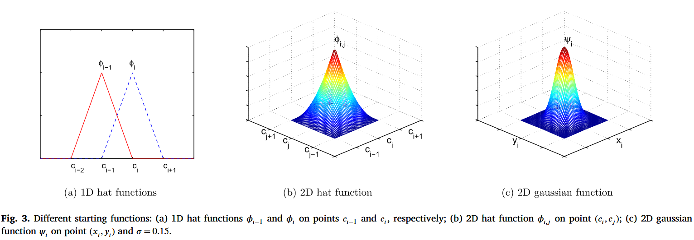

这是一篇使用同调法与 PINN 相结合解决非线性椭圆微分方程的论文，并处理了不规则边界区域。

# HomPINNs: Homotopy physics-informed neural networks for learning multiple solutions of nonlinear elliptic differential equations

## 摘要

**摘要原文：**

Physics-informed neural networks (PINNs) based machine learning is an emerging framework for solving nonlinear differential equations. However, due to the implicit regularity of neural network structure, PINNs can only find the flattest solution in most cases by minimizing the loss functions. In this paper, we combine PINNs with the homotopy continuation method, a classical numerical method to compute isolated roots of polynomial systems, and propose a new deep learning framework, named homotopy physics-informed neural networks (HomPINNs), for solving multiple solutions of nonlinear elliptic differential equations. The implementation of an HomPINN is a homotopy process that is composed of the training of a fully connected neural network, named the starting neural network, and training processes of several PINNs with different tracking parameters. The starting neural network is to approximate a starting function constructed by the trivial solutions, while other PINNs are to minimize the loss functions defined by boundary condition and homotopy functions, varying with different tracking parameters. These training processes are regraded as different steps of a homotopy process, and a PINN is initialized by the well-trained neural network of the previous step, while the first starting neural network is initialized using the default initialization method. Several numerical examples are presented to show the efficiency of our proposed HomPINNs, including reaction-diffusion equations with a heart-shaped domain.

**摘要翻译：**

基于物理信息神经网络（PINNs）的机器学习是一种新兴的非线性微分方程求解框架。然而，由于神经网络结构的隐含规律性，PINNs 在大多数情况下只能通过最小化损失函数找到最平坦的解。在本文中，我们将 PINNs 与**同调延续法**（一种计算多项式系统孤立根的经典数值方法）相结合，提出了一种新的深度学习框架，命名为同调物理信息神经网络（HomPINNs），用于求解**非线性椭圆微分方程的多解**。HomPINN 的实现是一个同调过程，由一个名为起始神经网络的全连接神经网络的训练和多个具有不同跟踪参数的 PINN 的训练过程组成。起始神经网络用于逼近由三元解构建的起始函数，而其他 PINN 则用于最小化由边界条件和同调函数定义的损失函数，这些函数随不同的跟踪参数而变化。这些训练过程被重新划分为同调过程的不同步骤，一个 PINN 由上一步训练有素的神经网络初始化，而第一个起始神经网络则使用默认初始化方法初始化。本文列举了几个数值示例来说明我们提出的 HomPINN 的效率，其中包括具有心形域的反应扩散方程。

<!-- truncate -->

我们还是老规矩，先看结论。

## 结论

同调延续法在计算非线性微分方程的多解时显示出优势。基于神经网络的技术，包括物理信息神经网络，已经证明了学习微分方程解的有效性。通过结合同调延续法和物理信息神经网络，我们在本手稿中开发了一种新的深度学习框架--HomPINNs，用于求解非线性微分方程的多解。具体而言，所提出的 HomPINN 通常包含几个子网络：**第一个称为起始神经网络，用于逼近起始函数**；其他网络逐步逼近目标系统，即我们想要求解的非线性微分方程。在训练过程中，我们使用前一个训练有素的子网络作为初始猜测来训练当前的子网络，并最终恢复非线性微分方程的多重解。我们在各种数值基准问题上对 HomPINNs 进行了测试，以显示 HomPINNs 学习多解的能力以及 HomPINNs 在不同网络结构上的鲁棒性。此外，**它还显示了在任意域上求解非线性微分方程的效率，而这对于传统方法来说是很困难的。**

今后，我们将把 HomPINNs 应用于其他微分算子和其他涉及多解的问题，如微分方程的特征值问题。另一个未来方向是探索**不同激活函数对 HomPINNs 的影响，例如 [74,75,47] 中介绍的自适应激活函数**。此外，还需要进一步研究起始函数的选择，以更好地捕捉非线性 PDE 的解结构。

加粗的部分是这篇文章比较亮点的地方，事实上针对随机域，PINN 比传统方法拥有得天独厚的优越性，这是传统方法与 PINN 的本身决定的，其实随机区域一直都是 PINN 的亮点方向，我比较新的研究工作也在做这方面。

## 实验

我们再来看看实验部分

本节将介绍几个示例，以展示 HomPINNs 在学习非线性 PDE 多解时的鲁棒性和效率。前两个例子是具有混合边界条件的一维非线性 PDE，它们是在配备 5G Quadro P2000 GPU 的个人电脑上实现的。第三个例子是具有 Dirichlet 边界条件的 2D Henon 方程和 9 个非微观解。最后一个例子是著名的 Gray-Scott 模型的静态空间模式，该模型在心形域上具有 Neumann 边界条件。这两个 2D 示例都是在配备 24G Titan RTX GPU 的科学工作站上实现的。所有示例均在 Python 3.8 中利用 Pytorch 库实现。此外，我们还说明了所有示例的一些基本设置如下：

#### 神经网络设置

我们使用 3 个隐藏层的神经网络，1D 实例每层 30 个神经元，2D 实例每层 80 个神经元，相应的激活函数选择双曲正切函数。所有神经网络都使用 He 初始化，这是 pytorch 库中的一种默认初始化方法。

  

#### 同调过程的超参数

在所有示例中，我们设置 $α = 10，m = 10$ ，即一个同调过程有 11 个步骤，即 $t_i = 0.1 × i，i = 0, 1, \dots, 10。$ 对于一维示例，配准点数设为 Ng = 100 和 Nb = 2；对于 4.3 小节中的示例 3，配准点数设为 $N_g = 5000$ 和 $N_b = 500$；对于 4.4 小节中的示例 4，配准点数设为 $N_g = 9768$ 和 $N_b = 630$。在算法 1 中，初始迭代的起始函数数设为 $m_s = 20$，以后迭代的起始函数数设为 $m_s = 10$，直到解集保持不变。在每个同调过程中，迭代次数设置为 $i = 0, 1, \dots , 9 $ 时，$N*{I,i} = 20000；i = 0, 1, \dots , 9$ 时，$N*{I,10} = 40000$。

#### 优化器设置

我们使用 Pytorch 库中的 Adam 训练算法[68]，参数如下：$betas = (0.9, 0.999)，eps = 10-8，weight\_{decay} = 0，amsgrad = False，maximize = False$，以解决 (8) 和 (9) 中定义的优化问题 ${L(θ, t_i)}^m_{i=0}$ 。学习率设定为 $τ_n = τ_{initial} × γ^{[\frac{n}{Δ}]}$，即每迭代一次，学习率衰减 $γ$ 。在所有例子和每个同调步骤 $t_i$ 中，我们设置 $τ_{initial} = 0.002$ 和 $Δ = 1000$，而一维例子的衰减率 $γ = 0.85$，二维例子的衰减率 $γ = 0.95$。此外，在亚当优化之后，对求解进行了细化 LBFGS 是 Pytorch 库中的一种准牛顿方法，参数为 1D 示例 $max\_iter = 10000$，2D 示例 $max\_{iter}= 50000，tolerance\_{grad} = 1.0 × np.finfo(float).eps$ ，以获得更好的精度。

### 算例 1：有两个解的一维示例

我们首先考虑一个在 [0, 1] 上带有混合边界条件的一维非线性微分方程，

$$
\left\{\begin{aligned} u_{xx}&=-1.2(1+u^{4}),\ \ x\in[0,1]\\ u^{\prime}(0)&= u(1)=0.\end{aligned}\right.
$$

文献[33]表明，这个例子有两个解析解。由于公式 (19) 没有实数三元解，我们定义 $\mathcal{U}_{0} = \{1, -1, \sqrt{2}, -\sqrt{2}\}$，求解 $f (u) = (u^2 - 1)(u^2 - 2) = 0$。图 4 和图 5 展示了这两个解的学习过程以及每个同调步骤的相应损失。表 1 和表 2 分别显示了 L2 准则下的损失和数值误差，证明了 HomPINNs 在不同网络结构上的良好精度。

  

  

  

### 算例 2：有多个解的一维示例

考虑下面这个有多个解的参数非线性微分方程，

$$
\left\{\begin{aligned} u_{xx}=& u^{2}(u^{2}-p), \ \ x\in(0,1)\\ u^{\prime}(0)=& 0,\ u(1)=0\end{aligned}\right.
$$

参数 $p > 0$ [70,71]。对于任何给定的参数 $p$，都存在多个解 $u$，而且解的数量随着参数 $p$ 的增大而增加。为了计算方程 (20) 不同参数下的多解，我们通过求解修正的非线性项 $(u^2 - 1)(u^2 - p) = 0$，将三元解集取为 $\mathcal{U}_{0} = \{1, -1, \sqrt{p}, -\sqrt{p}\}$。

在 $p = 3$、$p = 10$ 和 $p = 18$ 的情况下，所提出的 HomPINNs 能学习到一个、三个和七个解。这些结果与 [71] 现有的理论分析一致。图 6 显示了 HomPINNs 在不同参数下学习到的解，图 7 显示了 $p=10$ 时三个解的学习过程。我们还在表 3 中总结了不同神经网络结构下不同解的平均损失，这证实了 HomPINNs 对神经网络结构的鲁棒性。此外，为了分析解与参数 $p$ 的关系，我们定义了一个新的参数 $p$ 损失函数：

$$
\begin{split}\tilde{L}(\theta,p)&=\frac{1}{N_{g}} \sum_{i=1}^{N_{g}}\big(\mathcal{L}u_{N}(\mathbf{x}_{i}^{g};\theta,p)-f(u_{N} (\mathbf{x}_{i}^{g};\theta,p),p)\big)^{2}\\ &+\alpha\frac{1}{N_{b}}\sum_{j=1}^{N_{b}}\big(\mathcal{B}u_{N} (\mathbf{x}_{j}^{b};\theta,p)-b(\mathbf{x}_{j}^{b})\big)^{2},\end{split}
$$

其中 $u_N(xg_i; θ, p)$ 是方程 (21) 在任意给定参数 $p$ 下的解。通过追踪从 $p = 18$ 到 $p = 0$ 的解，我们将参数 $p$ 离散化为 $p = p₀, p₁, ⋯, p_{m_p}$，其中 $p₀ = 18，p_{m_p} = 0$，且 $m_p + 1$ 是参数 $p$ 的离散点数。然后，我们得到由 HomPINNs 学习的初始七个解$\{ui(x; θ_i, p_0)\}^7_{i=1}$，并计算 $u(\textbf{x} ; θ_j , p_j ) (j > 0)$ 通过将 $u(x; θ_{j−1}, p_{j−1})$ 作为优化求解器的初始猜测，直到 $j = m_p$。因此，我们获得了参数微分方程 (20) 的解行为，如图 6d 所示。

  

  

  

### 算例 3：带有九个解的 2D Henon 方程

接下来，我们考虑以下 Henon 方程

$$
\left\{\begin{aligned} \Delta u+|\mathbf{x}|^{7}u^{3}=& 0, \mathbf{x}\in\Omega\\ u|_{\partial\Omega}=& 0,\end{aligned}\right.
$$

其中,$\Omega= \{\mathbf{x} =(\mathbf{x}，y)\in \mathbb{R}^2:|\mathbf{x}| ≤1\}$ 且 $|\mathbf{x}| =\sqrt{(x^2 + y^2)}$。平凡解集由解方程 $u（u -20）（u + 20）= 0$ 得出，其解集为 $\mathcal{U}_{0}=\{20,-20,0\}$，该方程与 $u³$ 的次数相同。

提出的 HomPINNs 模型学习到了九种不同的解，如图 8 所示。值得注意的是，解 $u_i$ 与解 $u_{10-i}$ 关于 x-y 平面呈对称关系，其中 $i = 1, 2, 3, 4$。传统方法[72]仅发现八个解 $\{u_i, u_{10-i}\}^{4}_{i=1}$，这些解成对出现，这可能是由计算前的某些变换引起的。HomPINNs 中不存在任何变换，我们直接使用非线性微分方程(22)定义损失函数。这是提出 HomPINNs 相对于传统方法计算非线性系统多个解的一大优势。此外，我们还测试了 HomPINNs 在不同神经网络结构下的鲁棒性，并总结了不同解的平均损失值，如表 4 所示。

  

  

#### Gray-Scott 模型的稳态空间模式

Gray 和 Scott [7\u20129]提出的描述自催化反应的 Gray-Scott 模型采用以下形式：

$$
\left\{\begin{aligned} \frac{\partial A}{ \partial t}&= D_{A}\Delta A+ S A^{2}-( \mu+ \rho) A,\\ \frac{\partial S}{\partial t}&= D_{S}\Delta S- S A^{2}+ \rho(1- S).\end{aligned}\right.
$$

具有无通量边界条件的稳态系统写为

$$
\left\{\begin{aligned} D_{ A}  \Delta A+ S A^{2}-( \mu+ \rho) A = 0,\\ D_{ S} \Delta S- S A^{2}+ \rho(1- S) = 0,\\ \frac{\partial A}{\partial x} \left|{}_{\partial \Omega}=\frac{\partial S}{ \partial x} S\right|_{\partial  \Omega} = 0,\end{aligned}\right.
$$

其中，结构域 $Ω$ 在$\mathbb{R}^2$中设置为心形结构域（如图 9 所示），由下式表述

$$
\Omega=\{(x,y)\in\mathbb{R}^{2}\ \textbf{:}\ (x^{2}+y^{2}-1)^{3}-x^{2}y^{3} \ \textbf{=}\ 0\}.
$$

  

在[73]之后，参数值设置为

$$
D_{A}=2.5\times 10^{-4},\ D_{S}=5\times 10^{-4 },\ \rho=0.04,\ {\rm and}\ \mu=0.065.
$$

由于扩散系数很小，我们通过除以扩散系数来对方程进行归一化，以避免 （24） 的损失太小。此外，为了避免收敛到平凡的解 $(A,S)= (0,1)$ 。我们引入重新缩放的变量，$\tilde{\textbf{\text{u}}} = (\tilde{A}, \tilde{S})$，使得 $\tilde{A} = 2A$ 和 $\tilde{S} = 2S$。因此，非线性微分方程组变成

$$
\left\{\begin{aligned} \mathcal{F}_{1}(\tilde{A},\tilde{S})& =\Delta\tilde{A}+\frac{1}{4D_{\tilde{A}}}\tilde{S}\tilde{A}^{2}- \frac{\mu+\rho}{D_{\tilde{A}}}\tilde{A}=0,\\ \mathcal{F}_{2}(\tilde{A},\tilde{S})&=\Delta\tilde{ S}-\frac{1}{4D_{\textbf{S}}}\tilde{S}\tilde{A}^{2}+\frac{\rho}{D_{\textbf{S}}}(2- \tilde{S})=0,\\ \frac{\partial\tilde{A}}{\partial x} |_{\partial\Omega}& =\frac{\partial\tilde{S}}{\partial x} |_{\partial\Omega}=0, \end{aligned}\right.
$$

首先，通过构建具有双宽度输出层的神经网络 $\tilde{\textbf{\text{u}}}(\textbf{\text{x}};θ)$ 来分别表示两个分量 $\tilde{A}$ 和 $\tilde{S}$，从而利用所提出的 HomPINNS 来求解系统（25）。通过求解 $(\tilde{A}+1) \tilde{A}(\tilde{A}-2)= 0,\mathcal{F}_{1}(\tilde{A},\tilde{S})$ 的平凡解集为 $\mathcal{A}_0={-1,0,2}$。$A$ 的起始函数 $A_s$ 是通过从 $\mathcal{A}_0$ 中随机选择系数，用高斯基函数构造的，$S$ 的起始函数定义为 $S_s = 2 − A_s$。通过选择 60 个起始函数，HomPIN 学习了 25 种不同的解，如图 10 和图 11 所示，适用于 $A(x,y)$ 和 $S(x,y)$。25 个学习神经网络的平均损耗为 $6.40 × 10^{−4}$，控制方程的平均残差为 $3.83 × 10^{−4}$。

  

  

## 结论

同伦延续法在计算非线性微分方程的多个解方面显示出优势。基于 NN 的技术，包括物理信息神经网络，已经证明了学习微分方程解的有效性。通过结合同伦延续方法和物理信息神经网络，我们在本手稿中开发了一种新的深度学习框架 HomPINNs，用于求解非线性微分方程的多个解。特别是，所提出的 HomPINN 通常包含几个子网络：第一个子网络称为起始神经网络，用于近似起始函数，其他网络逐渐成为目标系统，即我们想要求解的非线性微分方程。对于训练过程，我们以先前训练良好的子网络为初始猜测，训练当前子网络，最终恢复非线性微分方程的多解。我们在各种数值基准问题上测试了 HomPINNs，以展示 HomPINN 学习多种解决方案的能力以及 HomPINN 在不同网络结构上的鲁棒性。此外，它还显示了求解任意域上的非线性微分方程的效率，这是传统方法难以解决的。未来，我们将把 HomPINN 应用于其他微分算子和其他涉及多种解的问题，例如微分方程的特征值问题。未来的另一个方向是探索不同激活函数对 HomPINN 的影响，例如[74,75,47]中引入的自适应激活函数。此外，起始函数的选择需要进一步研究，以更好地捕获非线性偏微分方程的解结构。

实验和结论我们都看完了，作者提出了一个深度学习框架 HomPINNs，它可以用于求解任意域上的非线性微分方程，我觉得他的任意域做的挺不错而且精度也达到了我设想的高度，我们接下来看看他的方法是如何实现的

## 物理信息神经网络(2.1)

这个部分对 PINN 熟悉的可以略过就是普通的 PINN

本文提出的框架适用于计算不同种类非线性微分方程的多个解。为了说明这个框架的想法，我们考虑了以下非线性椭圆微分方程：

$$
\left \{ \begin{aligned} & \mathcal{L}u(\textbf{x})=f \left( u,\textbf{x} \right),\textbf{x} \in \Omega \\ & \mathcal{B}u(\textbf{x})=b \left( \textbf{x} \right),\textbf{x} \in \partial \Omega \end{aligned} \right.\tag{1}
$$

## 同伦延续法(Homotopy continuation method)

将数值解表示为 $\textbf{\text{U}}$，我们有以下离散多项式系统

$$
\mathbf{F}_{h} \left( \mathbf{U} \right) \equiv \mathcal{L}_{h} \mathbf{U}-f_{h} \left( \mathbf{U} \right)=0,\tag{4}
$$

其中，$\mathcal{L}_h$ 和 $f\_{h}$ 是采用有限差分法[58]、有限元法[59]或谱法[60]对 $\mathcal{L}$ 和 $f(⋅,x)$ 的离散化算子。如果 $f(u)$ 是 $u$ 的多项式函数，则 $\mathbf{F}_{h}$ 是 $\textbf{\text{U}}$ 的多项式系统。为了计算椭圆方程的所有解，我们定义了以下同伦方程

$$
\mathbf{H}(\mathbf{U},t):=t\mathbf{F}_{h}(\mathbf{U})+\gamma(1-t)\mathbf{G}_{ h}(\mathbf{U})=0,\tag{5}
$$

其中,$\mathbf{G}_{ h}(\mathbf{U})=0$ 称为“起始系统”[61]，$t ∈[0,1]$ 称为同伦参数，$γ$ 为随机复数[61]。当 $t = 0$ 时，式 (5) 是起始系统 $\mathbf{G}_{ h}(\mathbf{U})=0$。当 $t = 1$ 时，式(5)恢复目标系统(4)，然后通过跟踪相对于同伦参数 t 从 0 到 1 的解来求解。

通过密切反映 $\mathbf{F}_{h}(\mathbf{U})$ 的结构来选择起始系统，如总度起始系统（ $\mathbf{G}_{ h}(\mathbf{U})$ 与 $\mathbf{F}_{h}(\mathbf{U})$ 具有相同的度数）、将变量 $\mathbf{U}$ 划分为若干同次组的多齐次起始系统、划分为若干线性系统的线性乘积起始系统等。由于 $\mathbf{G}_{ h}(\mathbf{U})$ 和 $\mathbf{F}_{h}(\mathbf{U})$ 都是多项式，因此由于 Bertini 定理[61,63,64]，$\mathbf{F}_{h}(\mathbf{U})$ 的所有解在理论上都可以通过同伦延续来保证。粗略地说，如果两个多项式没有共同解，则它们的一般线性组合，即同伦函数，将定义一个光滑的超曲面。起始系统的一种选择是所谓的总度制，即

$$
\bigg(\mathbf{G}_{h} \left( \mathbf{U} \right) \bigg)_{k}= \left( U_{k} \right)^{d_{k}}-1,k=1,2, \cdots,n \tag{6}
$$

其中, $\mathbf{U} = [U_1,\dots ,U_n]^T$ ，$d_k$ 是 $\mathbf{F}_{h}(\mathbf{U})$ 的第 $k$ 个方程的次数。总度数系统由 Bézout 定理[65]保证，可以计算 $\mathbf{F}_{h}(\mathbf{U})$ 的所有解。与仅计算单个解的传统方法（例如类牛顿法和梯度法）相比，使用（6）的缺点是在进行同伦连续时通过跟踪 $\Pi^n_{k=1}$ 解路径引入的计算耗时，这对于求解细网格上的非线性偏微分方程可能非常昂贵。为了加快计算速度，我们将 PINN 与同伦方法相结合。

## 用于计算多种解决方案的同伦物理信息神经网络 (HomPINNs)

在本节中，我们将利用同伦方法构建神经网络来计算非线性偏微分方程的多个解

### 同伦物理信息神经网络的架构 (损失函数设置，很重要)

设 $F(u)=\mathcal{L} u-f(u, \mathbf{x})$ 和 $G(u)=u^{k}-u_{s}^{k}$ ，其中 $k$ 是函数 $f$ 关于 $u$ 的次数，$u_s$ 是给定的简单起始函数，例如，一维情况的分段线性函数。我们可以应用同伦延续法得到非线性偏微分方程的多个解（1）。同伦函数构造为

$$
H(u, t)=t F(u)+(1-t) G(u),\tag{7}
$$

其中，$t \in[0,1]$ 是同伦参数。
将 HomPINNs 表示为 $u_{N}(\mathbf{x} ; \theta, t)$ ，HomPINNs 的损失函数定义为

$$
L(\theta, t)=\frac{1}{N_{g}} \sum_{i=1}^{N_{g}} H\left(u_{N}\left(\mathbf{x}_{i}^{g} ; \theta, t\right), t\right)^{2}+\alpha \frac{1}{N_{b}} \sum_{j=1}^{N_{b}}\left(B u_{N}\left(\mathbf{x}_{j}^{b} ; \theta, t\right)-b\left(\mathbf{x}_{j}^{b}\right)\right)^{2},\tag{8}
$$

其中，$t \in(0,1],\left\{\mathbf{x}_{i}^{g}\right\}_{i=1}^{N_{g}}$ 和 $\left\{\mathbf{x}_{j}^{b}\right\}_{j=1}^{N_{b}}$ 分别是同伦方程和边界条件的插值点。特别地，若 $t=t_{0}=0$ ，则损失函数定义为

$$
L(\theta, 0)=\frac{1}{N_{g}} \sum_{i=1}^{N_{g}}\left(u_{N}\left(\mathbf{x}_{i}^{g} ; \theta, 0\right)-u_{s}\left(\mathbf{x}_{i}^{g}\right)\right)^{2}.\tag{9}
$$

因此，HomPINNs 的初始神经网络通过最小化损失函数 (9) 对于不同的初始函数 $\left\{u_{s, i}\right\}*{i=1}^{m_{s}}$ 进行训练。然后，我们通过优化损失函数（8）关于 t 的变分来追踪解路径 $u_{N}(\mathbf{x} ; \theta, t)$，并在 $t=1$ 处恢复（1）。然后，HomPINNs 在 $t=t_{1}, t_{2}, \cdots, t_{m}$ 处进行训练，其中 $0<t_{1}<t_{2}<\cdots<t_{m}=1$ 。在第 $t\_{i}$ 步，网络参数 $\theta$ 通过以下方式更新：

$$
\theta \leftarrow \theta-\tau*{n} \nabla*{\theta} L\left(\theta, t\_{i}\right),
$$

其中，$\tau_{n}$ 是第 $n$ 次迭代的学习率，$n=1,2, \cdots, N_{I, i}$ 且 $i=0,1, \cdots, m$。HomPINNs 的示意图如图 2 所示，其训练过程总结在算法 1 中。

  

  

### 启动函数(Starting functions)

由于式(7)中的 $\mathcal{L}$ 是一个线性算子且不贡献非线性项，我们可以选择 $G(u)=f(u)$ 。因此，同伦函数变为

$$
H(u, t) \equiv t \mathcal{L} u+f(u)=0 .
$$

在此情况下，我们构造初始函数 $u_s(\mathbf{x})$，使得对于任意给定的粗网格点 $\mathbf{x}$，有 $f\left(u_s(\mathbf{x})\right)=\mathbf{0}$。在数值计算中，我们通过随机选择粗点网格上的平凡解 $f\left(u_s\left(\mathbf{x}_i\right)\right)=$ 0 来构造初始函数，其中 $\mathbf{x}_i, i=1,2, \cdots, m_c$ 是粗点网格上的点，$m_c$ 是粗点网格的点数。

#### 一维初始函数

假设一维域为 $[a, b]$ ，且 $c_0, c_1, \cdots, c_{m_c-1}$ 是满足 $a=c_0<c_1<\cdots<c_{m_c-1}=b$ 的均匀粗点，且 $h=c_{i+1}-c_i= (b-a) /\left(m_c-1\right)，i=0,1, \cdots, m_c-2$ 。一维帽子基函数在区间 $[a, b]$ 上的定义如下[66]：

$$
\phi_0(x)=
\begin{cases}
\dfrac{c_1-x}{h}, & a \leq x \leq c_1, \\[6pt]
0, & \text{otherwise},
\end{cases}
\tag{11}
$$

$$
\phi_{m_c-1}(x)=
\begin{cases}
\dfrac{x-c_{m_c-1}}{h}, & c_{m_c-2} \leq x \leq b, \\[6pt]
0, & \text{otherwise},
\end{cases}
\tag{12}
$$

以及

$$
\phi_i(x)=\left\{\begin{array}{cl}
\left(x-c_{i-1}\right) / h, & c_{i-1} \leq x \leq c_i \\
\left(c_{i+1}-x\right) / h, & c_i \leq x \leq c_{i+1}, \\
0, & \text {otherwise}
\end{array}\right.\tag{13}
$$

图 3a 展示了 1 维帽子函数$\phi_{i-1}$和$\phi_i$在点$c_{i-1}$和$c_i$上的示例。然后，初始函数 $u_s$ 被定义为一维帽子基函数 $\left\{\phi_i\right\}_{i=0}^{m_c-1}$ 的线性组合，即

$$
u_s(x)=\sum_{i=0}^{m_c-1} v_i \phi_i,\tag{14}
$$

其中 $v_i$ 随机选自由非线性迫使项定义的平凡解集 $v_0$。例如，若非线性迫使项取为 $f(u)=u^2-1$，则 $\mathcal{V}_0=\{1,-1\}$。

#### 二维初始函数

与一维初始函数类似，二维域 $[a, b] \times[a, b]$ 上的初始函数基于二维帽子基函数，其定义为

$$
\phi_{i, j}(x, y)=\phi_i(x) \phi_j(y), \quad 0 \leq i, j \leq m_c-1 \tag{15}
$$

其中 $\phi_i(x)$ 和 $\phi_j(y)$ 是 1D 帽子基函数。2D 帽子函数 $\phi_{i, j}$ 在点 ( $c_i, c_j$ ) 上的表示如图 3b 所示。然后，2D 初始函数变为

$$
u_s(x, y)=\sum_{i=0}^{m_c-1} \sum_{j=0}^{m_c-1} v_{i, j} \phi_{i, j}(x, y) \tag{16}
$$

系数 $v_{i, j}$ 随机选自平凡解集 $\mathcal{V}_0$。
对于任意二维域，我们选择二维高斯函数作为基函数：

$$
\psi_i(x, y ; \sigma)=\exp \left(-\frac{\left(x-x_i\right)^2+\left(y-y_i\right)^2}{2 \sigma^2}\right), i=1,2, \cdots, m_c \tag{17}
$$

其中 $\left\{\left(x_i, y_i\right)\right\}_{i=1}^{m_c}$ 是均匀或近似均匀的粗点，$\sigma$ 是高斯参数，取决于粗点的密度，$m_c$ 是所有粗点的数量。图 3c 展示了 2D 高斯函数$\psi_i$在点$\left(x_i, y_i\right)$上的示意图，其中$\sigma=0.15$。随后，相应的初始函数被构造为

$$
u_s(x, y)=\sum_{i=1}^{m_c} v_i \psi_i(x, y ; \sigma), \tag{18}
$$

其中系数 $v_i$ 随机选自平凡解集 $\mathcal{V}_0$。

  

## 总结

大致梳理了一遍 HomPINNs 框架的研究内容。作者通过结合同伦延续法与物理信息神经网络，提出了一种能够有效计算非线性椭圆微分方程多解的新方法。该方法的核心在于利用起始神经网络和逐步逼近的子网络结构，实现了从简单起始函数到目标方程解的渐进式学习。实验部分展示了 HomPINNs 在一维与二维算例中的适用性，尤其在不规则区域和复杂边界条件下仍能保持较高的精度与鲁棒性，体现了其相对于传统数值方法的优势。总体而言，HomPINNs 不仅拓展了 PINN 在多解问题上的适用范围，也为复杂域和高维 PDE 的求解提供了新的思路。未来的研究方向包括进一步优化起始函数的设计、探索不同激活函数对收敛性的影响，以及将 HomPINNs 推广至更多类型的非线性算子和应用场景，如果有需要可以阅读这篇文章的原文。
