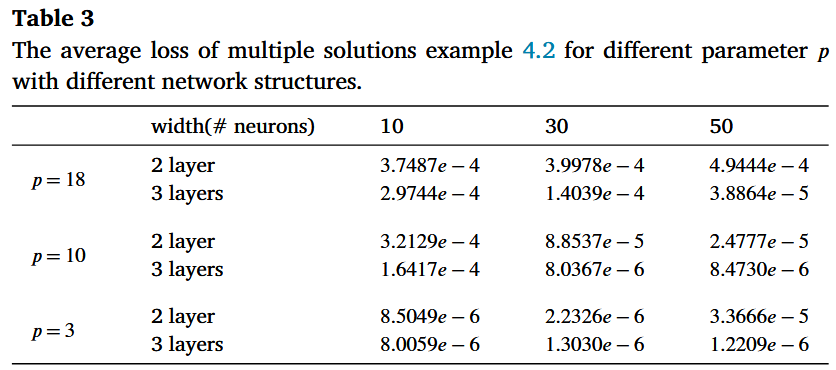
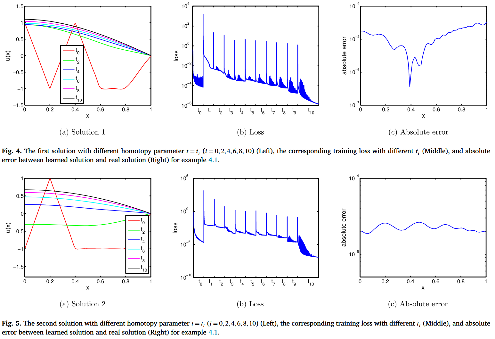
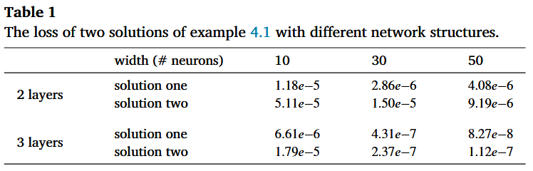
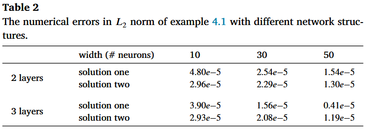
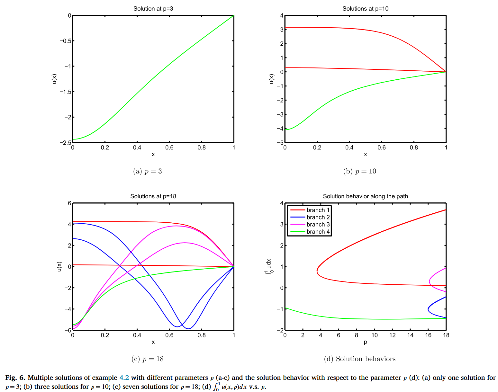
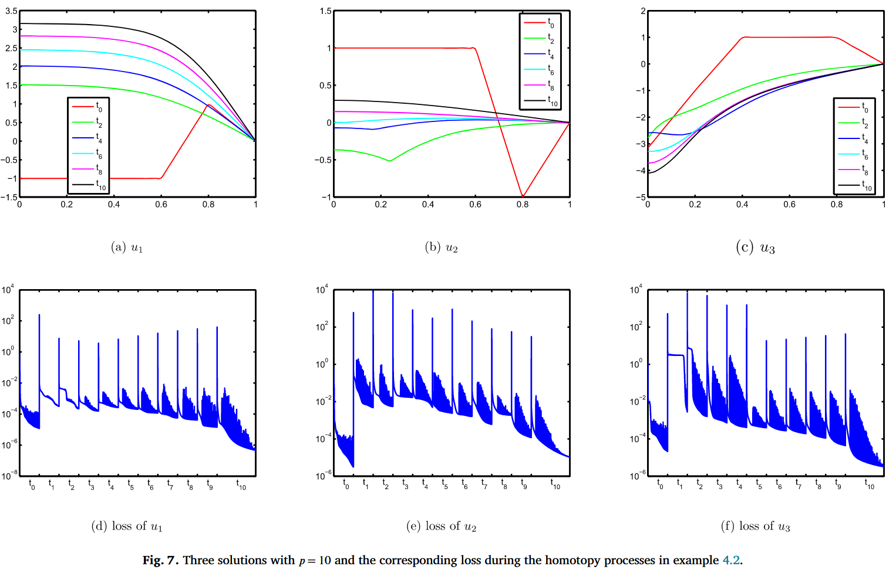
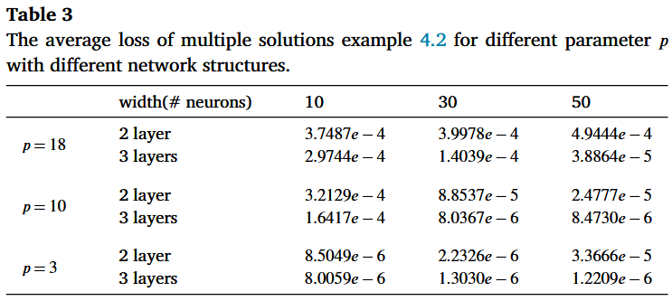

这是一篇使用同调法与 PINN 相结合解决非线性椭圆微分方程的论文，并处理了不规则边界区域。

# HomPINNs: Homotopy physics-informed neural networks for learning multiple solutions of nonlinear elliptic differential equations

## 摘要

**摘要原文：**

Physics-informed neural networks (PINNs) based machine learning is an emerging framework for solving nonlinear differential equations. However, due to the implicit regularity of neural network structure, PINNs can only find the flattest solution in most cases by minimizing the loss functions. In this paper, we combine PINNs with the homotopy continuation method, a classical numerical method to compute isolated roots of polynomial systems, and propose a new deep learning framework, named homotopy physics-informed neural networks (HomPINNs), for solving multiple solutions of nonlinear elliptic differential equations. The implementation of an HomPINN is a homotopy process that is composed of the training of a fully connected neural network, named the starting neural network, and training processes of several PINNs with different tracking parameters. The starting neural network is to approximate a starting function constructed by the trivial solutions, while other PINNs are to minimize the loss functions defined by boundary condition and homotopy functions, varying with different tracking parameters. These training processes are regraded as different steps of a homotopy process, and a PINN is initialized by the well-trained neural network of the previous step, while the first starting neural network is initialized using the default initialization method. Several numerical examples are presented to show the efficiency of our proposed HomPINNs, including reaction-diffusion equations with a heart-shaped domain.

**摘要翻译：**

基于物理信息神经网络（PINNs）的机器学习是一种新兴的非线性微分方程求解框架。然而，由于神经网络结构的隐含规律性，PINNs 在大多数情况下只能通过最小化损失函数找到最平坦的解。在本文中，我们将 PINNs 与**同调延续法**（一种计算多项式系统孤立根的经典数值方法）相结合，提出了一种新的深度学习框架，命名为同调物理信息神经网络（HomPINNs），用于求解**非线性椭圆微分方程的多解**。HomPINN 的实现是一个同调过程，由一个名为起始神经网络的全连接神经网络的训练和多个具有不同跟踪参数的 PINN 的训练过程组成。起始神经网络用于逼近由三元解构建的起始函数，而其他 PINN 则用于最小化由边界条件和同调函数定义的损失函数，这些函数随不同的跟踪参数而变化。这些训练过程被重新划分为同调过程的不同步骤，一个 PINN 由上一步训练有素的神经网络初始化，而第一个起始神经网络则使用默认初始化方法初始化。本文列举了几个数值示例来说明我们提出的 HomPINN 的效率，其中包括具有心形域的反应扩散方程。

<!-- truncate -->

我们还是老规矩，先看结论。

## 结论

同调延续法在计算非线性微分方程的多解时显示出优势。基于神经网络的技术，包括物理信息神经网络，已经证明了学习微分方程解的有效性。通过结合同调延续法和物理信息神经网络，我们在本手稿中开发了一种新的深度学习框架--HomPINNs，用于求解非线性微分方程的多解。具体而言，所提出的 HomPINN 通常包含几个子网络：**第一个称为起始神经网络，用于逼近起始函数**；其他网络逐步逼近目标系统，即我们想要求解的非线性微分方程。在训练过程中，我们使用前一个训练有素的子网络作为初始猜测来训练当前的子网络，并最终恢复非线性微分方程的多重解。我们在各种数值基准问题上对 HomPINNs 进行了测试，以显示 HomPINNs 学习多解的能力以及 HomPINNs 在不同网络结构上的鲁棒性。此外，**它还显示了在任意域上求解非线性微分方程的效率，而这对于传统方法来说是很困难的。**

今后，我们将把 HomPINNs 应用于其他微分算子和其他涉及多解的问题，如微分方程的特征值问题。另一个未来方向是探索**不同激活函数对 HomPINNs 的影响，例如 [74,75,47] 中介绍的自适应激活函数**。此外，还需要进一步研究起始函数的选择，以更好地捕捉非线性 PDE 的解结构。

加粗的部分是这篇文章比较亮点的地方，事实上针对随机域，PINN 比传统方法拥有得天独厚的优越性，这是传统方法与 PINN 的本身决定的，其实随机区域一直都是 PINN 的亮点方向，我比较新的研究工作也在做这方面。

## 实验

我们再来看看实验部分

本节将介绍几个示例，以展示 HomPINNs 在学习非线性 PDE 多解时的鲁棒性和效率。前两个例子是具有混合边界条件的一维非线性 PDE，它们是在配备 5G Quadro P2000 GPU 的个人电脑上实现的。第三个例子是具有 Dirichlet 边界条件的 2D Henon 方程和 9 个非微观解。最后一个例子是著名的 Gray-Scott 模型的静态空间模式，该模型在心形域上具有 Neumann 边界条件。这两个 2D 示例都是在配备 24G Titan RTX GPU 的科学工作站上实现的。所有示例均在 Python 3.8 中利用 Pytorch 库实现。此外，我们还说明了所有示例的一些基本设置如下：

#### 神经网络设置

我们使用 3 个隐藏层的神经网络，1D 实例每层 30 个神经元，2D 实例每层 80 个神经元，相应的激活函数选择双曲正切函数。所有神经网络都使用 He 初始化，这是 pytorch 库中的一种默认初始化方法。

  

#### 同调过程的超参数

在所有示例中，我们设置 $α = 10，m = 10$ ，即一个同调过程有 11 个步骤，即 $t_i = 0.1 × i，i = 0, 1, \dots, 10。$ 对于一维示例，配准点数设为 Ng = 100 和 Nb = 2；对于 4.3 小节中的示例 3，配准点数设为 $N_g = 5000$ 和 $N_b = 500$；对于 4.4 小节中的示例 4，配准点数设为 $N_g = 9768$ 和 $N_b = 630$。在算法 1 中，初始迭代的起始函数数设为 $m_s = 20$，以后迭代的起始函数数设为 $m_s = 10$，直到解集保持不变。在每个同调过程中，迭代次数设置为 $i = 0, 1, \dots , 9 $ 时，$N*{I,i} = 20000；i = 0, 1, \dots , 9$ 时，$N*{I,10} = 40000$。

#### 优化器设置

我们使用 Pytorch 库中的 Adam 训练算法[68]，参数如下：$betas = (0.9, 0.999)，eps = 10-8，weight\_decay = 0，amsgrad = False，maximize = False$，以解决 (8) 和 (9) 中定义的优化问题 ${L(θ, t_i)}^m*{i=0}$ 。学习率设定为 $τ_n = τ_{initial} × γ^{[\frac{n}{Δ}]}$，即每迭代一次，学习率衰减 $γ$ 。在所有例子和每个同调步骤 $t_i$ 中，我们设置 $τ_{initial} = 0.002$ 和 $Δ = 1000$，而一维例子的衰减率 $γ = 0.85$，二维例子的衰减率 $γ = 0.95$。此外，在亚当优化之后，对求解进行了细化 LBFGS 是 Pytorch 库中的一种准牛顿方法，参数为 1D 示例 $max\_iter = 10000$，2D 示例 $max\_iter = 50000，tolerance\_grad = 1.0 × np.finfo(float).eps$ ，以获得更好的精度。

### 算例 1：有两个解的一维示例

我们首先考虑一个在 [0, 1] 上带有混合边界条件的一维非线性微分方程，

$$
\left\{\begin{aligned} u_{xx}&=-1.2(1+u^{4}),\ \ x\in[0,1]\\ u^{\prime}(0)&= u(1)=0.\end{aligned}\right.
$$

文献[33]表明，这个例子有两个解析解。由于公式 (19) 没有实数三元解，我们定义 $\mathcal{U}_{0} = \{1, -1, \sqrt{2}, -\sqrt{2}\}$，求解 $f (u) = (u^2 - 1)(u^2 - 2) = 0$。图 4 和图 5 展示了这两个解的学习过程以及每个同调步骤的相应损失。表 1 和表 2 分别显示了 L2 准则下的损失和数值误差，证明了 HomPINNs 在不同网络结构上的良好精度。

  

  

  

### 算例 2：有多个解的一维示例

考虑下面这个有多个解的参数非线性微分方程，

$$
\left\{\begin{aligned} u_{xx}=& u^{2}(u^{2}-p), \ \ x\in(0,1)\\ u^{\prime}(0)=& 0,\ u(1)=0\end{aligned}\right.
$$

参数 $p > 0$ [70,71]。对于任何给定的参数 $p$，都存在多个解 $u$，而且解的数量随着参数 $p$ 的增大而增加。为了计算方程 (20) 不同参数下的多解，我们通过求解修正的非线性项 $(u^2 - 1)(u^2 - p) = 0$，将三元解集取为 $\mathcal{U}_{0} = \{1, -1, \sqrt{p}, -\sqrt{p}\}$。

在 $p = 3$、$p = 10$ 和 $p = 18$ 的情况下，所提出的 HomPINNs 能学习到一个、三个和七个解。这些结果与 [71] 现有的理论分析一致。图 6 显示了 HomPINNs 在不同参数下学习到的解，图 7 显示了 $p=10$ 时三个解的学习过程。我们还在表 3 中总结了不同神经网络结构下不同解的平均损失，这证实了 HomPINNs 对神经网络结构的鲁棒性。此外，为了分析解与参数 $p$ 的关系，我们定义了一个新的参数 $p$ 损失函数：

$$
\begin{split}\tilde{L}(\theta,p)&=\frac{1}{N_{g}} \sum_{i=1}^{N_{g}}\big(\mathcal{L}u_{N}(\mathbf{x}_{i}^{g};\theta,p)-f(u_{N} (\mathbf{x}_{i}^{g};\theta,p),p)\big)^{2}\\ &+\alpha\frac{1}{N_{b}}\sum_{j=1}^{N_{b}}\big(\mathcal{B}u_{N} (\mathbf{x}_{j}^{b};\theta,p)-b(\mathbf{x}_{j}^{b})\big)^{2},\end{split}
$$

其中 $u_N(xg_i; θ, p)$ 是方程 (21) 在任意给定参数 $p$ 下的解。通过追踪从 $p = 18$ 到 $p = 0$ 的解，我们将参数 $p$ 离散化为 $p = p₀, p₁, ⋯, p_{m_p}$，其中 $p₀ = 18，p_{m_p} = 0$，且 $m_p + 1$ 是参数 $p$ 的离散点数。然后，我们得到由 HomPINNs 学习的初始七个解$\{ui(x; θ_i, p_0)\}^7_{i=1}$，并计算 $u(\bm x; θ_j , p_j ) (j > 0)$ 通过将 $u(x; θ_{j−1}, p_{j−1})$ 作为优化求解器的初始猜测，直到 $j = m_p$。因此，我们获得了参数微分方程 (20) 的解行为，如图 6d 所示。

  

  

  

#### 算例 3：带有九个解的 2D Henon 方程

接下来，我们考虑以下 Henon 方程

$$
\left\{\begin{aligned} \Delta u+|\mathbf{x}|^{7}u^{3}=& 0, \mathbf{x}\in\Omega\\ u|_{\partial\Omega}=& 0,\end{aligned}\right.
$$

其中,$\Omega= \{\mathbf{x} =(\mathbf{x}，y)\in \mathbb{R}^2:|\mathbf{x}| ≤1\}$ 且 $|\mathbf{x}| =\sqrt{(x^2 + y^2)}$。平凡解集由解方程 $u（u -20）（u + 20）= 0$ 得出，其解集为 $\mathcal{U}_{0}=\{20,-20,0\}$，该方程与 $u³$ 的次数相同。

提出的 HomPINNs 模型学习到了九种不同的解，如图 8 所示。值得注意的是，解 $u_i$ 与解 $u_{10−i}$ 关于 x-y 平面呈对称关系，其中 i = 1, 2, 3, 4。传统方法[72]仅发现八个解 {ui, u10−i}4 i=1，这些解成对出现，这可能是由计算前的某些变换引起的。HomPINNs 中不存在任何变换，我们直接使用非线性微分方程(22)定义损失函数。这是提出 HomPINNs 相对于传统方法计算非线性系统多个解的一大优势。此外，我们还测试了 HomPINNs 在不同神经网络结构下的鲁棒性，并总结了不同解的平均损失值，如表 4 所示。
