这是一篇使用 VPinn 来求解 Navier-Stokes 方程的论文。

# An efficient hp-Variational PINNs framework for incompressible Navier-Stokes equations

我们先来看看这篇论文的摘要：

## 摘要

英文原文：

Physics-informed neural networks (PINNs) are able to solve partial differential equations (PDEs) by incorporating the residuals of the PDEs into their loss functions. Variational Physics-Informed Neural Networks (VPINNs) and hpVPINNs use the variational form of the PDE residuals in their loss function. Although hp-VPINNs have shown promise over traditional PINNs, they suffer from higher training times and lack a framework capable of handling complex geometries, which limits their application to more complex PDEs. As such, hp-VPINNs have not been applied in solving the Navier-Stokes equations, amongst other problems in CFD, thus far. FastVPINNs was introduced to address these challenges by incorporating tensor-based loss computations, significantly improving the training efficiency. Moreover, by using the bilinear transformation, the FastVPINNs framework was able to solve PDEs on complex geometries. In the present work, we extend the FastVPINNs framework to vector-valued problems, with a particular focus on solving the incompressible Navier-Stokes equations for two-dimensional forward and inverse problems, including problems such as the lid-driven cavity flow, the Kovasznay flow, and flow past a backward-facing step for Reynolds numbers up to 200. Our results demonstrate a 2x improvement in training time while maintaining the same order of accuracy compared to PINNs algorithms documented in the literature. We further showcase the framework’s efficiency in solving inverse problems for the incompressible Navier-Stokes equations by accurately identifying the Reynolds number of the underlying flow. Additionally, the framework’s ability to handle complex geometries highlights its potential for broader applications in computational fluid dynamics. This implementation opens new avenues for research on hp-VPINNs, potentially extending their applicability to more complex problems.

翻译：

物理信息的神经网络（PINN）能够通过将 PDE 的残差纳入其损失函数来解决部分微分方程（PDE）。变异物理信息的神经网络（VPINN）和 HPVPINNS 在其损失函数中使用 PDE 残差的变异形式。尽管 HP-vpinns 对传统的 PINN 表现出了希望，但它们遭受了较高的训练时间，并且缺乏能够处理复杂几何形状的框架，从而将其应用限制在更复杂的 PDES 中。因此，迄今为止，尚未应用 HP-VPINN 在求解 Navier-Stokes 方程中，以及 CFD 中的其他问题。引入了 FASTVPINNS，通过结合基于张量的损失计算，从而显着提高训练效率，以应对这些挑战。此外，通过使用双线性转换，FastVpinns 框架能够在复杂的几何形状上求解 PDE。在目前的工作中，我们将 FASTVPINNS 框架扩展到了矢量值问题，特别着眼于解决不可压缩的 Navier-Stokes 方程，以解决二维向前和反向问题，包括诸如盖子驱动的腔流，kovasznay 流量以及以后的阶段进行阶段的阶段，以改进阶段的时间，并将其进行了训练。与文献中记录的 PINNS 算法相比，准确性。我们通过准确识别基础流的雷诺数数量，进一步展示了该框架在解决不可压缩的 Navier-Stokes 方程中的反问题方程的效率。此外，该框架处理复杂几何形状的能力突出了其在计算流体动力学中更广泛应用的潜力。该实施为 HP-VPINNS 研究开辟了新的途径，有可能将其适用性扩展到更复杂的问题上。

## 数值结果

在以下部分中，我们将对 FASTVPINNS 框架进行全面验证，以用于流体流量问题中的应用。我们首先在 Inviscid 汉堡方程式上测试代码，然后将 FASTVPINNS 框架扩展到矢量值问题。接下来，我们使用不可压缩的 Navier-Stokes 方程来解决前进和反问题。我们通过首先求解 kovasznay 流并将预测的解决方案与可用的精确解决方案进行比较，从而验证了 FastVpinns 框架的准确性。对于 Kovasznay 流，我们还比较了 FastVpinns 又有 NSFNETS10 的准确性和效率，我们认为这是基准。我们还对 Kovasznay 流进行了网格连接研究，显示了元素大小对结果准确性的影响。接下来，我们将 FASTVPINNS 框架应用于流体流量问题中的三个规范示例：Liddriven 的腔流，流过矩形通道并流过向后的步骤。我们还通过解决 Falkner-Skan 边界层问题并将我们的结果与文献中建立的结果进行比较 11，我们还证明了 FastVpinns 对层流边界流的适用性。如前所述，FastVpinns 框架可以处理具有偏斜的四边形元素的复杂网格。为了强调这一点，我们解决了一个圆柱体问题的流程，证明了 FastVpinns 在处理非平凡域离散化时的灵活性和鲁棒性。最后，我们通过说明方法在反问题上的应用来结束讨论，通过预测雷诺数的数字，同时求解超过向后的步骤的流程。

FastVpinns Library 已使用 TensorFlow 版本 2.0 编写。对于以下示例，测试功能是形式

$$
v_{k}=P_{k+1}-P_{k-1},
$$

其中，$V_k$ 是 $k^{th}$ 阶的多项式，$P_k$ 是 $k^{th}$ 阶的 Legendre 多项式。对于数值正交，使用 Gausslobatto-Legendre 方法。使用 ADAM Optimizer[28]优化了所有实验的具有 TANH 激活函数的完全连接的神经网络。相对 $l^2$ 误差定义如下：

$$
L^{2}_{rel}(u)=\frac{\|u-u_{\mathrm{ref}}\|_{2}}{\|u_{\mathrm{ref}}\|_{2}},
$$

其中，$∥·∥_2$ 是 $l^2$ norm，$u$ 是预测的解决方案，$u_{ref}$ 是参考解决方案。为了使结果的可重复性的利益，我们提到了表 I 中用于运行实验的一些其他规格。

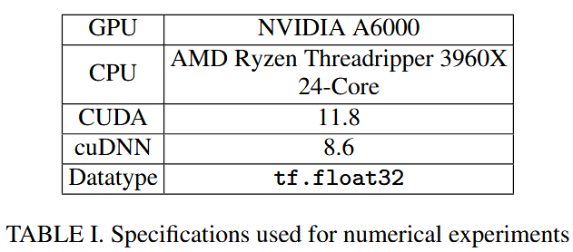

### Burgers' Equation

我们通过求解等式中显示的 2D、固定以及粘性 Burgers 方程式开始讨论数值结果。我们采用生产解决方案的方法来生成精确的解决方案，定义为：

$$
\begin{split} u&=\sin(x^{2}+y^{2}),\\ v&=\cos(x^{2})\tanh(8y^{2}).\end{split}\tag{10}
$$

右侧项 $(f_x,f_y)$ 是通过在等式中替换(10)中的值来得出的。将粘度系数 $ν$ 设置为 1。计算域，$\Omega$ 由 $[-1，1]^2$ 给出，分别为 x-和 y-Dimensions 分别为 8 个元素。对于这个问题，我们使用一个神经网络，其中包含 3 个隐藏层，每个神经元包含 30 个神经元。该网络使用 0.001 的恒定学习率对 20,000 个时期进行了训练。为了计算损失，我们使用 25 个测试功能和每个元素的 100 个正交点，总共 6400 个正交点。边界损耗以 800 点计算，并在域的边界上采样。图 2 显示了精确的解决方案，即 FastVPINNs 预测的解决方案以及 $U$ 和 $V$ 组件的点误差。 FastVPINNs 能够为 $U$ 和 $V$ 分别达到 $1.9×10^{-3}$ 和 $6.1×10^{-3}$ 的 $L^2_{Rel}$ 误差。此外，平均训练时间为每个时期 2.4ms，突出了我们方法的计算效率。

### Kovasznay Flow

现在，我们继续求解不可压缩的 Navier Stokes 方程，从 Kovasznay Flow29 开始，这是 2D 不可压缩的 NavierStokes 方程的众所周知的分析解决方案。该流量代表二维网格后面的层流状态，其特征是参数 $\lambda$ 取决于雷诺数。分析解决方案的存在将为评估所提出方法的准确性提供明确的基线。它还将使我们能够将方法的准确性和速度与最新状态 NSFnets[10] 进行比较。 kovasznay 流的分析解决方案由：

$$
\begin{split} u(x,y)&=1-e^{\zeta x}\cos(2\pi y),\\ v(x,y)&=\frac{\zeta}{2\pi}e^{\zeta x}\sin(2\pi y), \\ p(x,y)&=\frac{1}{2}\left(1-e^{2\zeta x}\right), \end{split}
$$

其中，

$$
\zeta=\frac{1}{2\mu}-\sqrt{\frac{1}{4\mu^{2}}+4\pi^{2}},\quad\mu=\frac{1}{ \mathrm{Re}}.
$$

我们在矩形域 $[-0.5，1]×[-0.5，1.5]$ 上解决了 $Re = 40$ 的 kovasznay flow。该结构域在 x 维度中被 6 个 cell 离散，在 Y 维度中将 10 个 cell 离散，因此 $N_elem = 60$。在 NSFnets 中，使用具有 7 个隐藏层的神经网络获得了最佳溶液，每个层均包含 100 个神经元，总计为 2601 和 400 个边界点。为了与 NSFnets 进行公平的比较，我们将使用相同的网络体系结构以及表 II 中的参数。等式中的加权系数 $α$，$β$ 和 $γ$。在公式（8）中全部设置为 10。

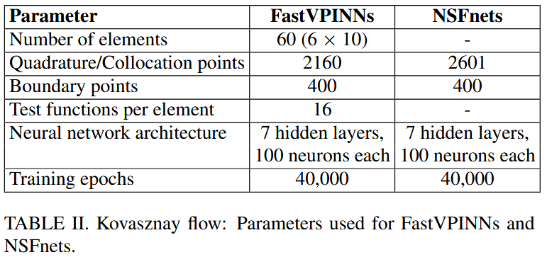

与 NSFnets 一样，我们训练 FastVpinns 进行 40,000 次迭代，从而导致图 3 中所示的损失函数。图 4 中显示了每个组件的预测解决方案和点的误差。在表 III 中显示了 NSFnets 和 FastVpinns 之间的比较。该表已使用 NSFnets 和 FastVpinns 具有独立初始网络参数的 5 个运行的平均结果和标准偏差进行编译。我们观察到，FastVpinns 的准确性与 NSFnets 相匹配，而仅需约 40％的训练时间。表 XIII（在附录）中可以找到具有 4 个具有 50 个神经元的 4 个隐藏层的网络的类似比较。

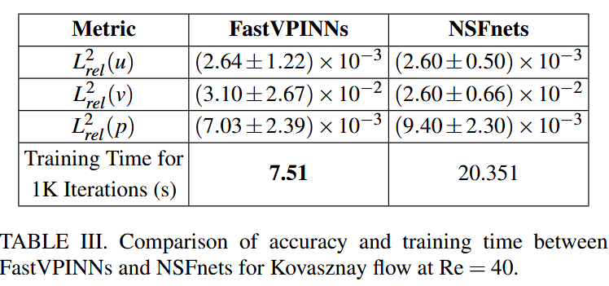

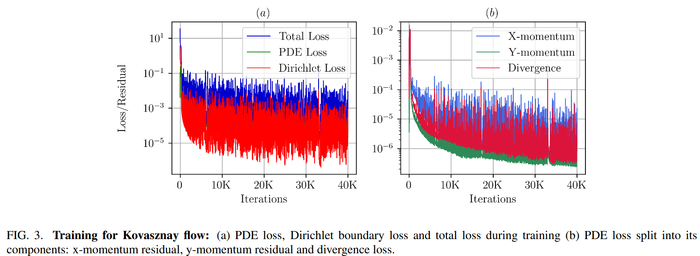

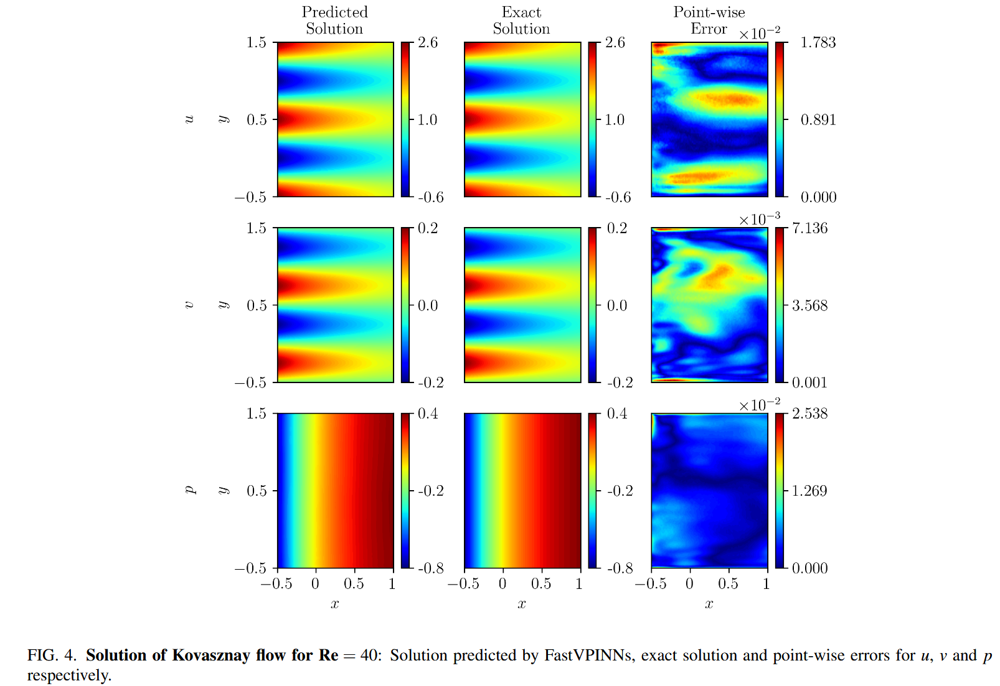

#### Grid Convergence for Kovasznay Flow

为了证明 hp-VPINNs 具有越来越多的元素的收敛性，我们为 Kovasznay 流量问题进行了网格收敛研究。每个元素的正交点的数量固定在 36 中。测试功能，边界点和神经网络架构的数量与表 II 所示的相同。为了确保随着元素数量的增加而对网络进行适当的培训，我们根据以下关系调整培训迭代次数：

$$
\text{Number of training iterations} = κ + ξ × N\_quad ∗ N\_elem
$$

其中，$κ= 6000$ 代表时期的基本数量，而 $ξ= 6$ 是一个缩放因素，它解释了域内正交点的增加。表 IV 和图 5 显示了 u，v 和 p 的相对 $L^2$ 误差。我们观察到，通过足够的训练，随着域中元素数量的增加，测试误差会减少。

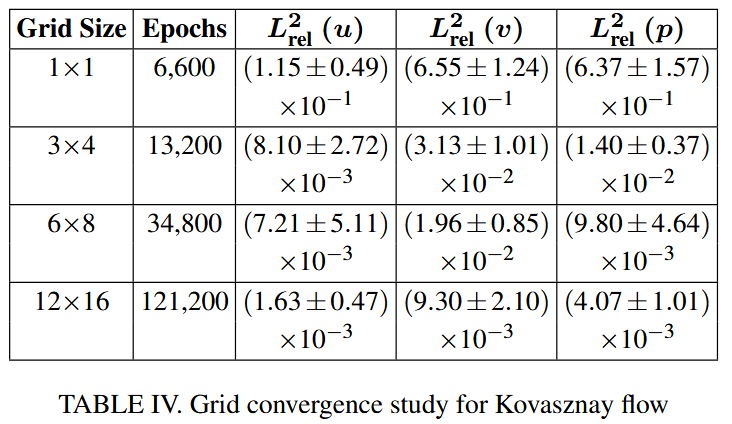

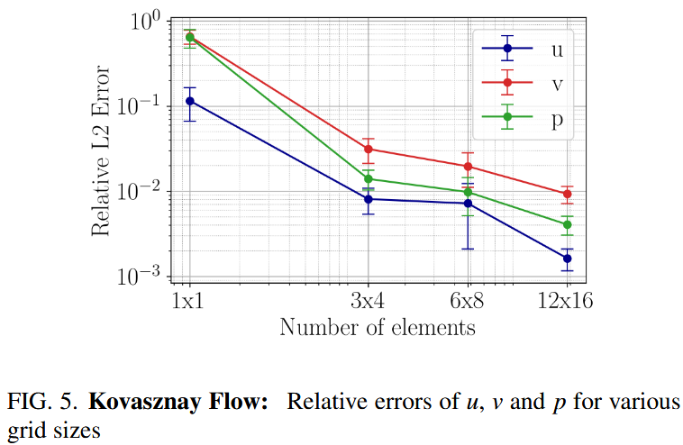

### Lid Driven Cavity Flow

在研究了 Kovasznay 流量后，我们现在将注意力转向流体动力学中的另一个经典基准问题：盖子驱动的腔流量。我们使用每个维度中的 8 个四边形元素离散单位方形域，并在表 5 中显示参数。

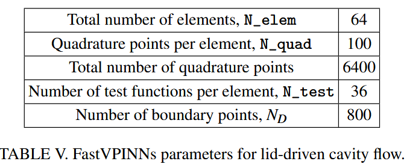

对于 lid-driven 的腔流，使用了由六个隐藏层组成的神经网络结构，每个层都使用了 20 个神经元。如图 6 所示，对该网络进行了 50,000 轮训练，初始学习率为 0.0013。该学习率是使用指数学习率调度程序衰减的，每 1000 步的衰减率为 0.99。我们在等式中设置了加权系数。 $(8)$ 作为 $α= 1,β= 1,γ= 10^4$。此选择强调了连续性方程在损耗函数中的重要性。图 7 列出了使用 Parmoon30 计算的 FEM 解决方案与神经网络预测的解决方案之间的比较。图 8 说明了 FEM 值与神经网络的预测值之间的中线速度比较，我们观察到我们的神经网络解决方案与 FEM 解决方案非常吻合。

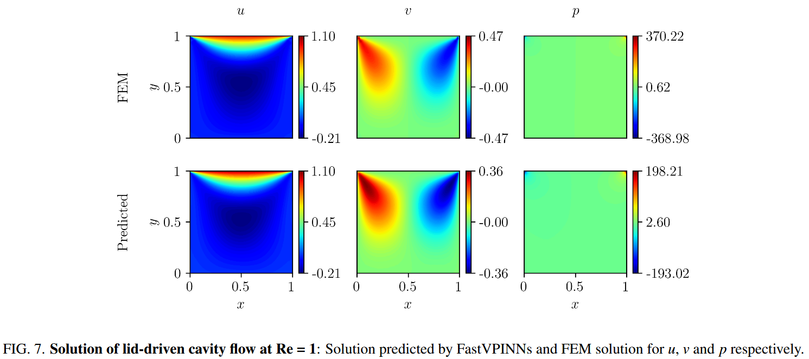

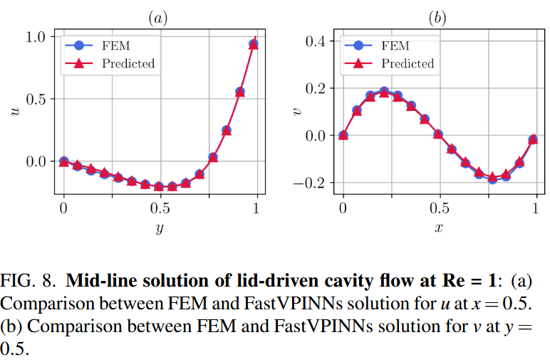

### Flow through channel

接下来，我们解决了通过矩形通道的流动，以验证我们的诺伊曼边界条件的实现。该案例研究涉及矩形结构域 $[0，3]×[0，1]$ 中的流体流量，使用一百个常规的四边形元件离散。入口速度轮廓定义为

$$
u(0,y)=4y(1-y),
$$

在 $y = 0.5$ 时达到 1 的最大值为 1。我们将无滑动边界条件施加在顶部和底部壁上，而插座的 Neumann 边界条件为零。共有 800 个边界点在整个域边界上分布，以强迫边界条件。等式中的加权系数。公式(8)设置为 $α= 10^{-4},β= 10^{-4},γ= 10^4$ 。表 VI 总结了此模拟中使用的关键超参数。 ADAM 优化器的学习率为 $0.001$，并进行了 30,000 轮的训练。对于雷诺数为 1 的数字，我们获得了 X 差速器中速度的 $L^2_{Rel}$ 误差为 $1.09×10^{-2}$。图 9 显示了预测的 U 速度和相应的点误差。

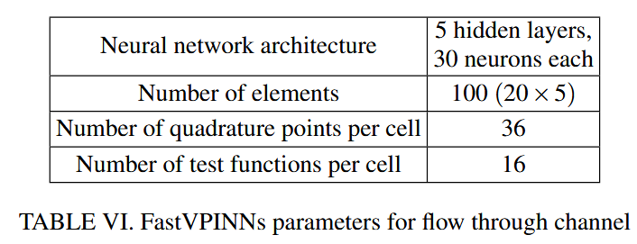

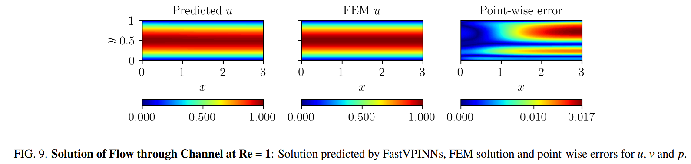

### Flow past a backward facing step

向后的步骤问题是流体动力学中充满挑战的情况，涉及突然扩展的通道。这种构型导致复杂的现象，例如流动分离，重新分析和再循环区域。我们以 200 的雷诺数为基础研究了这个问题，该问题为我们的 FastVPINNs 框架提供了重大测试，这是由于沿通道长度的较大域和变化的速度场。与 Gartling31 中类似的计算域在图 10 中说明了。该图既显示了向后的步骤的几何形状，又显示了我们模拟中使用的入口速度曲线。我们将域将域离散为 100 个元素（20×5），其中表 VII 中详细介绍了计算参数。

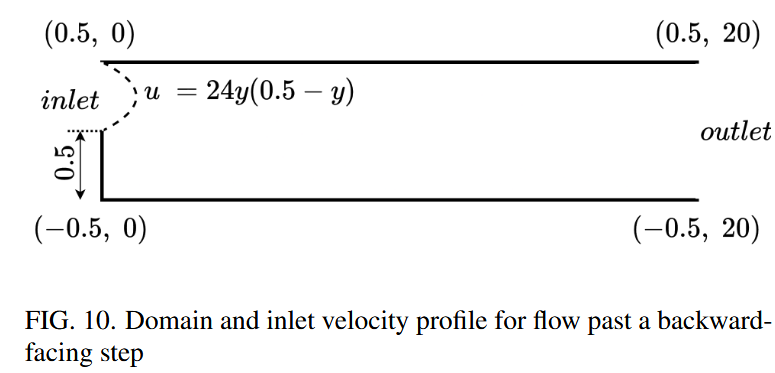

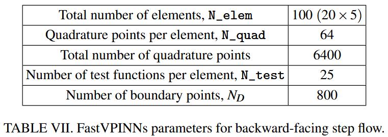

对于这个问题，我们采用了一个神经网络，该网络具有八个隐藏层，每个层都包含 50 个神经元。如图 11 所示，对该网络进行了 250,000 轮训练，初始学习率为 0.0015。该学习率是使用指数学习率调度程序衰减的，每 1000 步的衰减率为 0.98。等式中的加权系数。 （8）全部设置为 10。为了验证我们的方法，我们将我们的结果与从 FEM 获得的结果进行了比较。表 VIII 列出了速度成分 $u,v$ 和压力 $p$ 的 $L^2_{Rel}$ 误差。图 12 说明了通过神经网络，FEM 解决方案和速度和压力分量的点误差的预测解决方案之间的比较。我们的分析表明， FastVPINNs 的预测解决方案与 FEM 解决方案非常吻合，证明了我们在此复杂流动问题上的框架的有效性。

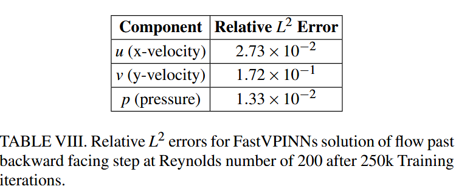

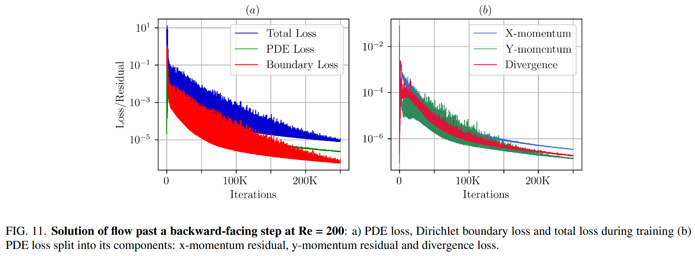

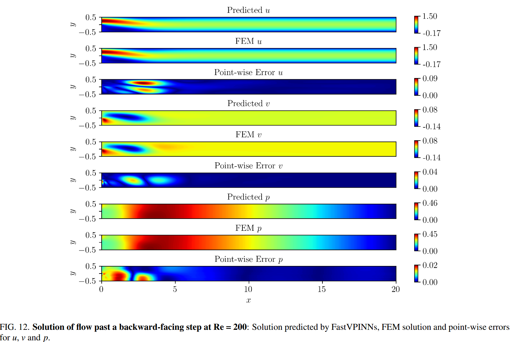

### Falkner Skan flow

在研究了经典流体动力学问题之后，我们现在检查了 Falkner-Skan 边界层问题 32，这是层流流分析中的重要案例研究。

这个问题描述了层流区域稳定，不可压缩的边界层流的速度曲线。我们选择了这个问题来证明与传统的 Pinns 实现相比，FastVPINNs 的性能。在我们的研究中，我们采用了 Eivazi 等人 11 的问题参数，考虑到 $M = -0.08$ 的雷诺数为 $100$，导致楔形角 $β= -0.1988$。参考解决方案和 $PINNS$ 代码是从官方 GitHub Repository[33] 获得的。计算域跨越 X 差异 $[0,20]$ ，在 yDimension 中跨越[0，5]。表 IX 总结了我们的 FastVpinns 模拟中使用的关键参数和 PINNS 实现的比较。两种方法都使用 Adam Optimizer 训练 10,000 轮。我们报告了 10 次独立运行的平均结果。图 13 说明了训练的进展，显示了训练迭代中的总损失及其组成部分。等式中的加权系数 $α,β$ 和 $γ$。 方程 (8) 已设置为 1。表 X 详细介绍了 FastVPINNs 和 Pinns 之间的性能比较。值得注意的是，我们能够通过 FASTVPINN 实现重大加速。我们计算了一千次迭代的平均训练时间，发现 FastVPINNs 与 Pinns 实施相比，速度达到了 2.24 倍。具体而言，每 1000 次训练迭代需要 16.67 秒的 PINNS 代码，而 FastVPINNs 仅在 7.43 秒内完成了相同数量的迭代。

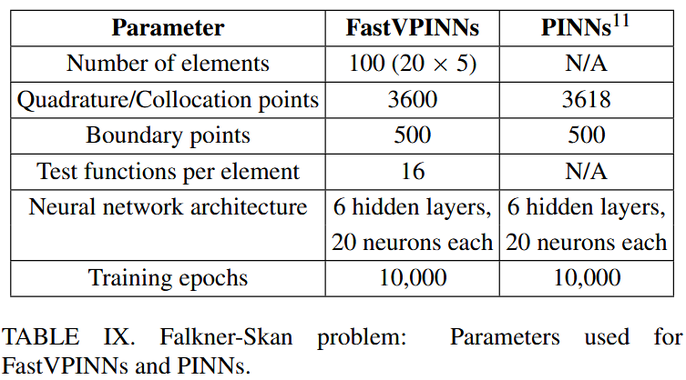

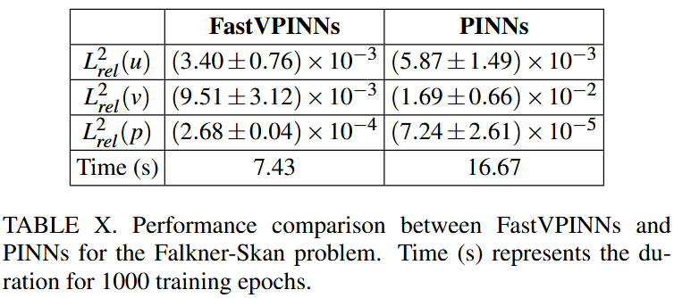

### Flow past a cylinder

为展示本框架处理复杂几何结构的能力，我们采用带斜四边形单元的网格解决了圆柱体周围流动问题(如图 15 所示)。计算域包含 553 个单元，每个单元使用 9 个测试函数和 16 个求积点，整个域共计 8,848 个求积点。我们选取 1,673 个边界点施加边界条件。针对该几何结构，采用包含 7 个隐藏层（每层 20 个神经元）的神经网络架构。网络采用初始学习率 $2.9×10^{-3}$ 进行 250,000 轮训练，配合指数学习率调度器（衰减步长 2200，衰减率 0.985）确保稳定收敛。图 16 展示训练进程中总损失及其各分量的演变趋势。我们将式(8)中的权重系数 α、β 和 γ 均设为 10。图 17 呈现的结果表明，FastVPINNs 对速度和压力分量的预测与有限元法解具有良好一致性，验证了本框架能精确捕捉圆柱体周围复杂流场（包括尾流区域）的能力。表 XI 量化了本方法的精度，给出了速度和压力分量的$L^2_{Rel}$误差。这些结果强调了 FastVPINNs 在解决复杂几何流体动力学问题时的有效性，在保持计算效率的同时实现了良好的精度。

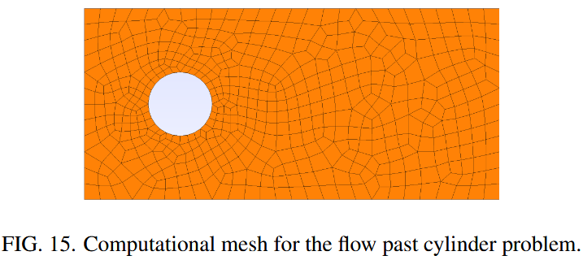

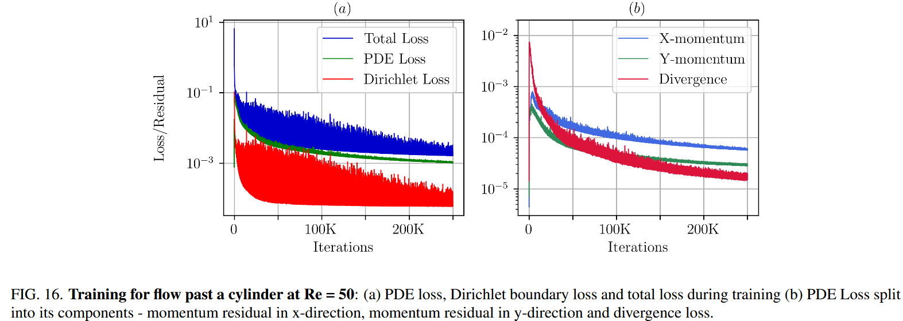

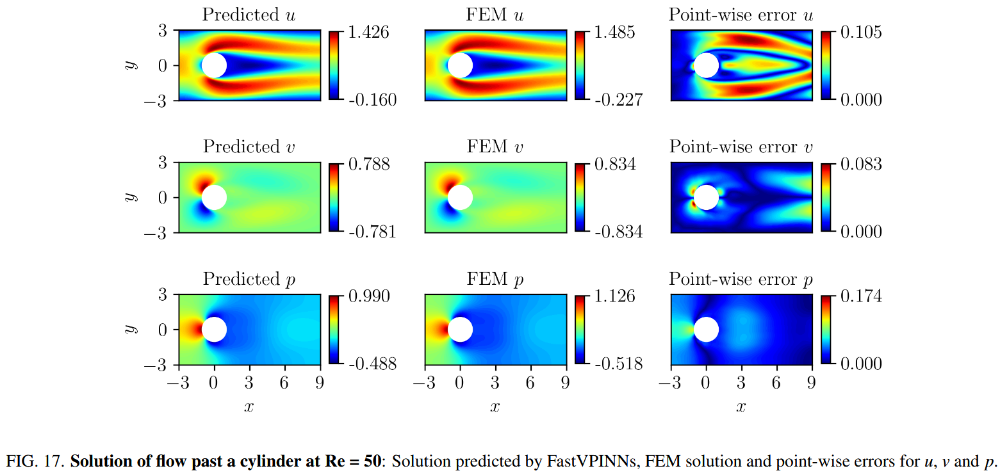

### INVERSE PROBLEMS

为了证明 FastVPINNs 在解决反问题中的能力，我们应用框架来识别通过向后的步骤中流动中的雷诺数。流体动力学中的反问题通常涉及估计管理 PDE 的参数，例如 Navier-Stokes 方程中的雷诺数。在 FastVPINNs 中，这是通过将目标参数视为神经网络体系结构中的可训练变量来实现的。我们的计算结构域跨越 X 二维和 $[-0.5,0.5]$ 的计算结构域在 y 维度中跨越 $[0.5，0.5]$ ，在 XDimension 中具有 XDimension 的入口速度曲线。

$$
u=24y(0.5-y)\quad\mathrm{for} y\in[0,0.5]
$$

沿着左墙。该流量的实际雷诺数为 200，我们的模型旨在预测。我们使用 25 个测试函数和每个元素的 64 个正交点将域离散为 100 个元素（20×5），从而总共 6400 个正交点。此外，我们采样了 800 个边界点，并设置了 100 的边界 $τ$ 。为了预测雷诺数，我们利用域内的 100 个随机分布的传感器点来利用速度数据。我们的神经网络体系结构包括 8 个隐藏层，每个层有 50 个神经元，使用 $1.9×10^{-3}$ 的初始学习速率对 250,000 个时代进行了训练，并与指数型衰减调度程序（1500 衰减步骤，衰减率为 0.985）。图 18（a）和（b）说明了训练过程中各种损失成分的演变，从而洞悉了我们模型的收敛行为。传感器丢失表示神经网络预测与传感器点数据之间的差异，如图 18（a）所示。图 20 显示了最终预测的速度和压力场，证明了框架捕获流动模式的能力，同时估算了雷诺数。表 XII 列出了我们的预测的准确性，显示了雷诺数的初始猜测为 120 时，L2 的速度和压力组件的 RER 误差。训练模型花了 25 万次迭代。

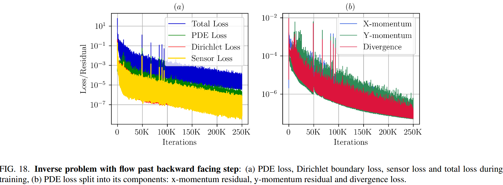

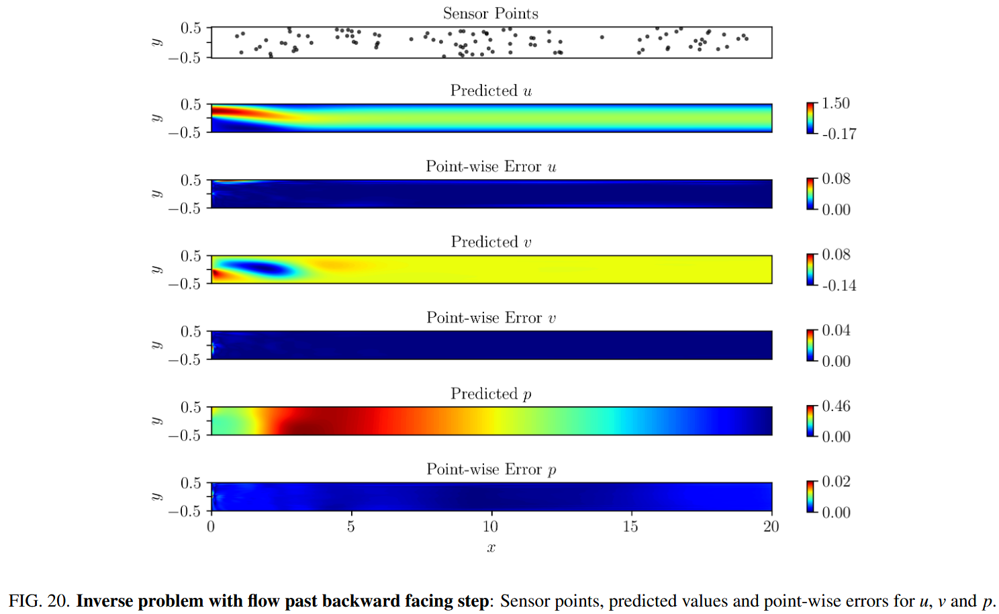

为了评估我们的方法的鲁棒性，我们初始化了雷诺数估计值，值范围从 120 到 280。图 19 说明了这些估计值与 200 的真实值的收敛性，突出了该框架准确确定雷诺数数量的能力，而不管最初的猜测如何。这些结果证明了 FASTVPINN 在解决流体动力学中解决反问题中的有效性，显示了对复杂几何形状中的参数估计和流动表征的应用的希望。

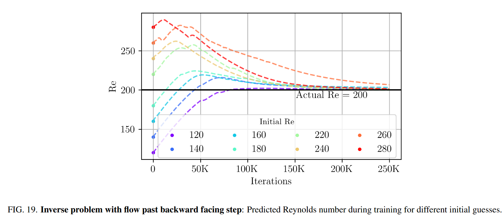

## 结论

在这项工作中，我们成功地扩展了 FastVpinns 框架以解决矢量值问题，特别关注不可压缩的 Navier-Stokes 方程。我们通过一组全面的数值实验验证了我们的方法，包括诸如 kovasznay 流，盖子驱动的腔流以及流过向后的步骤等问题。与现有方法相比，我们的实施表明计算效率和准确性都有显着提高。值得注意的是，在与有关 Kovasznay 流量和 Falkner-Skan 边界层问题的 PINN 的现有文献进行比较时，我们在训练时间中达到了 2 倍的速度，同时相对于文献中提到的 PINNS 代码保持了可比或改进的精度。通过解决由偏斜的四边形元素组成的域上的圆柱问题，通过解决流动问题来展示该框架处理复杂几何形状的能力。此外，我们通过成功地将其应用于反问题，证明了 FastVpinns 的多功能性，从而准确地预测了雷诺数的数量，而雷诺数则超过了向后的步骤配置。该能力突出了我们方法对参数估计和流动表征任务的潜力。提高的计算效率，准确性以及处理前进问题和反向问题的能力的结合，FastVpinns 作为一种有前途的工具，用于广泛的流体动力学应用，从简单的几何形状到复杂的，现实世界中的情况。当前的工作是技术演示者，并且能够扩展到其他现实世界的工程应用程序，例如在管道中的风流或多相流中的湍流。

## 预备知识

在本节中，我们将简要说明使用 hp-VPINNs 求解标量 PDE 的 FastVPINNs 方法，然后陈述 FastVPINNs 中使用的基于张量的损耗计算例程。

### Variational form of a scalar PDE

我们从 2D 中的泊松问题开始，均匀的 dirichlet 边界条件，在开放域和有限域 $\Omega \in \$ 上定义
