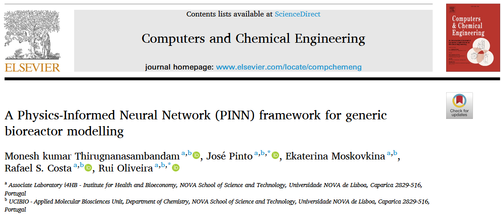

这是一篇使用 PINN 用于通用生物反应器建模的论文。

# A Physics-Informed Neural Network (PINN) framework for generic bioreactor modelling

我们先来看看这篇论文的摘要：

## 摘要

英文原文：

Many previous studies have explored hybrid semiparametric models merging Artificial Neural Networks (ANNs) with mechanistic models for bioprocess applications. More recently, Physics-Informed Neural Networks (PINNs) have emerged as promising alternatives. Both approaches seek to incorporate prior knowledge in ANN models, thereby decreasing data dependency whilst improving model transparency and generalization capacity. In the case of hybrid semiparametric modelling, the mechanistic equations are hard coded directly into the model structure in interaction with the ANN. In the case of PINNs, the same mechanistic equations must be “learned” by the ANN structure during the training. This study evaluates a dual-ANN PINN structure for generic bioreactor problems that decouples state and reaction kinetics parameterization. Furthermore, the dual-ANN PINN is benchmarked against the general hybrid semiparametric bioreactor model under comparable prior knowledge scenarios across 2 case studies. Our findings show that the dual-ANN PINN can level the prediction accuracy of hybrid semiparametric models for simple problems. However, its performance degrades significantly when applied to extended temporal extrapolation or to complex problems involving high-dimensional process states subject to time-varying control inputs. The latter is primarily due to the more complex multi-objective training of the dual-ANN PINN structure and to physics-based extrapolation errors beyond the training domain.

翻译：

许多先前的研究探索了将人工神经网络（ANN）与机制模型融合的混合半参数模型，用于生物过程应用。近年来，物理信息神经网络（PINN）作为有前景的替代方案应运而生。这两种方法都试图将先验知识融入 ANN 模型，从而降低对数据的依赖性，同时提高模型的透明度和泛化能力。在混合半参数建模中，机理方程被直接硬编码到模型结构中并与 ANN 交互作用；而在 PINN 中，相同机理方程需由 ANN 结构在训练过程中“学习”获得。本研究针对通用生物反应器问题评估了一种双 ANN-PINN 结构，该结构实现了状态参数与反应动力学参数的解耦。此外，通过两个案例研究，在可比先验知识情境下，将双 ANN PINN 模型与通用混合半参数化生物反应器模型进行基准对比。研究发现：对于简单问题，双 ANN-PINN 可达到与混合半参数模型相当的预测精度；但在扩展时间外推或涉及高维过程状态与时变控制输入的复杂问题中，其性能显著下降。后者主要源于双 ANN-PINN 结构更复杂的多目标训练过程，以及训练域外基于物理的外推误差。

通过摘要可以看出，文章利用 PINN 来求解一类同样由微分方程描述的生物反应器系统。这确实展示了 PINN 在传统物理模型之外的又一类应用场景——它同样能够有效处理其他类型的微分方程。至于该方法的具体实现方式，感兴趣的读者可以继续阅读下文以进一步了解。

## 方法

### 生物反应器系统的双人工神经神经网络 PINN 结构

完全混和的搅拌槽生物反应器的态空间方程具有以下通用形式：

$$
\frac{dC}{dt}=Sr(C,u)-DC+DC_{in},  C(0)=C_0, \tag{1a}
$$

其中， $C$ 是相关生化物种浓度的 $(n × 1)$ 状态向量，$S$ 是一个 $(n×m)$ 产率系数矩阵，$r(C,u)$ 是生物反应动力学的 $(m×1)$ 向量，$D = F/V$ 为稀释速率（为简化起见，液体体积 V 由单一进料流控制，流量为： $F$ ），$C_{in}$ 是进料流中浓度的 $(n × 1)$ 向量，$t$ 是自变量时间。恒定液体密度和单一进料流的整体材料平衡方程定义为，

$$
\frac{dC}{dt}=Sr(C,u)-DC+DC_{in},  C(0)=C_0, \tag{1b}
$$

基于生物反应器状态空间方程(1.a,b)，在假设反应动力学项未知（即没有定义项 $r(C,u)$ 的前提下，概述了一个对偶 ANN 的 PINN 结构（见图 1A）。该 PINN 结构由状态参数化前馈神经网络（FFNN-S）和反应动力学前馈神经网络（FFNN-R）组成。这种双元反向神经网络结构背后的原理是将动态状态变量随时间的参数化和反应动力学作为状态变量的函数解耦。这种模块化设计反映了工艺的底层结构，并增强了模型的泛化能力，具体内容在结果部分有进一步阐述。

这两种网络结构都是多层 FFNN，包含输入层、一个或多个隐藏层（用于捕捉系统中的复杂交互和非线性），以及输出层：

$$
y=\sigma ( W_L\sigma \left( W_{L-1}\sigma \left( W_1x+b_1 \right) +b_{L-1} )) +b_L, \right. \tag{2}
$$

其中， $y$ 是输出向量，$x$ 是输入向量，$W_i$ 是 $i$ 层权重矩阵，$b_i$ 是偏置参数向量，$\sigma$ 是激活函数。

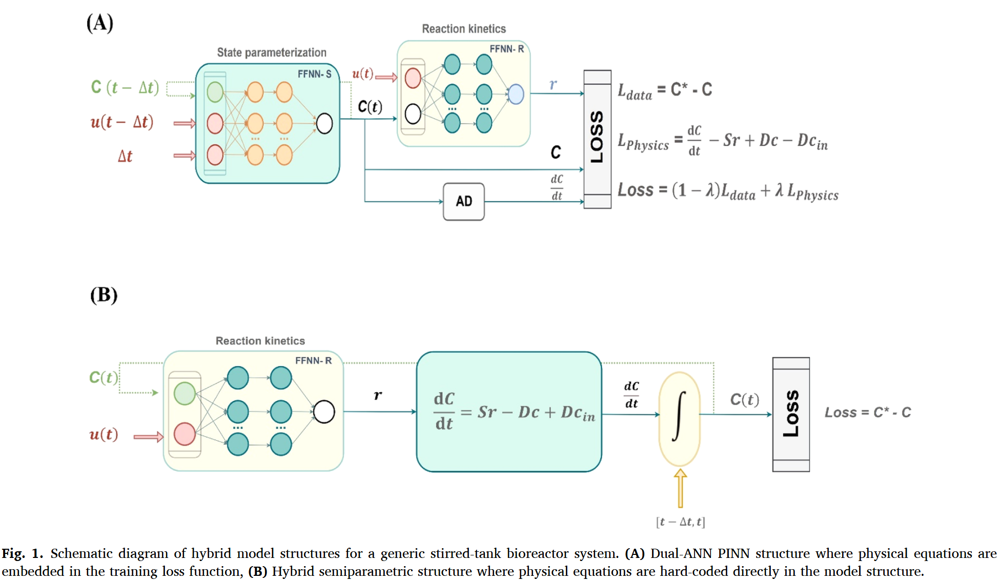

按照方程 $(2)$ 的结构，FFNN-S 被实现为一步预测变量。它接收状态变量 $C(t-\Delta t)$、控制输入 $u_{[t-\Delta t,t]}$（在时间区间内保持恒定）以及时间步长 $\Delta t$ 作为输入。由于数据稀疏性异构，时间步长 $\Delta t$ 可能不是恒定的。当它保持恒定时，可能会从 FFNN-S 输入中掉落。预测浓度通过神经网络输出计算如下：

$$
C\left( t \right) =C\left( t-\Delta t \right) +y\left( t \right) \Delta t.\tag{3}
$$

方程（3）确保当 $\Delta t = 0$ 时 $C(t) = C(t-\Delta t)$ ，从而消除了训练 PINN 的损失函数中对初始边界条件的需求。自动微分（AD）用于计算 $dC/dt$ ，这是物理损耗函数中所要求的。第二个神经网络 FFNN-R 计算当前时间点 $r(t) = y(t)$ ，作为当前时间浓度 $C(t)$ 和控制输入 $u(t)$ 的函数。PINN 的输出因此为 $C(t)$ 、$r(t)$ 和 $dC/dt$ 。这些数据用于计算数据损耗和物理损耗项。值得注意的是，材料平衡方程的先验知识并非直接嵌入模型结构中，而是用于计算物理损耗项。

### 生物反应器系统的混合半参数模型

本研究比较了双人工神经神经网络 PINN 与更传统的混合半参数方法。这里我们遵循之前发表的通用生物反应器混合模型概念（Oliveira，2004;Pinto 等，2022）在许多不同研究中应用。混合半参数模型见图。$(1B)$ 包含一个单一神经网络，将反应动力学建模为物种浓度和对照输入的函数。该网络与双人工关系网 PINN 结构的 FFNN-R 平行。计算出的反应动力学传递给由材料平衡方程导出的常微分方程系统。这与双人工神经网络 PINN 结构有根本区别，因为先验常微分方程直接硬编码在模型结构中。常微分方程在时间区间 $[t-\Delta t， t]$ 内进行数值积分，从初始条件 $C(t-\Delta t)$ 到当前浓度 $C(t)$ 。积分采用 Runge-Kutta 四阶方法(RK4)进行数值积分。这也是与 PINN 的另一个根本区别，因为混合半参数方法需要积分，而 PINN 方法则需要微分。然而，需要注意的是，过程离散以匹配采样时间步长会影响导数近似和整体解的准确性，正如 Cruz-Bournazou 等人(2022)所强调的。比较计算浓度与测量浓度可实现数据损失，但该损失在过程中被最小化。

### 训练方法

为确保可比性，两种建模方法的训练、验证和测试方法相同，唯独损失函数的计算在本质上不同。采用标准的自适应力矩估计法（ADAM）以最小化总损耗。具体来说，应用了 Kingma 和 Ba（2014）中描述的标准 ADAM 方法。在 PINN 结构中，具有两项的损失函数会被最小化。数据丢失项的计算方式为加权均方误差（WMSE），具体如下，

$$
\mathcal{L} _{data}=\frac{1}{N\times M}\sum_{i=1}^N{\sum_{j=1}^M{\left( \frac{C_{i,j}^{*}-C_{i,j}}{\sigma _{cj}} \right) ^2,}} \tag{4}
$$

其中，$N$ 为观测数，$M$ 为生化物种数，$C^∗_{i,j}$ 和 $C_{i,j}$ 分别为时间 $i$ 处生化物种 j 的测量浓度和模型预测浓度，$\sigma _{cj}$ 为生化物种 j 在观测集合上的浓度标准差。物理损耗的计算方法如下：

$$
e=\frac{dC}{dt}-Sr+DC-DC_{in}, \tag{5a}
$$

$$
\mathcal{L} _{physics}=\frac{1}{K\times M}\sum_{i=1}^K{\sum_{j=1}^M{\left( \frac{\Delta te_{i,j}}{\sigma _{cj}} \right) ^2,}} \tag{5b}
$$

其中, $K$ 表示共配点的数量，$e_{i,j}$ 是生化物种 $j$ 在共配点 $i$ 处的物理残余。配理点的数量与观测点的数量不一致。采用随机搭配方法将这些点分布在域空间中。此外，确保剩余总数 $(N + K)M$ 总是大于对偶 ANN 的 PINN 结构权重总数。最后，总损耗计算为两个损耗项的加权和：

$$
\mathcal{L} _{total}=(1-\lambda )\mathcal{L} _{data}+\lambda \mathcal{L} _{physics}. \tag{6}
$$

参数 $\lambda$ 由用户设置在 0 到 1 之间，以调整物理和数据丢失项的相对重要性。对于混合半参数结构，物理损耗项下降，因此总损耗简单地表示为 $\mathcal{L} _{total} = \mathcal{L} _{data}$。

梯度的计算是两种建模方法成功的关键步骤。在混合半参数情况下，常应用灵敏度方程（Oliveira， 2004;Pinto 等，2022）。然而，为了实现可比性，PyTorch（Baydin 等，2018）中实现的自动微分方法被应用于两种建模方法。

数据在 PINN 和半参数结构中均进行了一致划分，以确保可比性。具体来说，数据集被划分为训练、验证和测试三个子集，具体划分在不同案例研究中有所不同。为减少过拟合，案例研究 1 采用标准交叉验证，案例研究 2 采用了遵循 Pinto 等人（2022）的迷你批次随机正则化方案（详见第 3 节）。在比较不同 PINN 模型时，最佳模型的选择基于总测试损耗，同时考虑数据损耗和物理损耗项。在比较不同模型类型时，最佳模型的选择仅基于测试数据丢失项。

本研究中的所有方法均在 Python 3.11.5 中实现。结果是在搭载 Intel Core i9 CPU 和 32 GB 内存的 PC 上运行 Windows 11 Pro 时获得的。

## 案例

### 案例 1- 供给批次生物反应器中的物流生物质生长

案例研究 1 是一个非常简单的物流生长过程，在一个供给批次生物反应器中，仅有两个状态变量，由两个常微分方程描述。（7a，b），以及逻辑增长模型方程（7c）：

$$
\frac{dX}{dt}=\mu X-DX,\tag{7a}
$$

$$
\frac{dV}{dt}=F,\tag{7b}
$$

$$
\mu =\mu _{max}\left( 1-\frac{X}{X_{max}} \right) ,\tag{7c}
$$

其中，$X$ 是生物量浓度，$V$ 是液体体积，$μ$ 是比增长速率，$F$ 是进入反应器的进料速率，$D = F /V$ 是稀释速率，$μ_{max}$ 是最大比增长速率，$X_{max}$ 是最大生物量浓度。合成实验使用 Runge-Kutta 四阶/五阶常微分方程求解器动态模拟，$\mu _{max} = 0.3 h^{-1},X_{max} = 47.3 g/L$。数据点采样为 1 小时，噪声为 5%（为真实值的 5%）。采用中央复合材料设计（CCD），包含 3 个因素（初始生物量浓度为 0.5–2.5 克/升，初始体积为 1.9–3.5 升，进料速率为 $F$ ，范围为 0.05–0.5 升/小时），得出了包含 15 项实验的数据集。鉴于其基础的简单性，本案例研究的主要目标是评估用单次喂食批次实验数据训练模型是否能有效捕捉底层过程动态。因此，数据划分包括一个训练子集，包含一个反应堆实验（CCD 中心点对应 24 个观测值）、与一个反应堆实验的交叉验证（中心点实验的重复，对应 24 个观测值），以及对其余 14 个实验（336 个观测值）进行验证和测试。数据集及相应分区的详细信息见补充文件 1。

### 案例 2- Park & Ramirez 供料批次生物反应器

案例研究 2 涉及一个高度非线性的酵母细胞供给生物反应器，表达外来蛋白。该过程由五个状态变量和随时间变化的输入进料速率（Park 和 Ramirez，1988）为特征。状态变量包括生物量浓度（$X$）、葡萄糖浓度（$S$）、分泌蛋白浓度（$Pm$）、总蛋白浓度（$Pt$）和反应器中的液体体积（$V$）。生物反应器受以下材料平衡方程控制：

$$
\frac{{dX}}{{dt}}={\mu X}-{DX},\tag{8a}
$$

$$
\frac{dS}{dt}=-Y\mu X+D(S_{in}-S),\tag{8b}
$$

$$
\frac{dP_m}{dt}=\theta \left( P_t-P_m \right) -DP_m,\tag{8c}
$$

$$
\frac{dP_t}{dt}=f_pX-DP_t,\tag{8d}
$$

$$
\frac{dV}{dt}=F.\tag{8e}
$$

该工艺采用单一进料流，流量为 $F$ ，底物浓度为 $S_{in} = 20 g/L$ 。比反应速率由高度非线性的动力学方程定义：

$$
\mu =\frac{21.87S}{\left( S+0.4 \right) \left( S+62.5 \right)},\tag{8a}
$$

$$
\theta =\frac{4.75\mu}{0.12+\mu},\tag{8b}
$$

$$
\theta =\frac{4.75\mu}{0.12+\mu},\tag{8c}
$$

其中， $μ$ 为比生长速率，$Y$ 为底物/生物量产率系数，$θ$ 为外来蛋白分泌速率，$f_p$ 为外来蛋白合成速率。共模拟了 16 个实验，时间窗口为 0–15 小时，初始条件始终相同 $(X(0) = 1.0g/L，(0) = 5.0g/L，P_t(0) = 0g/L，P_m(0) = 0g/L，V(0) = 1.0L)$ ，但进给速率 $F$ 和时间轮廓各异。十五项实验由三因素 CCD 设计。这些因素是进料速率随时间的变化，定义如下：进料速率在 0 至 5 小时( $F_1$ )，进料速率在 5 至 10 小时($F_2$)之间，进料速率在 10 至 15 小时之间 ($F_3$)。每个因子的变速范围在 0 到 2 升/小时之间。对应 CCD 立方体和中心点的 9 个实验用于嵌入随机正则化的训练。对应 CCD 星点的 6 个实验被用于验证。第 16 项实验采用了最优对照进料速率曲线，在 10 升生物反应器（32.4 克）中实现最大可能分泌蛋白（Park 和 Ramirez，1988）。该最优对照实验被用作测试实验。过程仿真采用了 Runge-Kutta 四阶/五阶常微分方程求解器。数据点采样为 1 小时一次，噪声为 5%（为真实值的 5%）。数据集及相应分区的详细信息见补充文件 2。

## 结果

### 案例研究 1 生物反应器 PINN 模型的开发

对双人工神经神经网络 PINN 结构进行了深入研究，针对两个生物反应器案例研究，起始于更简单的逻辑式生长饲批反应器问题。关键目标是在高度数据稀疏条件下评估 PINN 方法，通过单一实验（24 个观测值）训练，并用剩余 14 个实验（336 个观测值）的数据进行验证和测试。所有试验的数据分区保持不变。用于计算物理损失的先验知识包括生物质和体积材料平衡方程($7a,b$)，但排除了逻辑增长率定律，方程($7c$)。数据丢失包括生物质，但排除了体积测量。这是有意为之，以评估 PINN 是否能预测未测量的体积动力学，因为物理损失项包含了精确定义体积动力学的方程($7b$)。

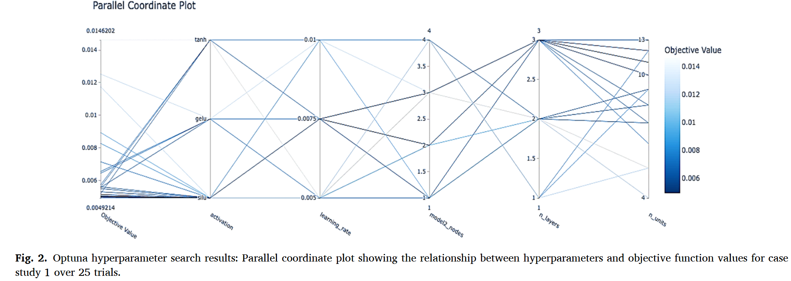

为了优化 PINN 结构，采用了采用贝叶斯优化和树状结构 Parzen 估计器（TPE）算法的自动框架 Optuna（Akiba 等，2019）进行系统超参数搜索。优化针对关键超参数，包括学习率、两个网络中的激活函数（tanh、SiLU 和 gelu）、层数（n_layers）、FFNN-S 中的节点（n_units）和 FFNN-R（model2_nodes;由于方程（$7c$）定义的未知动力学项的简单性，保留了单一隐藏层，历时 25 次尝试。此阶段，预优化的加权参数 $\lambda = 0.5$ 和配点数 $K$ （相当于 FFNN-S 大小 $K=NWS$ ）被排除在超参数搜索之外（下文详细讨论）。图 2 展示了 Optuna 搜索的平行坐标图，线代表试点，颜色表示目标值。Optuna 收敛到最优的双人工神经网络 PINN 配置，FFNN-S 大小为 $3×12×12×12×2$ ，隐藏层激活 SiLU，隐藏层激活 ×FFNN-R 为 $13×1$ ，tanh 激活，学习率为 $0.005$ 。该配置实现了总训练损失 $0.002$ ，总验证损失为 $0.007$ 。

通过对关键超参数的手动网格搜索进一步完善了自动搜索。保留了从 Optuna 导出的 SiLU 和 tanh 激活函数，但对大小和学习率在手动网格搜索中进行了进一步研究。每种 PINN 变体的详细性能指标见补充文件 3 的表 S1。人工优化收敛至最优 PINN 结构（FFNNS：$3 × 8 × 8 × 8 × 2$（含 SiLU，ffnn-R：1 ×5 × 1，含 tanh），学习率为 $0.0075$。略高的学习率被证明能加速收敛且不影响性能。该配置实现了相同的训练（$0.002$）和验证（$0.007$）的 Optuna 总损失，但权重数减少。

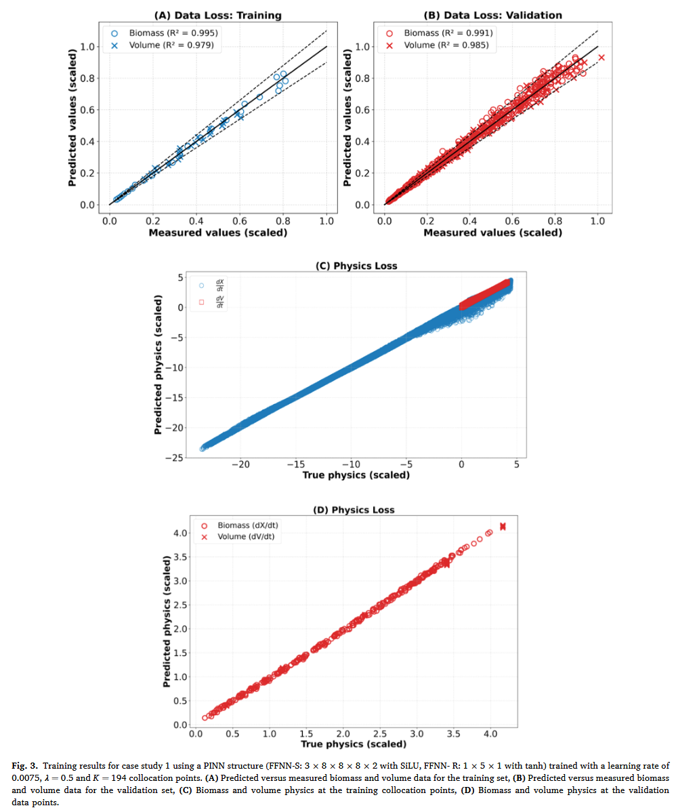

图 3A–D 展示了案例研究 1 所选 PINN 结构的预测能力及对物理约束的遵守情况。图 3 A,B 分别显示了模型在训练和验证实验中的表现。生物质（X）和体积（V）的决定系数均较高，且与 train 和 validation 数据子集相当。此外，最终列车数据损耗为 $0.0046$ ，几乎与噪声水平（$0.0049$）一致，显示出可忽略的过拟合。最终验证数据损耗为 $0.013$，几乎是噪声水平（$0.007$）的两倍，但仍然非常低。

图 3C 展示了模型在随机生成的配点处对底层物理定律的遵循情况。这些点在设计空间（生物量、体积和进给速率）中被采样，以强制执行相关作范围内的物理约束。在每个训练阶段，在已知范围内随机生成一组配点，以确保设计空间的全面覆盖。FFNN-S 输出导数（$dX/dt$ 和 $dV/dt$）通过自动微分计算在共配点，然后与控制微分方程的导数值进行比较。方程 7a,b 图中导数宇称图中观察到的强烈线性。图 3C 突出了模型准确满足支配微分方程的能力。此外，图 3D 将物理依从性分析扩展到验证数据点，表明物理约束在验证数据空间中也得到遵守。

总体而言，这些结果表明，双人工神经网络 PINN 在所有验证实验中，利用单一实验的训练数据成功描述了生物量和体积动力学。值得注意的是，体积动力学的预测完全依赖于嵌入的物理定律，方程 7b。这个简单的例子表明，当已知某一子状态变量的完整且精确的物理时，原则上不需要对这些状态变量的观测来训练 PINN。这凸显了 PINN 相较于传统神经网络的一个关键优势，因为后者总是需要数据进行训练。

### 案例研究 2 的生物反应器 PINN 模型开发

双人工反星神经网络 PINN 框架被应用于更复杂的 Park and Ramirez（1988）供给批次生物反应器基准测试，该基准具有更高的状态变量维度（生物量（$X$）、底物（$S$）、总蛋白质（$P_t$）、分泌蛋白（$P_m$）和体积（$V$））、高度非线性动力学和时间变化的控制输入。关键目标是评估在稀疏数据集（15 个 CCD 实验中有 9 个）训练的 PINN 是否能准确预测 Park 和 Ramirez（1988）推导出的最佳产出情景（应用最佳饲料配置时分泌 32.4 克蛋白）。物理损失包括五个状态变量的物质平衡方程，方程 8 a-e，并排除了反应动力学方程。（9a-c）。采用了案例研究 1 相同的配理积分方案。数据丢失包括除体积（$X$、$S$、$P_t$ 和 $P_m$）外的所有状态变量的测量。体积训练完全依赖物理损耗项（基于方程 8 e），如案例研究 1 所示。CCD 中心和方形实验（9）用于训练，CCD 星形实验（6）用于验证。通过随机正则化，将过度拟合最小化，随机选取 9 个训练实验中的 6 个计算每个时代的训练数据损失。基于案例研究 1 中已确定的最优双人工神经神经元 PINN 结构特征，按照补充文件 3 表 S2 的详细描述，进行了对最优 FFNN-S 和 FFNN-R 尺寸的人工网格搜索。该过程收敛至最优结构（FFNN-S： 6 × 17×17×5，搭配 SiLU，FFNN-R： 1 × 6 × 3，搭配 TANH）。图 4A–D 显示所选双人工神经网络 PINN 的训练、验证和测试性能。训练数据集中五个状态变量的预测值与测量值之间存在强烈一致性，见图 4A。值得注意的是，所有表现出优异训练表现的状态变量的决定系数（R²）均超过 0.99。然而，该模型推广到测试实验时显著退化，见图 4B。$X(0.95)$、$S(0.90)$ 和 $V(0.95)$ 的（R2）值保持较高，但 $P_t(0.58)$和 $P_m(0.68)$ 性能明显下降。图 4 C 展示了 PINN 在随机生成的配址点上对底层物理定律的遵循。沿对角线的紧密对齐证明了对物理约束的高度遵循。然而，物理方程对测试数据点的推广受到严重影响，见图 4D，尤其是与蛋白质动力学相关的数据点（$P_t$ 和 $P_m$），这些数据点表现出显著的散布。

  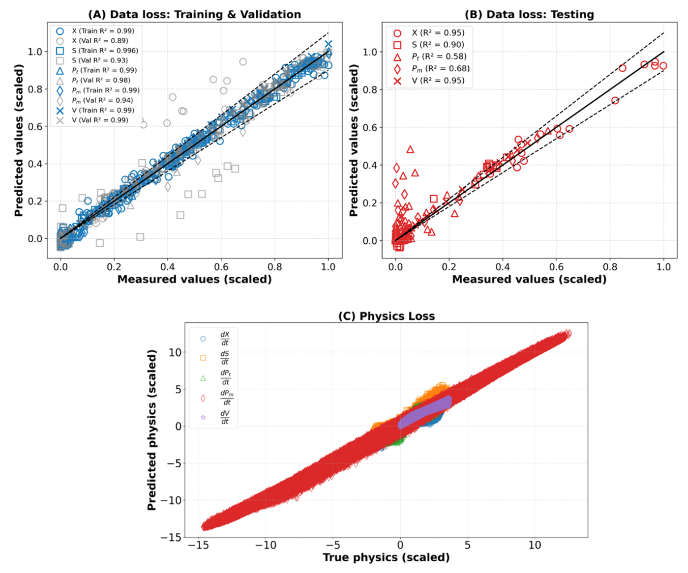
  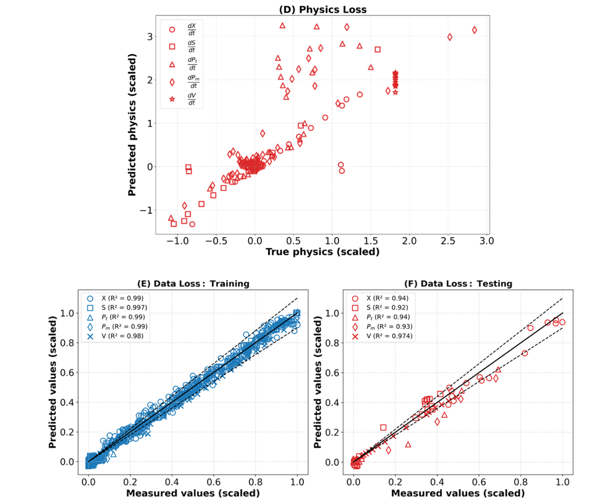
  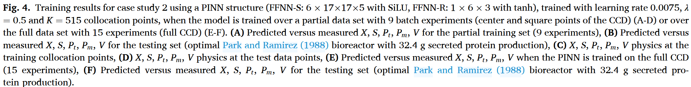

### 训练融合

PINNs 的训练因需要同时最小化训练项和物理损失项而复杂。本研究采用了最常见的方法，即将全损函数（定义为物理和数据损失项的加权和）最小化，公式（6）。在这种方法中，两个损失项都必须正确归一化至关重要。图 5 A,B 阐明了案例研究 1 和 2 中选定的双人工神经网络 PINN 结构的训练收敛行为，包括数据丢失、物理损失和总损失在不同训练时代的演变。在这两种情况下，都观察到稳定但噪声较大的收敛行为，表现为总损耗函数初始迅速下降，涵盖数据和物理损失，随后在低损耗值下出现长时间的停滞期。在案例研究 1 中，随机性通过随机选择搭配点引入物理损失函数，该随机通过神经网络参数的更新传播到数据丢失函数。在案例研究 2 中，随机性既源于物理损失（随机搭配点）也源于数据丢失（计算数据丢失的随机实验）。物理损耗项通常在数据损耗项以下趋于稳定。这由数据残差固有但物理残差中不存在的随机实验误差来解释。值得注意的是，数据丢失项趋于接近 WMSE 噪声水平（案例 1 为 $0.0049$，案例 2 为 $0.013$），表明两种情况均成功缓解了过拟合。

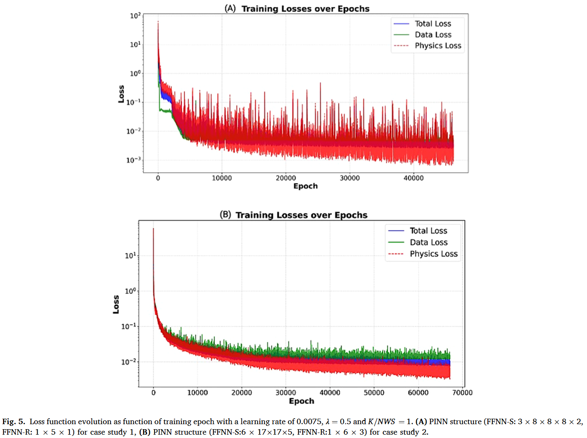

### 数据损失与物理损失的相对重要性

加权参数 $λ$ 决定物理损失（$λ$）和数据损失（$1 - λ$）的相对重要性。λ 的选择可能显著影响训练收敛度和整体模型表现。上述结果假设物理和数据丢失项的重要性相同（$λ = 0.5$）。图 6A 显示了 $λ$ 对案例研究 1 中选定的双人工神经神经网络 PINN 结构最终训练和验证损失的影响。当 $λ = 0.0$ 时，物理损失不会被最小化，因此 PINN 类似于传统的神经网络模型。如预期，当 $λ = 0.0$ 时，PINN 成功描述了训练数据（最终数据丢失率较低）。然而，验证损失是所有运行中最高的。这凸显了“物理学习”对于 PINN 推断未知观测的重要性。当 $λ$ 从 $0.25$ 增加到 $0.9$ 时，训练和验证物理损失明显下降。值得注意的是，这伴随着验证数据丢失的下降趋势，表明物理与数据学习之间的协同效应。将 $λ = 0.5$ 设为最低损耗值，从而在数据损耗项与物理损耗项之间实现最佳权衡。图 6B 对案例研究 2 中选定的双人工神经网络 PINN 结构显示了类似结果。与前例一样，加权因子 $λ = 0.5$ 提供了数据与物理损失最小化之间的最佳平衡。总的来说，这些结果凸显了 PINN 框架中数据与物理学习组成部分之间的协同效应。学习物理对 PINN 的外推能力至关重要，这在下文中进一步讨论，这在传统神经模型中具有明显优势。

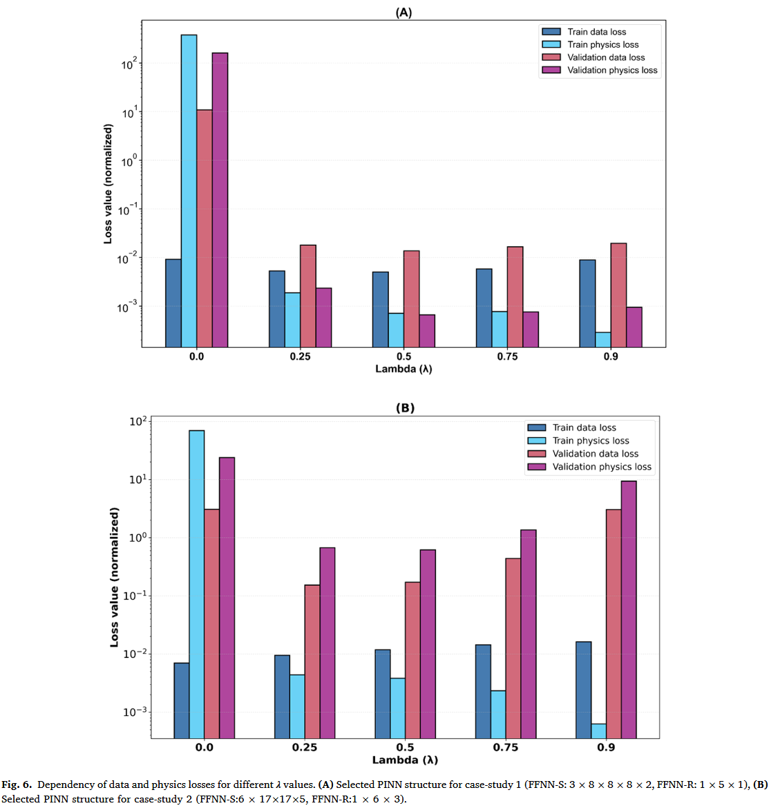

### 采样点的影响

采样点（$K$）的数量直接影响物理损失最小化，间接影响训练收敛和整体模型指标。本研究中，配址点数被设定为 FFNN-S（NWS）权重数量的倍数。因此，选择 K/NWS≥1 即可获得足够的物理残差，即使没有数据点也能训练 FFNN-S。理论上，提高 $K/NWS$ 比率可以积极影响训练和验证指标。图 7A,B 展示了 $K/NWS = 1， 2， 3$ 比值对案例研究 1 和 2 中选定的双人工神经神经网络 PINN 结构训练和验证损失项的影响。如预期，增加 K/NWS 通常会减少训练和验证物理损失项，但案例研究 1 的改善比案例 2 更显著。然而，物理损耗减少并未反映在数据损耗项中，数据损耗项对 $K/NWS$ 比值似乎相对不敏感。结论是 $K/NWS = 1$ 就足以实现稳健的模型收敛。重要的是，计算成本（$CPU$）与 $K/NWS$ 呈线性递增。因此，1 的比例在模型准确性与计算效率之间提供了最佳平衡。因此，本研究所有试验均采用了 $K/NWS=1 $的值。

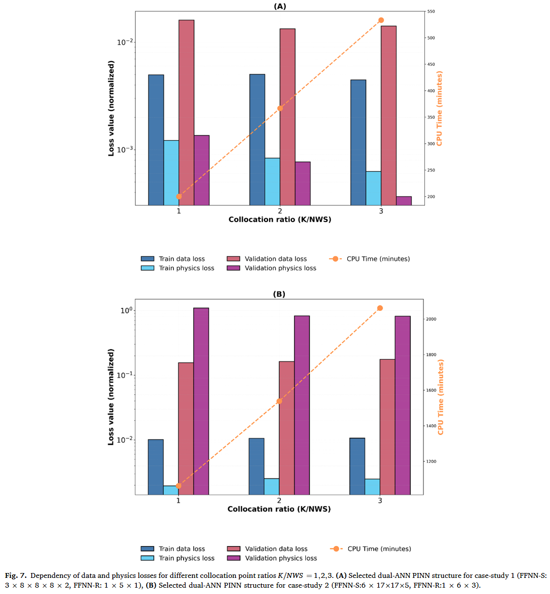

### 单 ANN 与双 ANNPINN 模型的比较

虽然此前大多数发表的研究都涉及单人工神经网络结构（例如 Raissi 等，2019;Wang 等，2021,2022;Yang 等，2024;Jul-Rasmussen 等，2025）本研究聚焦于对对抗反反神经网络 PINN 结构。为了在生物反应器建模环境中阐明这一方面，系统地比较了双人工神经网络 PINN 结构与单人工神经神经网络 PINN 结构，后者所有状态变量和动力学速率均由单一 FFNN 计算。为确保公平比较，具有相同大小（隐藏层数和节点数）的模型接受相同的训练、验证和测试流程。每个研究单人工神经神经网络 PINN 结构的详细性能指标分别见补充文件 3 的表 S1 和 S2，分别针对案例研究 1 和 2。图 8A,B 展示了在等效尺寸结构下，以数据、物理和总损耗比（单 ANN PINN）/（双 ANN PINN）表示所得结果。在案例研究 1 图 8A 中，训练损失比中位数接近 1，表明大小相当的单 ANN 和双 ANNPINN 在训练表现上表现相似。然而，在验证数据集中观察到显著差异，损失比显著大于 1，尤其是在数据丢失和全损部分。图 8B 将损失比分析扩展到更复杂的案例研究 2.单 ANN 和双 ANN 的 PINN 之间的区别在这里并不那么简单。单人工神经网络结构的训练性能更好，这表明在涉及复杂物理时，双人工神经网络结构的训练负担增加了。然而，双人工神经网络 PINN 的验证数据丢失较低。综合两个案例研究，可以得出结论，dualANN PINN 更准确地捕捉了非线性过程动态，具有更高的预测力。由于两种结构都经历了相同的训练程序，双人工神经网络 PINN 的预测优势可能归因于结构与实际过程的更对齐。具体来说，双人工神经神经网络 PINN 假设反应速率静态且完全依赖于浓度，而单人工神经神经网络 PINN 则动态参数化动力学速率，这种表述并未反映真实的系统行为。事实上，双人工神经网络 PINN 遵循模块化设计，神经网络模型基于所研究过程的拓扑和功能结构相互连接（Thompson 和 Kramer，1994）。换句话说，双 PINN 结构基于经典混合建模意义上的先验知识，在描述底层过程方面具有额外的优势。

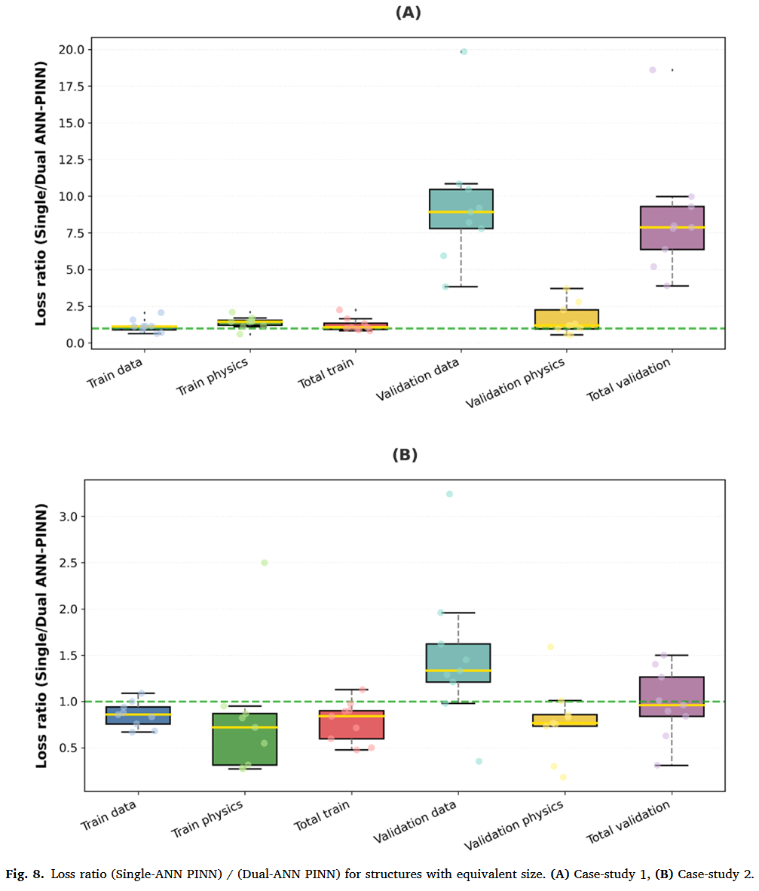

### 与混合半参数建模的比较

多项建模研究显示，PINNs 比传统神经网络产生更低的预测误差（例如，Bangi 等，2022;Moayedi 等，2024;Velioglu 等，2025）。只有少数研究比较了 PINNs 与混合半参数建模（Yang 等，2024;Jul-Rasmussen 等，2025）。分析两种方法在相同数据和先验知识下表现是否不同尤其有趣。为评估这一点，选定的双人工神经网络 PINN 结构、混合半参数和传统神经网络结构（不含物理成分）进行了比较。混合半参数模型的 FFNN-R 结构和传统 FFNN 模型的 FFNN-S 结构通过手动网格搜索系统性评估，采用与双人工神经网络 PINN 相同的训练、验证和测试程序。绩效指标的详细信息分别见案例研究 1 和 S2 的表 S1 和 S2（补充文件 3）。每个类别中最佳模型的选择基于验证损失，而所选最佳模型的比较基于测试数据损失。案例研究 1 的测试实验呈现了一个特别具有挑战性的情景，因为时间尺度被延长至 166 小时，以评估模型进行时间外推的能力。案例研究 2 的测试实验同样具有挑战性，因为模型输入了最佳供给速率曲线（训练时未见），并被要求预测培养结束时最大化总分泌蛋白浓度的工艺动态。结果总结见表 1。

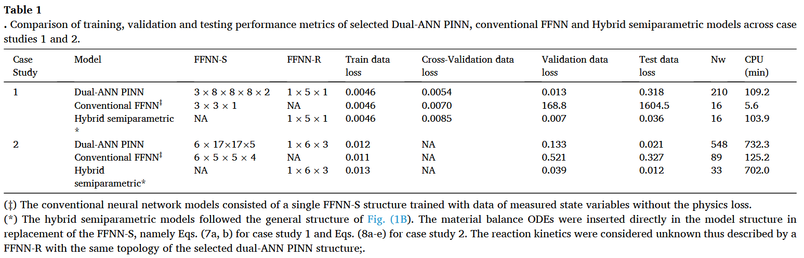

在案例研究 1 中，双人工星根 PINN 模型、混合半参数模型和传统 FFNN 模型均实现了相同的最终训练数据丢失（见表 1）。然而，混合半参数模型的预测准确性优于 PINN 模型（测试数据丢失降低~50%）。图 9 A,B 进一步详细介绍案例研究 1 测试实验的预测曲线。双人工反根神经网络 PINN 和半参数模型均有效近似实验数据散布中的增长曲线。相比之下，传统的 FFNN 严重未能预测真实的动态轨迹。在扩展时间外推条件下评估时，混合半参数模型收敛为稳定的最终生物量浓度，相对于真实值偏移 $8%$。然而，dualANN PINN 表现出不稳定的行为，随着时间推移会偏离最终生物量浓度。这种双人工神经神经网络 PINN 的明显缺点并非偶然，因为在多个实验中都观察到类似行为。此外，混合半参数模型展示了完美体积预测如图 9B，因为模型中嵌入了完整的物理结构，唯一的误差来源是数值积分。相比之下，PINN 随时间误差递增，可能是由于学习到的 ddVt = F 方程外推受限。值得注意的是，传统的 FFNN 无法预测体积，因为训练时无法获得体积数据点。图 9 C,D 展示了所有 CCD 实验在较长时间内的数据丢失，证实混合半参数模型在时间外推条件下持续优于 PINN 模型。值得一提的是，单一实验的训练是数据稀疏的极端例子。将训练批次增加到两个显著减少了混合半参数偏移，并显著提升了 PINN 外推性能（结果未显示）。

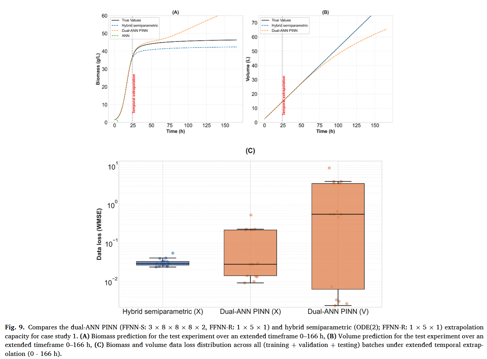

至于案例研究 1，PINN 混合半参数模型和传统 FFNN 模型在案例 2 中几乎实现了相同的最终训练数据丢失，表明训练数据的描述能力相当。然而，Park 和 Ramirez（1988）最优实验的预测准确度在三个模型之间差异很大。混合半参数模型的测试数据损失最低，达到 0.039，其次是 PINN 模型，增长了 3.4 倍。如预期，传统的 FFNN 模型预测准确率最低，测试数据丢失相比混合半参数模型增加了 13.1 倍。图 10 A–F 描绘了最优 Park 和 Ramirez（1988）送料率曲线的状态变量预测轮廓。图 10F 显示了分段恒定的最佳进料速率曲线（1 小时步长），以实现最佳蛋白质产量（$P_m（15）V（15） = 32.4g$，培养 15 小时）。混合半参数模型比其他方法更准确地预测了真实的过程动态。最终预测的分泌蛋白为 32.48 克，几乎与最优值 32.4 克相同。相比之下，双人工神经网络 PINN 相比混合半参数模型表现明显不足，尤其是在 $S、P_t、P_m$ 和 $V$ 的预测方面。最终预测的分泌蛋白仅为 28.16 克（低估 13.1%）。传统 FFNN 显示出与真实过程剖面最大的偏差（与案例研究 1 相同，传统 FFNN 模型未使用体积数据训练，因此无法预测体积）。值得注意的是，传统的 FFNN 模型偶尔会预测 $S、P_t$ 和 $P_m$ 的负浓度值。在双人工神经网络 PINN 的情况下，由于训练过程中的物理正则化，这一问题在很大程度上得到了缓解（基板除外）。基质面临重大挑战，因为其浓度在最后四个培养小时内几乎降至零。双人工神经网络 PINN 无法应对负浓度，最可能导致材料平衡方程外推不准确（物理学中的不准确性）。混合半参数模型实际上消除了负浓度，因为材料平衡方程被数值积分。

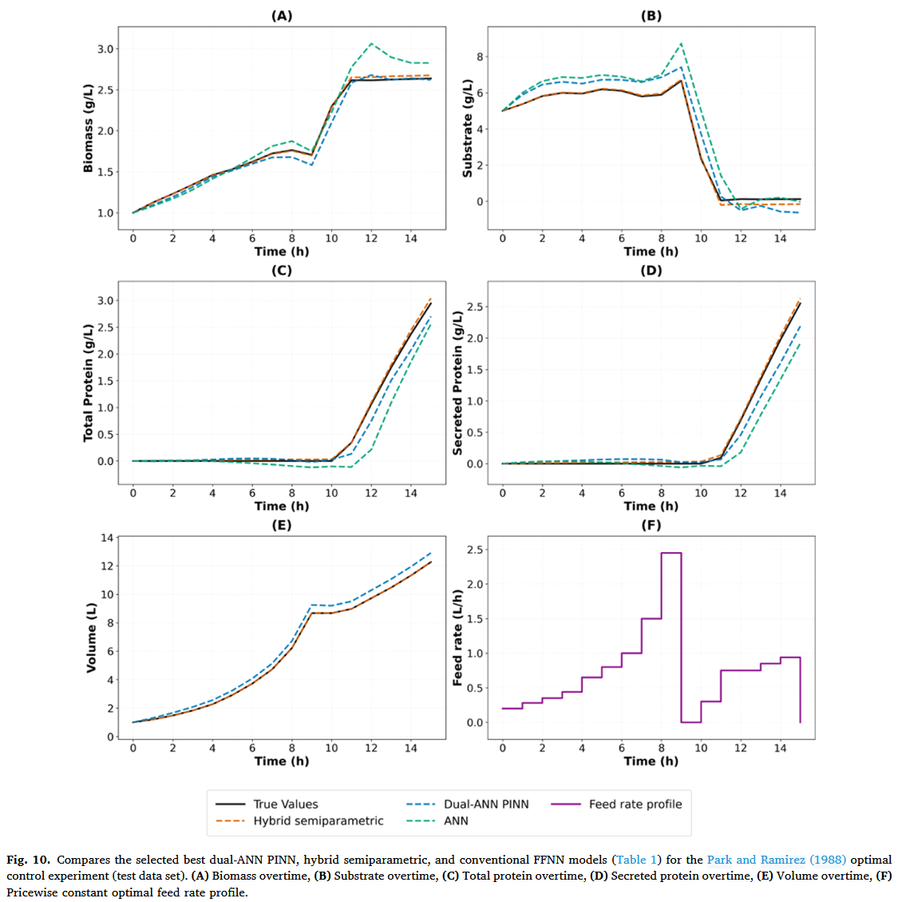

## 讨论

本研究比较了双人工神经神经网络 PINN 结构与混合半参数生物过程建模，并在两个不同机制复杂度的案例中进行了评估。比较分析阐明了每种建模范式的优势和局限性，特别是在数据稀缺的环境和外推任务下。案例研究 1 涉及由相对简单动力学支配的逻辑微生物生长，双人工神经网络 PINN 和混合半参数模型在数据领域均取得了优异的预测性能。双人工神经网络 PINN 仅通过生物质测量有效推断了未观测的体积动态，展示了将物理知识嵌入损失函数以预测未观测目标变量的潜力。然而，如图 9 所示，混合半参数模型在扩展时间外推中始终优于双人工神经神经网络 PINN 模型，受益于模型结构中控制方程的直接积分。

案例研究 2 则呈现了一个显著更复杂的情景，涉及五个相互作用的状态变量、非线性反应动力学以及时间变化的控制输入。在此条件下，双人工神经神经网络 PINN 的性能显著下降，尤其是在推断分泌蛋白（Pm）和总蛋白（Pt）动力学方面。混合半参数模型再次优于双人工神经网络 PINN 模型，提供了更低的训练和测试损失值，以及对所有状态变量的更准确预测。双人工神经网络 PINN 难以有效推广到未见的馈源曲线，这一结果与文献研究报告的 PINN 在捕捉非线性动力学方面存在缺陷，原因是梯度病理和优化过程的刚度，解空间的不同部分在不同尺度上存在差异（Wang 等，2021,2022）。Li 和 Feng（2022）强调了在训练过程中平衡物理和数据丢失的重要性，我们的研究通过手动调整加权参数 λ 来应对这一挑战，详见第 4.4 节。相比之下，混合半参数模型在两个案例研究中都保持了稳定且准确的性能。其架构直接将微分方程纳入模型结构，实现了机械知识的透明整合，降低了训练复杂度，并提升了收敛性。Jul-Rasmussen 等人（2025）也报告了类似结果。

不足为奇的是，传统 FFNN 在两个案例中表现始终不理想，原因是其缺乏机制结构，表现出较高方差和较差的泛化能力，相较于双人工反神经网络 PINN 和混合半参数模型。这些发现得到了 Velioglu 等人（2025 年）的最新研究的支持，他们提出了一种基于微分代数方程的启发式方法，以确定 PINN 是否能估计部分已知系统中的隐藏态。他们的结果表明，即使缺乏完整的本构方程，PINNs 在外推和状态重建能力上相较于传统神经网络仍有提升。这与本研究一致，即双人工神经网络 PINN 准确地超越了训练域，针对未测量体积等未观测状态。然而，这种外推优势在更复杂的系统中并不保证，正如案例研究 2 所强调的那样。

近期方法论贡献进一步揭示了 PINN 的局限性。Subramanian 等人（2023）提出了针对高误差区域的自适应配置方案，以提升物理学习和物理外推能力。虽然本研究未采用自适应重抽样，但采用了随机搭配策略，在有界状态空间的每个训练纪元重新生成配址点。这种方法在强制执行广泛的物理覆盖和稳定物理损失方面非常有效。为避免过拟合，Bajaj 等人（2023）提出了高斯过程（GP）平滑化策略。本研究采用了传统方法，例如案例研究 1 采用交叉验证，案例研究 2 则采用了通过小批量数据重抽样的随机正则化。此外，本研究依赖于标准自动微分，与传统 PINN 方法一致，但 Chiu 等（2022）的结果表明，耦合自动-数值微分法（Can-PINN）混合微分策略可能提升复杂物理系统求解的计算效率和准确性，这是未来研究中值得探讨的方向。

总体而言，本研究突出了每种建模框架的细致入微之处。混合半参数模型在明确定义的工艺范围内具有高准确性和稳定性。当模型的骨干由机械方程（如方程 1a，b ）精确定义时，这种情况尤为明显。一个关键优势是物理外推不会因训练限制而受到威胁。然而，数值积分的要求可能成为限制，尤其是对于刚性常微分方程系统。PINNs 也具有高度潜力，能够同时从数据和物理中学习，对于部分已知机制知识的问题可能更具灵活性。它们明显优于传统人工神经网络，但其多目标训练更为复杂。虽然 PINN 不受混合半参数模型中常微分方程相关的刚度问题影响，但其主要缺点在于对先前物理方程的外推。这种外推对所用训练方法极为敏感，这会显著影响 PINN 预测的可靠性。因此，这些范式的选择应由建模目标决定，取决于是否需要高保真插值还是稳健外推，以及现有工艺知识的性质以及遇到的数值实现挑战。

## 结论

本研究比较了双人工神经网络 PINN、混合半参数和传统人工神经网络结构在通用生物反应器建模中的两个案例研究。双人工神经网络 PINN 的一个关键方面是动态状态变量的解耦和静态反应动力学参数化，这持续提升了泛化能力。与以往研究一致，我们的结果强调，PINNs 通过将物理纳入损失函数，在数据稀疏度高的情况下，表现出比传统人工神经网络更强的外推能力。混合半参数模型将物理方程直接嵌入模型结构中，通常比双人工神经网络 PINN 方法提供更好的预测准确性和更稳定的收敛性，尤其是在具有时间变化控制输入的高维非线性动力系统中。研究结果显示，尽管 PINN 架构提供了更灵活的方式来整合部分先验知识和数据，但其性能对系统复杂度、超参数选择和潜在训练不稳定性非常敏感。由于它们不需要集成常微分方程，非常适合需要快速模型仿真的过程控制应用。相比之下，混合半参数模型继承了与机制方程相关的所有数值挑战。这可能导致不可行或僵硬的系统，需要显著延长的模拟时间和较慢的训练，最终限制了实际应用。双人工神经网络 PINN 框架因物理外推误差超出训练域，在控制输入（送料速率）时变和批次变化方面遇到困难。相比之下，将过程控制输入明确纳入混合半参数模型的机械部分，可以实现更稳健的过程控制设计，这也是该方法的显著优势。两种混合建模方法的选择最终取决于在具体生物反应器问题中，仔细权衡它们各自的优缺点。

## 补充材料以及原文链接

📌 **欢迎关注 FEMATHS 小组与山海数模，持续学习更多数学建模与科研相关知识！**

原文链接在这里：[https://www.sciencedirect.com/science/article/pii/S0098135425003564?via%3Dihub](https://www.sciencedirect.com/science/article/pii/S0098135425003564?via%3Dihub)

这篇文章的补充材料放在了线上可见： [https://www.sciencedirect.com/science/article/pii/S0098135425003564?via%3Dihub](https://www.sciencedirect.com/science/article/pii/S0098135425003564?via%3Dihub)
