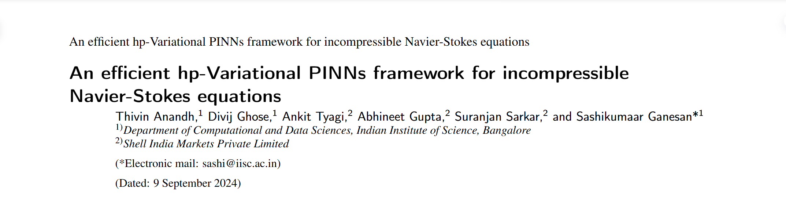

这是一篇使用 VPinn 来求解 Navier-Stokes 方程的论文。

# An efficient hp-Variational PINNs framework for incompressible Navier-Stokes equations

我们先来看看这篇论文的摘要：

## 摘要

英文原文：

In this paper, we propose a novel high order unfitted finite element method on Cartesian meshes for solving the acoustic wave equation with discontinuous coefficients having complex interface geometry. The unfitted finite element method does not require any penalty to achieve optimal convergence. We also introduce a new explicit time discretization method for the ODE system resulting from the spatial discretization of the wave equation. The strong stability and optimal hp-version error estimates both in time and space are established. Numerical examples confirm our theoretical results.

翻译：

在本文中，我们在笛卡尔网格上提出了一种新型的高阶未有限元方法，用于通过具有复杂界面几何形状的不连续系数来求解声波方程。未实现的有限元方法不需要任何惩罚来实现最佳融合。我们还为波动方程的空间离散化引起的 ODE 系统引入了一种新的显式时间离散方法。建立了强大的稳定性和最佳的 HP-version 误差估计时空和空间的估计。数值示例证实了我们的理论结果。

这篇论文主要看他的方法，他使用

波方程是描述波传播现象的数学物理学中的基本方程。它在科学和工程中发现了各种应用，包括地球科学，石油工程和电信（请参阅[30，31]以及其中的参考文献）。令 ω⊂R2 为有界的 Lipschitz 域，t> 0 为时间间隔的长度。我们在本文中考虑声波方程
