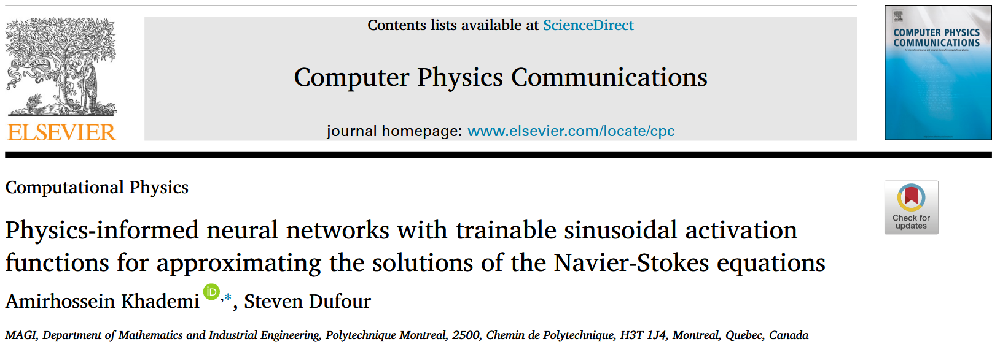
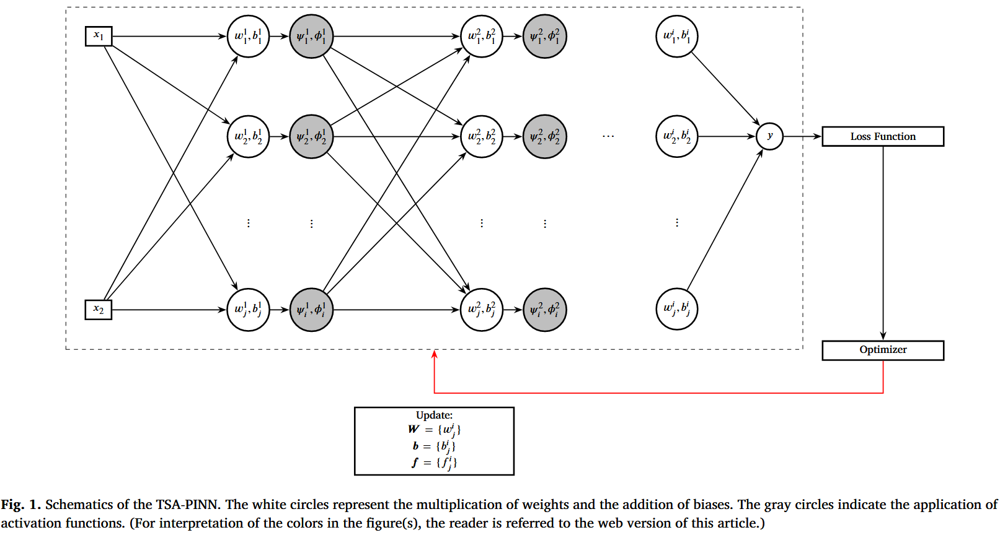

这是一篇使用 VPinn 来求解 Navier-Stokes 方程的论文。

# Physics-informed neural networks with trainable sinusoidal activation functions for approximating the solutions of the Navier-Stokes equations

我们先来看看这篇论文的摘要：

## 摘要

英文原文：

We present TSA-PINN, a novel Physics-Informed Neural Network (PINN) that leverages a Trainable Sinusoidal Activation (TSA) mechanism to approximate solutions to the Navier-Stokes equations. By incorporating neuronwise sinusoidal activation functions with trainable frequencies and a dynamic slope recovery mechanism, TSAPINN achieves superior accuracy and convergence. Its ability to dynamically adjust activation frequencies enables efficient modeling of complex fluid behaviors, reducing training time and computational cost. Our testing goes beyond canonical problems, to study less-explored and more challenging scenarios, which have typically posed difficulties for prior models. Various numerical tests underscore the efficacy of the TSA-PINN model across five different scenarios. These include steady-state two-dimensional flows in a lid-driven cavity at two different Reynolds numbers; a cylinder wake problem characterized by oscillatory fluid behavior; and two time-dependent three-dimensional turbulent flow cases. In the turbulent cases, the focus is on detailed near-wall phenomenaincluding the viscous sub-layer, buffer layer, and log-law region—as well as the complex interactions among eddies of various scales. Both numerical and quantitative analyses demonstrate that TSA-PINN offers substantial improvements over conventional PINN models. This research advances physics-informed machine learning, setting a new benchmark for modeling dynamic systems in scientific computing and engineering.

翻译：

我们介绍 TSA-PINN，一种新型物理知情神经网络（PINN），利用可训练正弦激活（TSA）机制近似纳维-斯托克斯方程的解。通过结合具有可训练频率的神经元正弦激活功能和动态斜坡恢复机制，TSAPINN 实现了卓越的准确性和收敛性。其动态调节激活频率的能力使复杂流体行为的高效建模成为可能，从而缩短训练时间和计算成本。我们的测试超越了典型问题，还研究了较少被探索且更具挑战性的情景，这些通常对以往模型来说是困难。各种数值测试强调了 TSA-PINN 模型在五种不同情景中的有效性。这些包括在两个不同雷诺数下，盖子驱动腔内的稳态二维流动;一个以振荡流体行为为特征的圆柱尾流问题;以及两个时间相关的三维湍流情况。湍流情况下，重点关注详细的近壁现象，包括粘性亚层、缓冲层和对数定律区域——以及不同尺度涡流之间的复杂相互作用。数值和定量分析均表明，TSA-PINN 相较传统 PINN 模型有显著改进。这项研究推动了基于物理的机器学习，为科学计算和工程中动态系统建模树立了新标杆。

<!-- truncate -->

## 方法

### 物理信息神经网络(PINN)

PINN 将观测数据和已知的控制方程整合到神经网络模型中，以近似物理系统的解。具体来说，他们估计状态向量 $\hat{u}(x,t)$ ,使其近似实际系统状态 $u(x,t)$，其中 $x \in \mathbb{R}^d$ 表示域内的空间坐标，$t \in [0,T]$ 表示时间。

系统的控制动力学被非线性算符 $\mathcal{N}$ 封装，系统的行为通过微分方程建模：

$$
\frac{\partial u}{\partial t}+\mathcal{N} \left( u;x,t \right) =0. \tag{1}
$$

PINN 模型旨在最小化包含数据忠实度项和物理信息项的损失函数。数据忠实度项旨在最小化预测解与参考解之间的差异

$$
L_{\mathrm{data}}=\sum_{i=1}^{{N}_{\mathrm{data}}}{\left\| \hat{{u}}({x}_i,t_i)-{u}({x}_i,t_i) \right\| ^2,}\tag{2}
$$

其中， $N_{data}$ 是可用数据点的数量，$(x_i,t_i)$ 表示这些点的时空坐标。

物理学基础的术语确保预测遵循控制的偏微分方程（PDE），

$$
L_{\mathrm{phys}}=\sum_{j=1}^{{N}_{\mathrm{phys}}}{\left\| \mathcal{N} (\hat{{u}}({x}_j,t_j);{x}_j,t_j) \right\| ^2,}\tag{3}
$$

其中， $N_{phys}$ 表示物理定律被执行的采样点数量。

训练的目标是最小化合并损失函数

$$
{L}_{{PINN}}={L}_{{data}}+{L}_{{phys}},\tag{4}
$$

我们想要的近似解 $\hat{u}(x,t)$ 收敛于真实解 ${u}(x,t)$ 。这一过程确保模型不仅符合观测数据，还满足支配系统的物理原理。

### 神经网络

普遍逼近定理证明，即使是带有单一隐藏层的简单多层感知器，也可以通过增加神经元数量，以任意精度近似任意连续函数[43–45]。PINN 模型中广泛使用的架构是前馈神经网络（FFNN），由多个完全连接的层组成。每个神经元在某一层的输出描述为

$$
{f}_i({x};{w}_i,{b}_i)={\alpha }({w}_i\cdot {x}+{b}_i),\quad \mathrm{for}\quad i=1,2,...,n,\tag{5}
$$

其中， $x$ 表示输入向量，$w_i$ 和 $b_i$ 分别是第 $i$ 个神经元的权重向量和偏置。非线性激活函数 $\alpha$ 使网络能够捕捉数据中的复杂关系。

在 Navier-Stokes 方程的近似解中，FFNN 接收空间和时间坐标 $X = (t,x,y,z)$ 作为输入。网络输出由速度场 $U(X) = (u, v, w)$ 和压力场 $P(X)$ 组成，表达式为

$$
{U\theta }({X}),{P\theta }({X})={f}_{\mathrm{NN}}({X},{\theta }),\tag{6}
$$

其中，$f_{NN} (X,θ)$ 是近似速度场和压力场的神经网络函数，$θ = w,b$ 表示网络中所有可训练参数。训练网络涉及通过最小化预测与实际物理场之间的差异来优化 $θ$ ，这些差异由损失函数(方程(1)、(2)、(3)和(4))表述。最终的 FFNN 表示写作：

$$
f_{NN}\left( x,\theta \right) =\left( a_L\circ \alpha \circ a_{L-1}\circ \cdots \circ \alpha \circ a_1 \right) \left( x \right) , \tag{7}
$$

其中， $a(x) = wx+b.$

### 物理信息神经网络的可训练正弦激活

#### 可训练的正弦激活机制

激活功能的目的是判断神经元应激活还是保持不活跃。在缺乏非线性激活函数的情况下，模型只需利用权重和偏差进行线性变换，这对应于线性回归模型。假设不使用非线性激活函数，这意味着 $f(z)= z$ 。在这种情况下，每层的输出仅为（见图 1）

$$
a_i=z_i=w_ia_{i-1}+b_i,\tag{8}
$$

从输入层开始

$$
{a}_{{1}}={w}_{{1}}{x}+{b}_{{1}}, \tag{9}
$$

第二层

$$
\begin{aligned}
a_2&=w_2a_2+b_2=w_2(w_1x+b_1)+b_2\\
&=w_1w_2x+w_2b_1+b_2\\ \tag{10}
\end{aligned}
$$

以及第三层

$$
a_3=w_3a_2+b_3=w_3(w_2w_1x+w_2b_1+b_2)+b_3
\\
\qquad \qquad =w_3w_2w_1x+w_3w_2b_1+w_3b_2+b_3.\tag{11}
$$

这一过程持续到到达最后一层 $L$ 。

$$
a_L=w_Lw_{L-1}...w_2w_1x+(w_Lw_{L-1}...w_2b_1+w_Lw_{L-1}...w_3b_2+\cdots +b_L).\tag{12}
$$

在最后一层，网络输出可以写成

$$
{y}={w}_{\mathrm{total}}{x}+{b}_{\mathrm{total}}\tag{13}
$$

其中，$w_{total} = w_Lw_{L−1}...w_2w_1$ 是将所有权重矩阵相乘而成的矩阵，$b_{total} = （w_Lw_{L−1} ...w_2b_1 + w_Lw_{L−1} ...w_3b_2 + ⋯ + b_L）$ 是所有偏置项的组合。该表达式是输入 $x$ 的线性变换。网络中没有引入非线性，因此无论网络深度（层数多少），输出仍然是输入（13）的线性函数。对于标准全联通神经网络（FFNN），第 $k$ 层神经元 $i$ 的预激活输出为：

$$
{z}_{{i}}^{{(k)}}=\mathbf{w}_{i}^{(k)}\cdot \mathbf{a}^{(k-1)}+b_{i}^{(k)},\tag{14}
$$

其中，$\mathbf{a}^{\left( k-1 \right)}\in \mathbb{R} ^{n_{k-1}}$ 是来自第 $k-1$ 层的输入向量，$\mathbf{w}_{i}^{(k)}\in \mathbb{R} ^{n_{k-1}}$ 是 $K$ 层中神经元 $i$ 的权重矢量， $b_{i}^{\left( k \right)}\in R$ 是神经元 $i$ 的偏置，$z_{i}^{\left( k \right)}\in R$ 是标量激活前的输出。

在本研究中，我们使用一个按神经元划分的正弦激活函数，其频率为可训练的 $f_{i}^{\left( k \right)}\in \mathbb{R}$ 。每个神经元的激活输出计算为：

$$
\psi _{i}^{\left( k \right)}=\sin \left( f_{i}^{\left( k \right)}z_{i}^{\left( k \right)} \right) , \tag{15}
$$

$$
\phi _{i}^{\left( k \right)}=\cos \left( f_{i}^{\left( k \right)}z_{i}^{\left( k \right)} \right) , \tag{16}
$$

$$
a_{i}^{(k)}=\zeta _1\psi _{i}^{(k)}+\zeta _2\phi _{i}^{(k)}=\zeta _1\sin\mathrm{(}f_{i}^{(k)}z_{i}^{(k)})+\zeta _2\cos\mathrm{(}f_{i}^{(k)}z_{i}^{(k)}),\tag{17}
$$

其中，$\zeta_1,\zeta_2\in \mathbb{R}$ 是可训练或固定的标量系数，跨层共享。

设 $a（k−1）\in \mathbb{R}^{n_{k−1}}$ 为 $k$ 层的输入向量。该层的预激活向量为：

$$
\mathbf{z}^{(k)}=\mathbf{W}^{(k)}\mathbf{a}^{(k-1)}+\mathbf{b}^{(k)}, \tag{18}
$$

其中，$\mathbf{W}^{(k)}\in \mathbb{R} ^{n_k\times n_{k-1}}$ 是第 $k$ 层的权重矩阵，$b^{\left( k \right)}\in R^{n_k}$ 是偏置向量，$z^{\left( k \right)}\in R^{n_k}$ 是预激活载体。

元素间正弦激活使用可训练频率向量 $f^{\left( k \right)}\in R^{n_k}$ ：

$$
\psi ^{\left( k \right)}=\sin \left( f^{\left( k \right)}\odot z^{\left( k \right)} \right) ,\tag{19}
$$

$$
\phi ^{\left( k \right)}=\cos \left( f^{\left( k \right)}\odot z^{\left( k \right)} \right) ,\tag{20}
$$

其中，$\odot$ 表示哈达玛（按元素）乘积。

当 $N = n_k$ 个神经元时， 第 $k$ 层的最终输出显式表示为：

$$
\mathbf{a}^{(k)}=\left[ \begin{array}{c}
	a_{1}^{(k)}\\
	a_{2}^{(k)}\\
	\vdots\\
	a_{N}^{(k)}\\
\end{array} \right] =\left[ \begin{array}{c}
	\zeta _1\sin\mathrm{(}f_{1}^{(k)}z_{1}^{(k)})+\zeta _2\cos\mathrm{(}f_{1}^{(k)}z_{1}^{(k)})\\
	\zeta _1\sin\mathrm{(}f_{2}^{(k)}z_{2}^{(k)})+\zeta _2\cos\mathrm{(}f_{2}^{(k)}z_{2}^{(k)})\\
	\vdots\\
	\zeta _1\sin\mathrm{(}f_{N}^{(k)}z_{N}^{(k)})+\zeta _2\cos\mathrm{(}f_{N}^{(k)}z_{N}^{(k)})\\
\end{array} \right] .\tag{21}
$$

这种表述使每个神经元能够独立适应其激活频率，使网络能够在不同神经元之间表示具有不同且可能高频成分的功能。

#### Slope recovery

边坡恢复项 $S(a)$ 动态调整激活函数的斜率，这对于保持网络中活跃且有效的梯度传播至关重要。通过引入这一受 Jagtap 等人[42]启发的术语，网络被迫快速提升激活斜率，从而加速训练过程。我们有

$$
S\left( a \right) =\frac{1}{\frac{1}{L-1}\sum_{k=1}^{L-1}{\exp \left( \frac{1}{N_k}\sum_{i=1}^{N_k}{f_{i}^{k}} \right)}},\tag{22}
$$

其中，$L$ 表示图层总数; $N_k$ 表示第 k 层的神经元数; ${f}_{{i}}^{{k}}$ 是第 $k$ 层中第 $i$ 个神经元的可训练频率。

斜率恢复项被包含在损失函数中，以调节可训练频率对训练动力学的影响。带边坡恢复项的增减损函数写作

$$
L_{PINN}=L_{data}+L_{phys}+\lambda S\left( a \right) ,\tag{23}
$$

其中， $λ$ 是一个超参数，用于确定全损耗中边坡恢复项的权重，限制模型优化频率参数。

#### 损失函数

为了建立与 TSA-PINN 模型相关的损耗函数，考虑了一个涉及三维时间依赖湍流通道流的问题。控制流动的不可压缩纳维-斯托克斯方程以速度-压力（VP）形式表示：

$$
\frac{\partial {u}}{\partial t}+{u}\cdot \nabla {u}+\nabla p-\frac{1}{Re}\Delta {u}=0,\hskip 28.4528pt \mathrm{in}\hskip 5.69055pt \Omega ; \tag{24}
$$

$$
\nabla \cdot {u}=0,\qquad \qquad \qquad \qquad \qquad \qquad \mathrm{in}\Omega ; \tag{25}
$$

$$
{u}={u}_{\Gamma},\qquad \qquad \qquad \qquad \qquad \qquad \quad on\,\, \Gamma _D; \tag{26}
$$

$$
\frac{\partial {u}}{\partial n}=0,\qquad \qquad \qquad \qquad \qquad \qquad on\Gamma _{{N}}.\tag{27}
$$

在此内容中，无维时间为 $t$ 。无量纲速度矢量记为 $u（x,y,z,t） = [u,v,w]^T$ 和 $P$ 表示无量纲压力。雷诺数 $Re$ 是一个参数，用于通过比较惯性力与粘性力来表征流动的动力学。定义为 $Re=\frac{\rho uL}{\mu}$ ，其中 $ρ$ 是流体密度，$u$ 是特征速度，$L$ 代表特征长度尺度，$μ$ 是动态粘度。狄利克雷边界条件和诺依曼边界条件分别由方程（26）和（27）给出。与动量守恒方程和连续性方程（24）和（25）相关的残差分别可表示为：

$$
R_x=\partial _tu+u\partial _{_x}u+\upsilon \partial _{_y}u+\upsilon \upsilon \partial _{_Z}u+\partial _{_X}p -\frac{1}{Re}(\partial _{xx}^{2}u+\partial _{yy}^{2}u+\partial _{_Zz}^{2}u);\tag{28}
$$

$$
R_y=\partial _t\upsilon +u\partial _x\upsilon +\upsilon \partial _y\upsilon +\upsilon \partial _z\upsilon +\partial _yp-\frac{1}{Re}(\partial _{xx}^{2}\upsilon +\partial _{yy}^{2}\upsilon +\partial _{zz}^{2}\upsilon );\tag{29}
$$

$$
{R}_z=\partial _t{w}+{u}\partial _x{w}+{\upsilon }\partial _y{w}+{w}\partial _z{w}+\partial _z{p}-\frac{1}{{Re}}(\partial _{xx}^{2}{w}+\partial _{yy}^{2}{w}+\partial _{zz}^{2}{w});\tag{30}
$$

$$
R_c=\partial _xu+\partial _yv+\partial _zw.\tag{31}
$$

这里，$R_x$、$R_y$、$R_z$ 和 $R_c$ 分别表示 $x$、$y$ 和 $z$ 方向动量方程的残差，以及无散度约束。为了计算偏微分算子，使用自动微分[46]。该方法涉及计算计算图输出对变量 $x$ 、$y$、$z$ 和 $t$ 的导数，以近似控制方程中的导数。在 TSA-PINN 的背景下，近似问题被重新表述为涉及网络参数 $w$、$b$ 和 $f$ 的优化问题。目标是最小化与解近似相关的损失函数。损失函数表示为：

$$
{L}={L}_{{IC}}+{L}_{{BC}}+{L}_{{R}}+\lambda {L}_{{S}},\tag{32}
$$

以及损失函数项可以写成：

$$
L_{IC}=\frac{1}{N_1}\sum_{n=1}^{N_1}{\bigl| u_{\theta}^{n}-u_{IC}^{n} \bigr| ^2;}\tag{33}
$$

$$
{L}_{{BC}}=\frac{1}{{N}_{{B}}}\sum_{{n}={1}}^{{N}_{{B}}}{\left| u_{\theta}^{n}-u_{\mathrm{BC}}^{n} \right|^2};\tag{34}
$$

$$
L_{\mathrm{R}}=\frac{1}{N_{\mathrm{R}}}\biggl( \sum_{n=1}^{N_{\mathrm{R}}}{\bigl| R_{x}^{n} \bigr| ^2}+\sum_{n=1}^{N_{\mathrm{R}}}{\bigl| R_{y}^{n} \bigr| ^2}+\sum_{n=1}^{N_{\mathrm{R}}}{\bigl| R_{z}^{n} \bigr| ^2}+\sum_{n=1}^{N_{\mathrm{R}}}{\bigl| R_{c}^{n} \bigr| ^2} \biggr) ,\tag{35}
$$

其中，$L_{IC}$ 、 $L_{BC}$ 和 $L_R$ 分别表示与初始条件（$IC$）、边界条件（$BC$）和支配偏微分方程残差的近似相关的误差。方程（32）的最后一项代表了边坡恢复项，如方程（22）所示。优化问题会发现网络参数的最优值，使得最小化与近似相关的损失：

$$
W^*=arg\min_w \left( L\left( w \right) \right) ;\tag{36}
$$

$$
b^*=arg\min_b \left( L\left( b \right) \right) ;\tag{37}
$$

$$
f^*=arg\min_f \left( L\left( f \right) \right) .\tag{38}
$$

该最小化问题通过梯度下降方法近似。模型参数更新如下：

$$
{w}^{{m}+{1}}={w}^{{m}}-\eta \nabla _{{w}^{{m}}}{L}^{{m}}({w});\tag{39}
$$

$$
{b}^{{m}+{1}}={b}^{{m}}-{\eta }\nabla _{{b}^{{m}}}{L}^{{m}}{(b)};\tag{40}
$$

$$
f^{m+1}=f^m-\eta \nabla _{f^m}L^m(f),\tag{41}
$$

其中，在第 $m$ 次迭代中，$η$ 表示学习率，$L_m$ 为损失函数。

## 结果与讨论

这里边提出了五个算例，三个二维算例，两个三维算例。

为了验证 TSA-PINN 的特性，应用它在各种场景下近似纳维斯托克斯方程：

1. Re = 100 时的二维稳态盖驱动腔问题;
2. Re = 3200 处的二维稳态盖驱动腔问题;
3. 二维时变圆柱尾迹;
4. 3D 时间依赖湍流通道流：近壁区;
5. 3D 时间依赖湍流通道流动：覆盖更大范围。

为了估计每种情景相关的误差，使用所有评估点误差的相对 $L_2$ 范数为

$$
\mathrm{Error}_i=\frac{\left\| \hat{{U}}_i-{U}_i \right\| _2}{\left\| {U}_i \right\| _2}\times 100, \tag{42}
$$

其中，下标 $i$ 表示变量的指标，$‖⋅‖_2$ 表示 $L_2$ 范数。$\hat{U}$ 和 $U$ 分别表示近似解和参考解的向量。标准 PINN 模型使用 tanh 激活函数。对于两种模型，TSA-PINN 和标准 PINN，权重和偏差均使用格洛罗特正规法初始化 [47]。可训练频率初始化时使用 $\sigma = 1.0$ ，除非另有说明。所有情况下均采用梯度下降法，配合 ADAM 优化器[48]。TensorFlow 用于自动微分和计算图构建[49]。

### Re = 100 时的二维稳态盖驱动腔问题;

第一个测试用例是在二维盖驱动腔内的稳态流动，受二维稳态不可压缩纳维斯托克斯方程（24）和（25）控制。对于这个问题，我们将雷诺数设为 Re = 100，系统预期收敛到稳态解 [50]。空间坐标 $x \in [0， 1]$ 和 $y \in [0， 1]$ 作为输入被提供给网络，输出流函数 $ψ$ 和压力场 $P$。所有变量都是无纲的。通过采用流函数表述，纳维-斯托克斯方程的解在一组无散度函数中得到探索

$$
u_x+v_y=0.\tag{43}
$$

在此环境中，速度分量为

$$
u=\partial _y\psi ,\tag{44}
$$

以及

$$\upsilon =-\partial _x\psi .\tag{45}$$

该假设自动满足连续性约束。需要注意的是，该领域内没有针对该问题的训练数据。培训完全依赖于无监督学习，使用领域内 4000 个搭配点，以及沿边界的 500 个边界条件点。在此情境下，控制方程的残差为：

$$
R_x=u\partial _xu+\upsilon \partial _yu+\partial _xp-\frac{1}{Re}(\partial _{xx}^{2}u+\partial _{yy}^{2}u);\tag{46}
$$
