这是一篇使用 VPinn 来求解 Navier-Stokes 方程的论文。

# Physics-informed neural networks with trainable sinusoidal activation functions for approximating the solutions of the Navier-Stokes equations

我们先来看看这篇论文的摘要：

## 摘要

英文原文：

We present TSA-PINN, a novel Physics-Informed Neural Network (PINN) that leverages a Trainable Sinusoidal Activation (TSA) mechanism to approximate solutions to the Navier-Stokes equations. By incorporating neuronwise sinusoidal activation functions with trainable frequencies and a dynamic slope recovery mechanism, TSAPINN achieves superior accuracy and convergence. Its ability to dynamically adjust activation frequencies enables efficient modeling of complex fluid behaviors, reducing training time and computational cost. Our testing goes beyond canonical problems, to study less-explored and more challenging scenarios, which have typically posed difficulties for prior models. Various numerical tests underscore the efficacy of the TSA-PINN model across five different scenarios. These include steady-state two-dimensional flows in a lid-driven cavity at two different Reynolds numbers; a cylinder wake problem characterized by oscillatory fluid behavior; and two time-dependent three-dimensional turbulent flow cases. In the turbulent cases, the focus is on detailed near-wall phenomenaincluding the viscous sub-layer, buffer layer, and log-law region—as well as the complex interactions among eddies of various scales. Both numerical and quantitative analyses demonstrate that TSA-PINN offers substantial improvements over conventional PINN models. This research advances physics-informed machine learning, setting a new benchmark for modeling dynamic systems in scientific computing and engineering.

翻译：

我们介绍 TSA-PINN，一种新型物理知情神经网络（PINN），利用可训练正弦激活（TSA）机制近似纳维-斯托克斯方程的解。通过结合具有可训练频率的神经元正弦激活功能和动态斜坡恢复机制，TSAPINN 实现了卓越的准确性和收敛性。其动态调节激活频率的能力使复杂流体行为的高效建模成为可能，从而缩短训练时间和计算成本。我们的测试超越了典型问题，还研究了较少被探索且更具挑战性的情景，这些通常对以往模型来说是困难。各种数值测试强调了 TSA-PINN 模型在五种不同情景中的有效性。这些包括在两个不同雷诺数下，盖子驱动腔内的稳态二维流动;一个以振荡流体行为为特征的圆柱尾流问题;以及两个时间相关的三维湍流情况。湍流情况下，重点关注详细的近壁现象，包括粘性亚层、缓冲层和对数定律区域——以及不同尺度涡流之间的复杂相互作用。数值和定量分析均表明，TSA-PINN 相较传统 PINN 模型有显著改进。这项研究推动了基于物理的机器学习，为科学计算和工程中动态系统建模树立了新标杆。

<!-- truncate -->

## 方法

### 物理信息神经网络(PINN)

PINN 将观测数据和已知的控制方程整合到神经网络模型中，以近似物理系统的解。具体来说，他们估计状态向量 $\hat{u}(x,t)$ ,使其近似实际系统状态 $u(x,t)$，其中 $x \in \mathbb{R}^d$ 表示域内的空间坐标，$t \in [0,T]$ 表示时间。

系统的控制动力学被非线性算符 $\mathcal{N}$ 封装，系统的行为通过微分方程建模：

$$
\frac{\partial u}{\partial t}+\mathcal{N} \left( u;x,t \right) =0. \tag{1}
$$

PINN 模型旨在最小化包含数据忠实度项和物理信息项的损失函数。数据忠实度项旨在最小化预测解与参考解之间的差异

$$
L_{\mathrm{data}}=\sum_{i=1}^{{N}_{\mathrm{data}}}{\left\| \hat{{u}}({x}_i,t_i)-{u}({x}_i,t_i) \right\| ^2,}\tag{2}
$$

其中， $N_{data}$ 是可用数据点的数量，$(x_i,t_i)$ 表示这些点的时空坐标。

物理学基础的术语确保预测遵循控制的偏微分方程（PDE），

$$
L_{\mathrm{phys}}=\sum_{j=1}^{{N}_{\mathrm{phys}}}{\left\| \mathcal{N} (\hat{{u}}({x}_j,t_j);{x}_j,t_j) \right\| ^2,}\tag{3}
$$

其中， $N_{phys}$ 表示物理定律被执行的采样点数量。

训练的目标是最小化合并损失函数

$$
{L}_{{PINN}}={L}_{{data}}+{L}_{{phys}},\tag{4}
$$

我们想要的近似解 $\hat{u}(x,t)$ 收敛于真实解 ${u}(x,t)$ 。这一过程确保模型不仅符合观测数据，还满足支配系统的物理原理。

### 神经网络

普遍逼近定理证明，即使是带有单一隐藏层的简单多层感知器，也可以通过增加神经元数量，以任意精度近似任意连续函数[43–45]。PINN 模型中广泛使用的架构是前馈神经网络（FFNN），由多个完全连接的层组成。每个神经元在某一层的输出描述为

$$
{f}_i({x};{w}_i,{b}_i)={\alpha }({w}_i\cdot {x}+{b}_i),\quad \mathrm{for}\quad i=1,2,...,n,\tag{5}
$$

其中， $x$ 表示输入向量，$w_i$ 和 $b_i$ 分别是第 $i$ 个神经元的权重向量和偏置。非线性激活函数 $\alpha$ 使网络能够捕捉数据中的复杂关系。

在 Navier-Stokes 方程的近似解中，FFNN 接收空间和时间坐标 $X = (t,x,y,z)$ 作为输入。网络输出由速度场 $U(X) = (u, v, w)$ 和压力场 $P(X)$ 组成，表达式为

$$
{U\theta }({X}),{P\theta }({X})={f}_{\mathrm{NN}}({X},{\theta }),\tag{6}
$$

其中，$f_{NN} (X,θ)$ 是近似速度场和压力场的神经网络函数，$θ = w,b$ 表示网络中所有可训练参数。训练网络涉及通过最小化预测与实际物理场之间的差异来优化 $θ$ ，这些差异由损失函数(方程(1)、(2)、(3)和(4))表述。最终的 FFNN 表示写作：

$$
f_{NN}\left( x,\theta \right) =\left( a_L\circ \alpha \circ a_{L-1}\circ \cdots \circ \alpha \circ a_1 \right) \left( x \right) , \tag{7}
$$

其中， $a(x) = wx+b.$

### 物理信息神经网络的可训练正弦激活

#### 可训练的正弦激活机制

激活功能的目的是判断神经元应激活还是保持不活跃。在缺乏非线性激活函数的情况下，模型只需利用权重和偏差进行线性变换，这对应于线性回归模型。假设不使用非线性激活函数，这意味着 $f(z)= z$ 。在这种情况下，每层的输出仅为（见图 1）

$$
a_i=z_i=w_ia_{i-1}+b_i,\tag{8}
$$

从输入层开始

$$
{a}_{{1}}={w}_{{1}}{x}+{b}_{{1}}, \tag{9}
$$

第二层

$$
\begin{aligned}
a_2&=w_2a_2+b_2=w_2(w_1x+b_1)+b_2\\
&=w_1w_2x+w_2b_1+b_2\\ \tag{10}
\end{aligned}
$$

以及第三层

$$
a_3=w_3a_2+b_3=w_3(w_2w_1x+w_2b_1+b_2)+b_3
\\
\qquad \qquad =w_3w_2w_1x+w_3w_2b_1+w_3b_2+b_3.\tag{11}
$$

这一过程持续到到达最后一层 $L$ 。

$$
a_L=w_Lw_{L-1}...w_2w_1x+(w_Lw_{L-1}...w_2b_1+w_Lw_{L-1}...w_3b_2+\cdots +b_L).\tag{12}
$$

在最后一层，网络输出可以写成

$$
{y}={w}_{\mathrm{total}}{x}+{b}_{\mathrm{total}}\tag{13}
$$

其中，$w_{total} = w_Lw_{L−1}...w_2w_1$ 是将所有权重矩阵相乘而成的矩阵，$b_{total} = （w_Lw_{L−1} ...w_2b_1 + w_Lw_{L−1} ...w_3b_2 + ⋯ + b_L）$ 是所有偏置项的组合。该表达式是输入 $x$ 的线性变换。网络中没有引入非线性，因此无论网络深度（层数多少），输出仍然是输入（13）的线性函数。对于标准全联通神经网络（FFNN），第 $k$ 层神经元 $i$ 的预激活输出为：

$$
{z}_{{i}}^{{(k)}}=\mathbf{w}_{i}^{(k)}\cdot \mathbf{a}^{(k-1)}+b_{i}^{(k)},\tag{14}
$$

其中，$\mathbf{a}^{\left( k-1 \right)}\in \mathbb{R} ^{n_{k-1}}$ 是来自第 $k-1$ 层的输入向量，$\mathbf{w}_{i}^{(k)}\in \mathbb{R} ^{n_{k-1}}$ 是 $K$ 层中神经元 $i$ 的权重矢量， $b_{i}^{\left( k \right)}\in R$ 是神经元 $i$ 的偏置，$z_{i}^{\left( k \right)}\in R$ 是标量激活前的输出。

在本研究中，我们使用一个按神经元划分的正弦激活函数，其频率为可训练的 $f_{i}^{\left( k \right)}\in \mathbb{R}$ 。每个神经元的激活输出计算为：

$$
\psi _{i}^{\left( k \right)}=\sin \left( f_{i}^{\left( k \right)}z_{i}^{\left( k \right)} \right) , \tag{15}
$$

$$
\phi _{i}^{\left( k \right)}=\cos \left( f_{i}^{\left( k \right)}z_{i}^{\left( k \right)} \right) , \tag{16}
$$

$$
a_{i}^{(k)}=\zeta _1\psi _{i}^{(k)}+\zeta _2\phi _{i}^{(k)}=\zeta _1\sin\mathrm{(}f_{i}^{(k)}z_{i}^{(k)})+\zeta _2\cos\mathrm{(}f_{i}^{(k)}z_{i}^{(k)}),\tag{17}
$$

其中，$\zeta_1,\zeta_2\in \mathbb{R}$ 是可训练或固定的标量系数，跨层共享。

设 $a（k−1）\in \mathbb{R}^{n_{k−1}}$ 为 $k$ 层的输入向量。该层的预激活向量为：

$$
\mathbf{z}^{(k)}=\mathbf{W}^{(k)}\mathbf{a}^{(k-1)}+\mathbf{b}^{(k)}, \tag{18}
$$

其中，$\mathbf{W}^{(k)}\in \mathbb{R} ^{n_k\times n_{k-1}}$ 是第 $k$ 层的权重矩阵，$b^{\left( k \right)}\in R^{n_k}$ 是偏置向量，$z^{\left( k \right)}\in R^{n_k}$ 是预激活载体。

元素间正弦激活使用可训练频率向量 $f^{\left( k \right)}\in R^{n_k}$ ：

$$
\psi ^{\left( k \right)}=\sin \left( f^{\left( k \right)}\odot z^{\left( k \right)} \right) ,\tag{19}
$$

$$
\phi ^{\left( k \right)}=\cos \left( f^{\left( k \right)}\odot z^{\left( k \right)} \right) ,\tag{20}
$$

其中，$\odot$ 表示哈达玛（按元素）乘积。

当 $N = n_k$ 个神经元时， 第 $k$ 层的最终输出显式表示为：

$$
\mathbf{a}^{(k)}=\left[ \begin{array}{c}
	a_{1}^{(k)}\\
	a_{2}^{(k)}\\
	\vdots\\
	a_{N}^{(k)}\\
\end{array} \right] =\left[ \begin{array}{c}
	\zeta _1\sin\mathrm{(}f_{1}^{(k)}z_{1}^{(k)})+\zeta _2\cos\mathrm{(}f_{1}^{(k)}z_{1}^{(k)})\\
	\zeta _1\sin\mathrm{(}f_{2}^{(k)}z_{2}^{(k)})+\zeta _2\cos\mathrm{(}f_{2}^{(k)}z_{2}^{(k)})\\
	\vdots\\
	\zeta _1\sin\mathrm{(}f_{N}^{(k)}z_{N}^{(k)})+\zeta _2\cos\mathrm{(}f_{N}^{(k)}z_{N}^{(k)})\\
\end{array} \right] .\tag{21}
$$

这种表述使每个神经元能够独立适应其激活频率，使网络能够在不同神经元之间表示具有不同且可能高频成分的功能。

#### Slope recovery

边坡恢复项 $S(a)$ 动态调整激活函数的斜率，这对于保持网络中活跃且有效的梯度传播至关重要。通过引入这一受 Jagtap 等人[42]启发的术语，网络被迫快速提升激活斜率，从而加速训练过程。我们有

$$
S\left( a \right) =\frac{1}{\frac{1}{L-1}\sum_{k=1}^{L-1}{\exp \left( \frac{1}{N_k}\sum_{i=1}^{N_k}{f_{i}^{k}} \right)}},\tag{22}
$$

其中，$L$ 表示图层总数; $N_k$ 表示第 k 层的神经元数; ${f}_{{i}}^{{k}}$ 是第 $k$ 层中第 $i$ 个神经元的可训练频率。

斜率恢复项被包含在损失函数中，以调节可训练频率对训练动力学的影响。带边坡恢复项的增减损函数写作

$$
L_{PINN}=L_{data}+L_{phys}+\lambda S\left( a \right) ,\tag{23}
$$

其中， $λ$ 是一个超参数，用于确定全损耗中边坡恢复项的权重，限制模型优化频率参数。

#### 损失函数

为了建立与 TSA-PINN 模型相关的损耗函数，考虑了一个涉及三维时间依赖湍流通道流的问题。控制流动的不可压缩纳维-斯托克斯方程以速度-压力（VP）形式表示：

$$
\frac{\partial {u}}{\partial t}+{u}\cdot \nabla {u}+\nabla p-\frac{1}{Re}\Delta {u}=0,\hskip 28.4528pt \mathrm{in}\hskip 5.69055pt \Omega ; \tag{24}
$$

$$
\nabla \cdot {u}=0,\qquad \qquad \qquad \qquad \qquad \qquad \mathrm{in}\Omega ; \tag{25}
$$

$$
{u}={u}_{\Gamma},\qquad \qquad \qquad \qquad \qquad \qquad \quad on\,\, \Gamma _D; \tag{26}
$$

$$
\frac{\partial {u}}{\partial n}=0,\qquad \qquad \qquad \qquad \qquad \qquad on\Gamma _{{N}}.\tag{27}
$$

在此内容中，无维时间为 $t$ 。无量纲速度矢量记为 $u（x,y,z,t） = [u,v,w]^T$ 和 $P$ 表示无量纲压力。雷诺数 $Re$ 是一个参数，用于通过比较惯性力与粘性力来表征流动的动力学。定义为 $Re=\frac{\rho uL}{\mu}$ ，其中 $ρ$ 是流体密度，$u$ 是特征速度，$L$ 代表特征长度尺度，$μ$ 是动态粘度。狄利克雷边界条件和诺依曼边界条件分别由方程（26）和（27）给出。与动量守恒方程和连续性方程（24）和（25）相关的残差分别可表示为：

$$
R_x=\partial _tu+u\partial _{_x}u+\upsilon \partial _{_y}u+\upsilon \upsilon \partial _{_Z}u+\partial _{_X}p -\frac{1}{Re}(\partial _{xx}^{2}u+\partial _{yy}^{2}u+\partial _{_Zz}^{2}u);\tag{28}
$$

$$
R_y=\partial _t\upsilon +u\partial _x\upsilon +\upsilon \partial _y\upsilon +\upsilon \partial _z\upsilon +\partial _yp-\frac{1}{Re}(\partial _{xx}^{2}\upsilon +\partial _{yy}^{2}\upsilon +\partial _{zz}^{2}\upsilon );\tag{29}
$$

$$
{R}_z=\partial _t{w}+{u}\partial _x{w}+{\upsilon }\partial _y{w}+{w}\partial _z{w}+\partial _z{p}-\frac{1}{{Re}}(\partial _{xx}^{2}{w}+\partial _{yy}^{2}{w}+\partial _{zz}^{2}{w});\tag{30}
$$

$$
R_c=\partial _xu+\partial _yv+\partial _zw.\tag{31}
$$

这里，$R_x$、$R_y$、$R_z$ 和 $R_c$ 分别表示 $x$、$y$ 和 $z$ 方向动量方程的残差，以及无散度约束。为了计算偏微分算子，使用自动微分[46]。该方法涉及计算计算图输出对变量 $x$ 、$y$、$z$ 和 $t$ 的导数，以近似控制方程中的导数。在 TSA-PINN 的背景下，近似问题被重新表述为涉及网络参数 $w$、$b$ 和 $f$ 的优化问题。目标是最小化与解近似相关的损失函数。损失函数表示为：

$$
{L}={L}_{{IC}}+{L}_{{BC}}+{L}_{{R}}+\lambda {L}_{{S}},\tag{32}
$$

以及损失函数项可以写成：

$$
L_{IC}=\frac{1}{N_1}\sum_{n=1}^{N_1}{\bigl| u_{\theta}^{n}-u_{IC}^{n} \bigr| ^2;}\tag{33}
$$

$$
{L}_{{BC}}=\frac{1}{{N}_{{B}}}\sum_{{n}={1}}^{{N}_{{B}}}{\left| u_{\theta}^{n}-u_{\mathrm{BC}}^{n} \right|^2};\tag{34}
$$

$$
L_{\mathrm{R}}=\frac{1}{N_{\mathrm{R}}}\biggl( \sum_{n=1}^{N_{\mathrm{R}}}{\bigl| R_{x}^{n} \bigr| ^2}+\sum_{n=1}^{N_{\mathrm{R}}}{\bigl| R_{y}^{n} \bigr| ^2}+\sum_{n=1}^{N_{\mathrm{R}}}{\bigl| R_{z}^{n} \bigr| ^2}+\sum_{n=1}^{N_{\mathrm{R}}}{\bigl| R_{c}^{n} \bigr| ^2} \biggr) ,\tag{35}
$$

其中，$L_{IC}$ 、 $L_{BC}$ 和 $L_R$ 分别表示与初始条件（$IC$）、边界条件（$BC$）和支配偏微分方程残差的近似相关的误差。方程（32）的最后一项代表了边坡恢复项，如方程（22）所示。优化问题会发现网络参数的最优值，使得最小化与近似相关的损失：

$$
W^*=arg\min_w \left( L\left( w \right) \right) ;\tag{36}
$$

$$
b^*=arg\min_b \left( L\left( b \right) \right) ;\tag{37}
$$

$$
f^*=arg\min_f \left( L\left( f \right) \right) .\tag{38}
$$

该最小化问题通过梯度下降方法近似。模型参数更新如下：

$$
{w}^{{m}+{1}}={w}^{{m}}-\eta \nabla _{{w}^{{m}}}{L}^{{m}}({w});\tag{39}
$$

$$
{b}^{{m}+{1}}={b}^{{m}}-{\eta }\nabla _{{b}^{{m}}}{L}^{{m}}{(b)};\tag{40}
$$

$$
f^{m+1}=f^m-\eta \nabla _{f^m}L^m(f),\tag{41}
$$

其中，在第 $m$ 次迭代中，$η$ 表示学习率，$L_m$ 为损失函数。

## 结果与讨论

这里边提出了五个算例，三个二维算例，两个三维算例。

为了验证 TSA-PINN 的特性，应用它在各种场景下近似纳维斯托克斯方程：

1. Re = 100 时的二维稳态盖驱动腔问题;
2. Re = 3200 处的二维稳态盖驱动腔问题;
3. 二维时变圆柱尾迹;
4. 3D 时间依赖湍流通道流：近壁区;
5. 3D 时间依赖湍流通道流动：覆盖更大范围。

为了估计每种情景相关的误差，使用所有评估点误差的相对 $L_2$ 范数为

$$
\mathrm{Error}_i=\frac{\left\| \hat{{U}}_i-{U}_i \right\| _2}{\left\| {U}_i \right\| _2}\times 100, \tag{42}
$$

其中，下标 $i$ 表示变量的指标，$‖⋅‖_2$ 表示 $L_2$ 范数。$\hat{U}$ 和 $U$ 分别表示近似解和参考解的向量。标准 PINN 模型使用 tanh 激活函数。对于两种模型，TSA-PINN 和标准 PINN，权重和偏差均使用格洛罗特正规法初始化 [47]。可训练频率初始化时使用 $\sigma = 1.0$ ，除非另有说明。所有情况下均采用梯度下降法，配合 ADAM 优化器[48]。TensorFlow 用于自动微分和计算图构建[49]。

### Re = 100 时的二维稳态盖驱动腔问题;

第一个测试用例是在二维盖驱动腔内的稳态流动，受二维稳态不可压缩纳维斯托克斯方程（24）和（25）控制。对于这个问题，我们将雷诺数设为 $Re = 100$ ，系统预期收敛到稳态解 [50]。空间坐标 $x \in [0， 1]$ 和 $y \in [0， 1]$ 作为输入被提供给网络，输出流函数 $ψ$ 和压力场 $P$。所有变量都是无纲的。通过采用流函数表述，纳维-斯托克斯方程的解在一组无散度函数中得到探索

$$
u_x+v_y=0.\tag{43}
$$

在此环境中，速度分量为

$$
u=\partial _y\psi ,\tag{44}
$$

以及

$$\upsilon =-\partial _x\psi .\tag{45}$$

该假设自动满足连续性约束。需要注意的是，该领域内没有针对该问题的训练数据。培训完全依赖于无监督学习，使用领域内 4000 个搭配点，以及沿边界的 500 个边界条件点。在此情境下，控制方程的残差为：

$$
R_x=u\partial _xu+\upsilon \partial _yu+\partial _xp-\frac{1}{Re}(\partial _{xx}^{2}u+\partial _{yy}^{2}u);\tag{46}
$$

$$
R_y=u\partial _x\upsilon +\upsilon \partial _y\upsilon +\partial _yp-\frac{1}{Re}(\partial _{xx}^{2}\upsilon +\partial _{yy}^{2}\upsilon ).\tag{47}
$$

这些项被包含在损失函数中，以满足物理知情部分。学习率设定为指数衰减，起始于初始值 $η = 10^{-3}$，衰减率为每 $1000$ 步 $0.9$ 。在这种情况下，训练包含 $8000$ 次迭代。为了估算误差，我们使用了一个 $400×400$ 点的空间网格。最后，用于该模拟的神经网络架构包含 $5$ 个隐藏层，每层有 $50$ 个神经元。

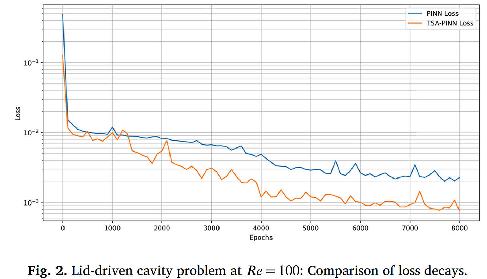

与标准 PINN 相比，TSA-PINN 的一个主要优势是其增强的模型表达性，这得益于采用可训练频率的神经元级正弦激活函数，从而实现更快的收敛速度。图 2 显示，TSA-PINN 的损耗衰减速度显著快于标准 PINNs，快近半个数量级。这一改进在图 3 中得到了进一步说明。虽然使用标准 PINN 的模拟难以准确捕捉速度场（图 3-a），但 TSAPINN 误差极小，准确捕捉所有现象（图 3-b）。

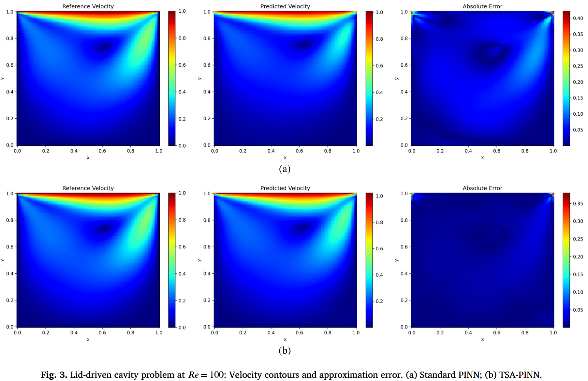

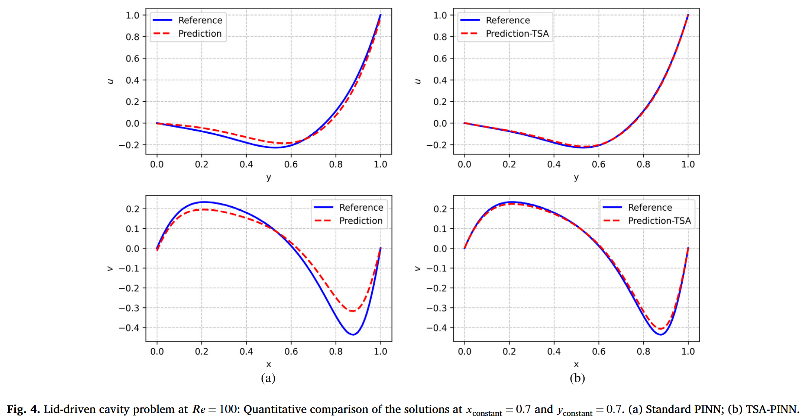

图 4 展示了 TSA-PINN（图 4-b）和标准 PINN（图 4-a）所做近似的定量分析。该分析定量地重申了先前结论，凸显了 TSA-PINN 的卓越准确性。TSA-PINN 所做的近似几乎与参考解完全一致。标准 PINN 近似显示明显误差。表 1 比较了 TSA-PINN 与标准 PINN 之间 L2 范数近似误差的差异。TSA-PINN 的准确度高于标准 PINN，后者的误差减少了一个数量级。这种准确度的提升代价是大约增加了 $24\%$ 的计算时间。

	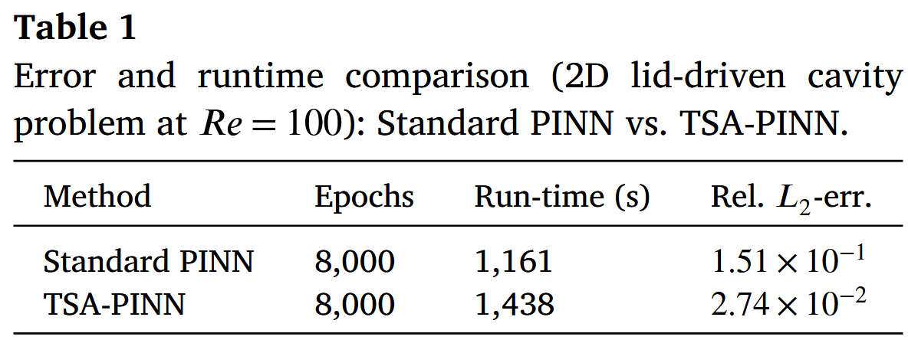
	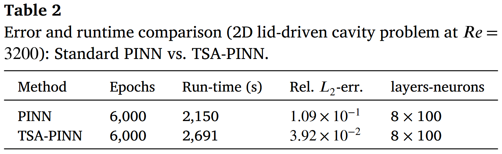

### Re = 3200 处的二维盖子驱动腔问题

为了进一步评估 TSA-PINN 在处理更具挑战性流动问题中的鲁棒性和能力，我们将该方法应用于由不可压缩纳维-斯托克斯方程控制的二维盖子驱动腔问题，雷诺数为 $Reyolds$ 数 $Re = 3200$ 。遵循 Wang 等人[51]的建议，并为减轻移动盖边界两角的不连续性，我们将顶边界条件重新表述为：

$$
u\left( x,y \right) =1-\frac{\cosh \left( C_0\left( x-0.5 \right) \right)}{\cosh \left( 0.5C_0 \right)},\tag{48}
$$

$$
\upsilon \left( x,y \right) =0,\tag{49}
$$

其中，$x \in [0,1],y=1,C_0=50$。我们使用三组评估点：$7000$ 点用于偏微分方程残差，$1000$ 点用于边界条件，$1000$ 点用于训练数据，这些数据均取自直接数值模拟的结果。

对于 $Re = 3200$ 时的盖驱动腔问题，我们的结果凸显了 TSA-PINN 优于标准 PINN 框架的性能。图 5 中展示了两种方法的速度轮廓和近似误差。在面板（a）中，标准 PINN 结果显示出更差的流动特征捕捉精度，尤其是在近壁区域，而面板（b）则显示 TSA-PINN 更好地解析这些流动结构，从而降低了近似误差。解的定量验证见图 6，图中将沿选定截面的近似解与参考数据进行比较。TSA-PINN 的预测与参考文献高度一致，确认其在高雷诺数下准确捕捉本质流动动态的能力。

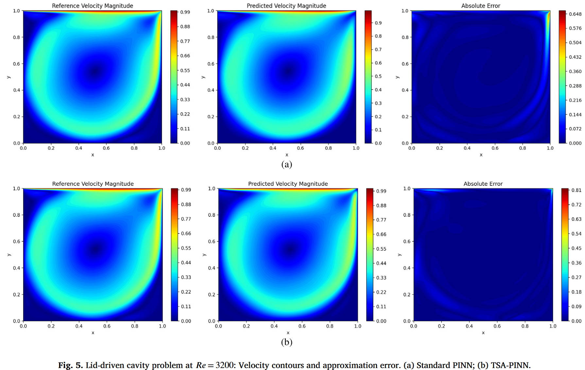

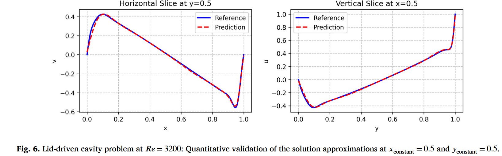

	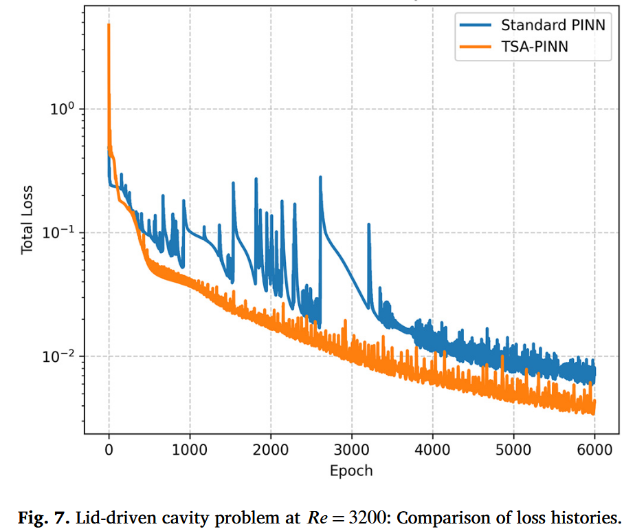

图 7 显示了两种方法的损失历史。TSA-PINN 表现出更平滑、更稳定的收敛行为，最终损失值低于标准 PINN，这表明训练效率和数值稳定性有所提升。最后，表 2 总结了标准 PINN 与 TSA-PINN 之间的错误度量和运行时间比较。尽管 TSA-PINN 的训练时间略有增加，但其显著的近似误差降低使其成为模拟 Re = 3200 处复杂流动现象的更稳健高效选择。

### 二维时变圆柱尾迹

第二个问题是对 Re = 100 时圆柱体后方二维涡旋脱落的时间依赖模拟。该问题由二维不可压缩纳维–斯托克斯方程（24）和（25）所支配。 入口条件指定为自由流无量纲速度 $u_{\infty} = 1$ ，运动粘度设为 $ν = 0.01$ 。圆柱体中心直径为 $D = 1$ ，位于 $(x,y) = (0,0)$ 。这种构型因涡流脱落产生不对称的旋涡，通常称为卡门涡街。在参考数据生成中，采用高保真 DNS 方法[2]。空间域的维数为 $[1,8] ×[−2,2]$。时间区间为 $[0,20]$ ，时间步长为 $\Delta t = 0.01$ 。神经网络模型的输入是时空坐标 $x$ 、$y$ 和 $t$（所有参数均为无纲）。二维输出表示流函数 $ψ(x,y,t)$ 和压力 $p(x,y,t)$。该领域内可获得带标签的训练数据。在 $200$ 个时间步中，每个使用 $1000$ 个共配点和 $400$ 个边界条件点来评估模型的损失。用于该模拟的神经网络架构包含 $4$ 个隐藏层，每层有 $50$ 个神经元。学习率设置为指数衰减，起始值为 $η = 5 × 10^{-3}$，衰减率为每 $1000$ 步 $0.95$ 。训练过程共进行了 $4000$ 次迭代。为了估计训练期间误差的 $L^2$ 范数，使用 $200×200$ 的网格来估算训练中未使用点的误差。该问题的控制方程残差为：

$$
\begin{aligned}
	R_x&=\partial _tu+u\partial _xu+\upsilon \partial _yu+\partial _xp-\frac{1}{Re}(\partial _{xx}^{2}u+\partial _{yy}^{2}u);\tag{50,51} \\
	R_y&=\partial _t\upsilon +u\partial _x\upsilon +\upsilon \partial _y\upsilon +\partial _yp-\frac{1}{Re}(\partial _{xx}^{2}\upsilon +\partial _{yy}^{2}\upsilon ).\\
\end{aligned}
$$

首先，我们分析 TSA-PINN 模型中可训练频率初始化的作用。尽管 TSA-PINN 内部频率具有适应性，初始化仍会影响优化。频率的初始值更适合与目标函数的谱特性对齐，使优化器更高效地收敛至最优参数值。图 8 展示了标准 PINN 与初始化为不同频率值 $\sigma$ 的 TSA-PINN 之间的损耗衰减比较。图 8 所示的丢失历史表明，当 TSA-PINN 模型初始化为最优频率时，收敛率更高，趋向准确解。这一观察说明了初始频率设置的重要性。$ \sigma = 1.0$ 的模型显示了损耗最初下降的速度最快，表明该值是该问题的相对最优频率。初始化为 $ \sigma = 1.0$ 且 $ \sigma = 3.0$ 的模型收敛速度较 TSA-PINN 慢，$ \sigma = 1.0$ ，表明起始点不理想，需要更多纪元调整至有效频率值。即使是 $ \sigma =0.1$ 和 $ \sigma = 3.0$ 的模型，尽管初始化未最优，其可训练频率在多次迭代后收敛率也优于标准 PINN。这展示了 TSA-PINN 在训练过程中动态适应和优化频率参数的能力。

	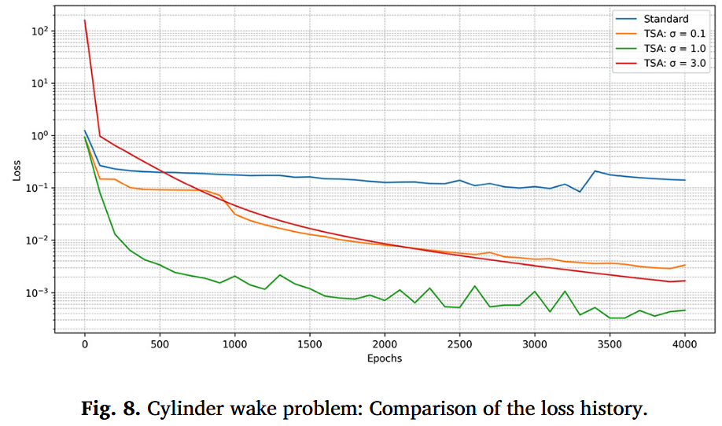

图 9 展示了 TSA-PINN 模型在 $\sigma$ 参数变化下相较标准 PINN 模型的误差动态。配置为 $\sigma = 1.0 $ 的 TSAPINN 始终表现出最低的错误率，从而快速减少误差并提升模型准确性。在各种初始 $\sigma$ 设置下，TSA-PINN 模型系统性地优于缺乏频率适应性的标准 PINN 模型。即使未 $\sigma$ 值最优设置，这一优势也凸显了 TSA-PINN 的优越性能。TSA-PINN 在多种 $\sigma$ 配置中的鲁棒性和一致性显示其优于传统 PINN 方法。值得注意的是，确定可训练频率初始化的最优值过程通常涉及反复试验，类似于选择最优网络大小。两者都被视为针对问题的超参数。

	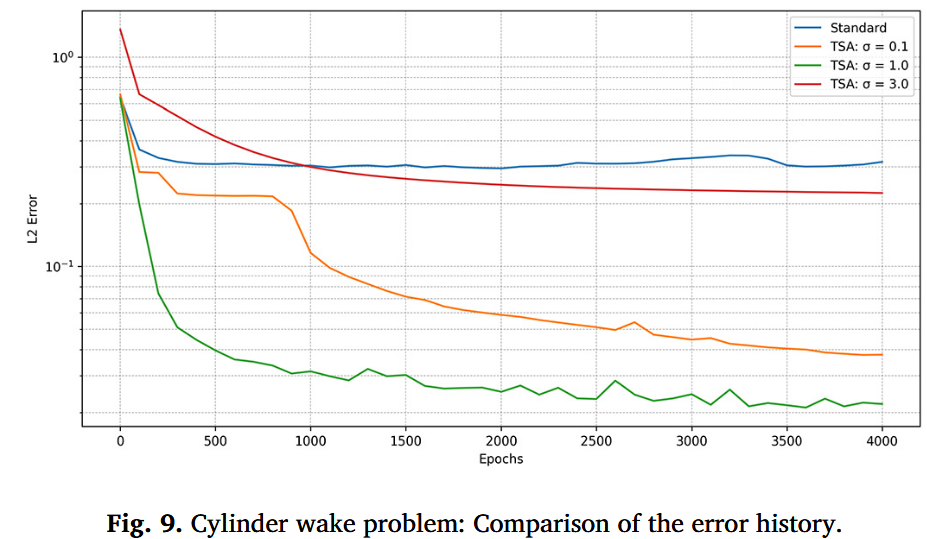

图 10 展示了 $t = 10.0$ 秒时的速度轮廓，比较了标准 PINN 模型和 TSA-PINN 模型的预测与参考数据。显然，标准 PINN 在有限的时代内难以捕捉圆柱体周围的详细流动结构，尤其是在尾流区域。相反，TSA-PINN 模型的预测能力有所提升。速度分量细节更佳，与参考数据高度吻合，高精度捕捉了涡旋脱落和尾流形成的所有特征。该比较分析强调了 TSA-PINN 在复杂流体力学建模中的优异表现，展示了其在有限训练周期内捕捉标准 PINN 无法解决的复杂流动特征的有效性。

	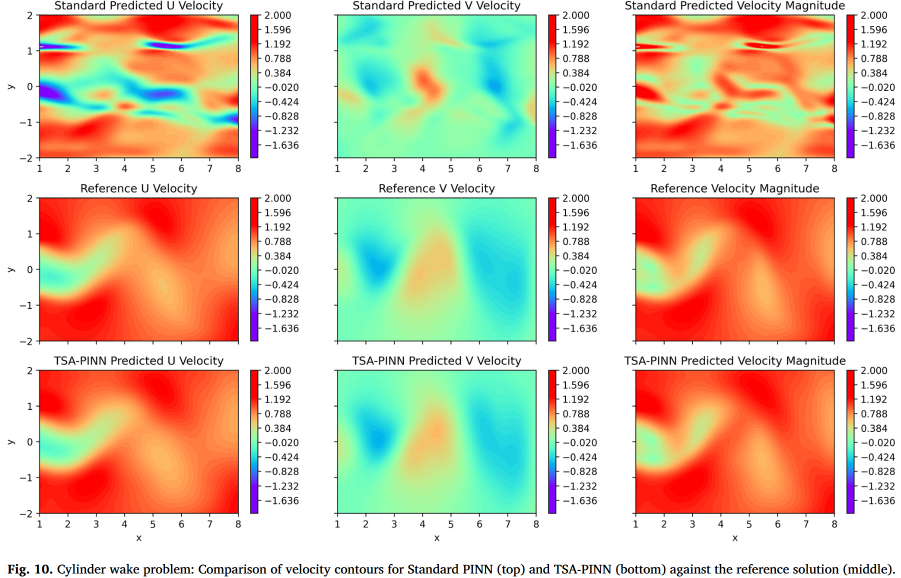

图 11 展示了圆柱尾流中固定点速度分量的时间演变，提供了 TSA-PINN 与标准 PINN 模型与参考数据的定量比较。此次比较验证了模型，展示了它们捕捉流体动力学随时间变化的能力。TSA-PINN 模型与参考数据高度一致，在极快且短的训练过程中准确复现了两个速度分量的正弦振荡（见表 3）。这种对流动振荡幅度和相位的精确捕捉，凸显了 TSA-PINN 可训练正弦激活函数的有效性，这些函数更适合此类流体动力学问题，其中底层解表现出正弦行为。相比之下，标准 PINN 无法准确匹配参考解。此次比较的定量结果不仅验证了 TSAPINN 模型，也强调了其在准确性和稳健性的优势。TSA-PINN 的性能提升显示其动态调节激活频率的能力。表 3 详细比较了标准 PINN 与 TSA-PINN 之间的 $L^2$ 范数近似误差和运行时间。数据明确显示，TSA-PINN 显著提升了准确性，且速度分量的 $L^2$ 误差更小。具体来说，TSA-PINN 的 $u$ 速度分量的 $L^2$ 误差为 $1.96 × 10^{-2}$，而标准 PINN 的 $6.41 × 10^{-1}$;而 v 速度分量的误差为 $6.63 × 10^{-1}$，而 $6.78 × 10^{-1}$，精度提升了近一个数量级。这表明，虽然 TSA-PINNs 所需的计算资源微乎其微，但其准确性回报却非常显著。虽然标准 PINN 趋向相对准确的解，但相比 TSA-PINN 需要更多的纪元。我们的比较研究显示，在有限的训练时间内，TSA-PINNs 能够实现相当的精度，且速度更快。这些结果确立了 TSA-PINN 作为更高效的替代方案，实现了更高的精度，使其成为在有限计算资源下要求高精度应用的更好选择。

	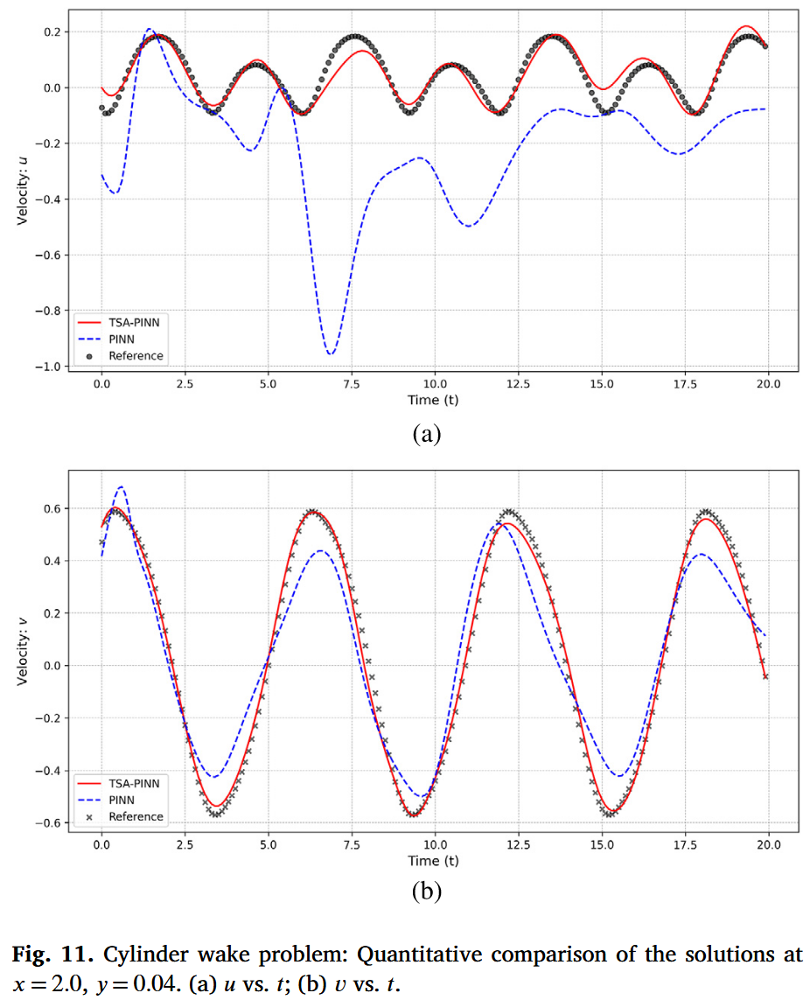

	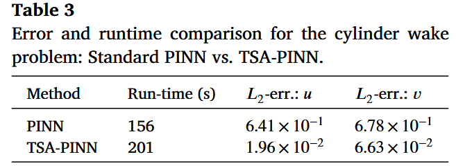

### 三维时间相关湍流通道流动：近壁区域

在第三个测试和验证场景中，我们将模型应用于更复杂且更现实的挑战，对 $Re = 999.4$ 的三维湍流河道流动进行时间依赖模拟。该问题受不可压缩纳维斯托克斯方程 $(24)$ 和 $(25)$ 控制。这种情况在 PINN 文献中较少被探讨，应用于流体力学问题，因为大多数研究通常关注更典型的问题。用于 Navier-Stokes 方程 VP 形式的训练和测试数据来源于 Perlman 等[52]、Li 等[53]、Graham 等[54]提供的湍流通道流数据库，详见 [https://turbulence.pha.jhu.edu/](https://turbulence.pha.jhu.edu/)。

	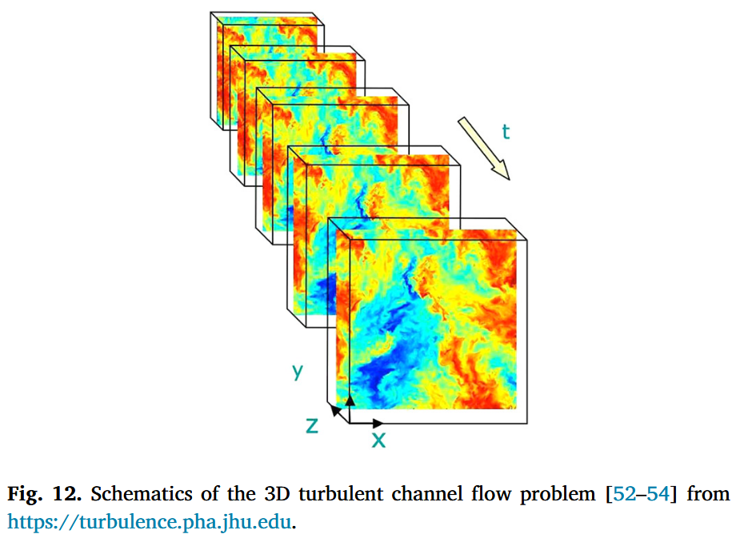

模拟的空间域分别为 $[0,8 \pi] × [−1,1] × [0,3 \pi]$ ，适用于 $x$、$y$ 和 $z$，时间步长为 $0.0065$ ，由在线数据库提供。粘度为 $ν = 5 × 10^{⁻5}$，初始条件代表完全发展的湍流。网络的输入和输出维度分别由四个变量组成：$(x,y,z,t)$ 作为输入，而对应的输出是速度分量和压力 $(u,v,w,P)$ 。问题领域的示意图如图 12 所示。为了研究 TSA-PINN 在近壁区域的性能，考虑一个较小的域，$x$、$y$ 和 $z$ 分别为 $[12.47,12.66] ×[−1.00,−0.90] ×[4.69,4.75]$ 。分析包含该区域内 17 个离散时间步长，重点捕捉边界附近的详细动态。根据数据库[54]的描述，指定区域包括粘性子层、缓冲层和对数定律区域：

- 粘性亚层，或称层流亚层，位于壁面附近，流动主要为粘性，湍流最小。在该区域，速度轮廓几乎是线性的，剪切应力主要为粘性。粘性效应占主导，速度梯度与剪切应力成正比，使该层相较其他层非常薄。

- 缓冲层位于粘性亚层之上、完全湍流区之下，作为粘性和湍流效应交织的过渡区。该层对粘性剪切和湍流剪切都具有重要意义，其特征是复杂的速度分布，既不遵循简单的线性定理也不遵循对数定律。它标志着湍流产生和耗散大致平衡的区域。

- 位于缓冲层上方的对数定律区域由完全湍流控制，与湍流的惯性效应相比，粘性效应可忽略不计。该区域内的平均速度分布随距离墙壁的对数分布，

$$
u^+=\frac{1}{k}\log \left( y^+ \right) +B,\tag{52}
$$

其中， $u^+$ 表示无量纲速度，$y^+$ 为从壁面的无量纲距离， $k$ 为冯·卡门常数（约 $0.41$ ），$B$ 为依赖于流动特性和表面粗糙度的常数，此处视为 $5.2$ 。

在该模拟中，每个时间步计算模型的损失，使用 $10,000$ 个共配点、$6,644$ 个边界条件点和 $10,000$ 个初始条件点。神经网络架构包含 $8$ 个隐藏层，每个层包含 $200$ 个神经元。训练采用分段的学习率衰减策略，使用 ADAM 优化器，最初在前 $150$ 轮为 $10^{-3}$ ，随后在接下来的 $200$ 轮衰减到 $10^{-4}$ ，接下来的 $200$ 轮为 $5×10^{-5}$，另外 $250$ 轮为 $5×10^{-6}$，最后 150 轮为 $10^{-6}$，每轮都有 150 次迭代。使用 ADAM 优化器的分段学习策略，利用了在不同培训阶段调整学习率的优势。通过分段学习策略，模型最初使用较高的学习率快速收敛到合理的解空间，然后逐渐降低学习率以细化解。为了评估训练后误差的 $L^2$ 范数，使用 $1500×1500$ 的网格网格，z=常数平面，用于评估每个时间步训练中未遇到的误差点的误差。该问题的控制方程残差，对于理解模型的动力学和性能至关重要，其残差在方程 $(28)$ 、$(29)$、 $(30)$ 和 $(31)$ 中表述。

值得注意的是，在湍流通道流问题（即第三和第四测试案例）中，TSA-PINN 和标准 PINN 的训练时长保持相同。在此限制下，标准 PINN 能够完成约 25%的训练周期。尽管如此，TSA-PINN 持续优于标准版本，展现出更优的性能。

	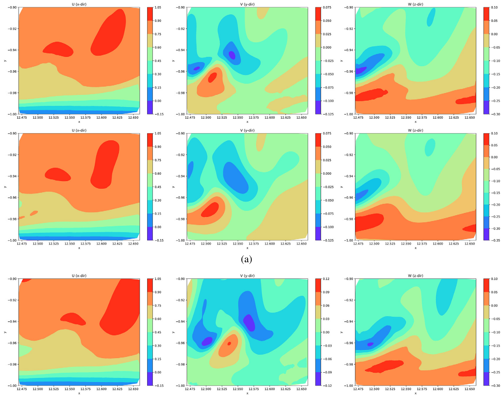
	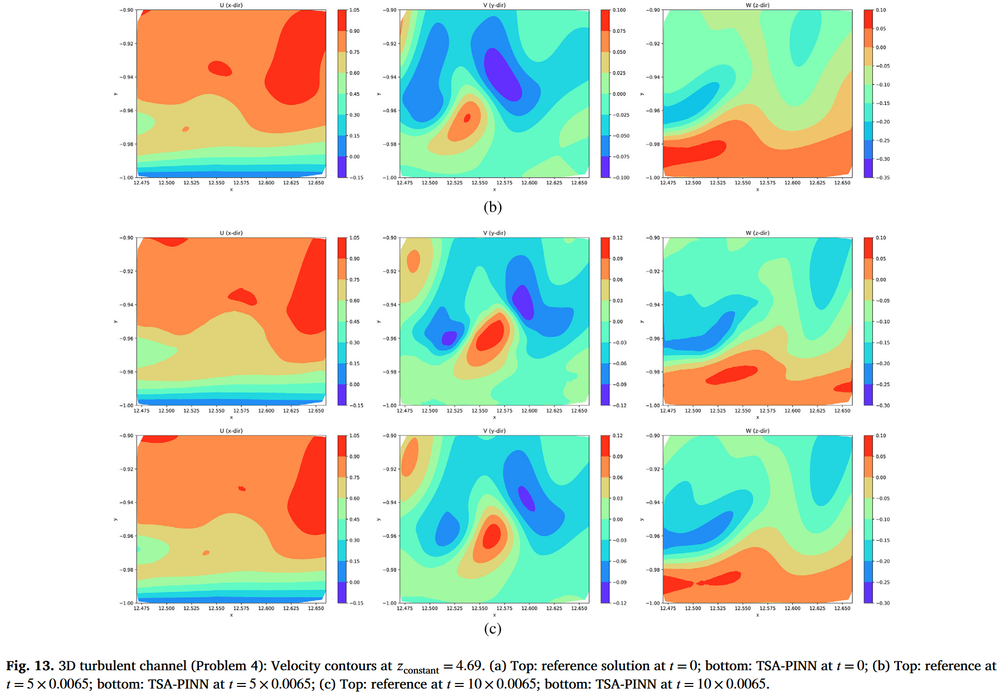

图 13 展示了瞬时速度场与参考 DNS 解和 TSA-PINN 预测的三个不同时间段的比较。这些比较表明，TSAPINN 的近似值与参考解相符，尤其是在早期阶段。由于初始条件在第一个时间框架中规定，准确性初期较好，但随着时间推移通常会下降。这一观察结果在表 4 中得到了证实，表 4 也清楚地显示了 TSA-PINN 相较于标准 PINN 的优越效率。此外，分析了 TSA-PINN 在捕捉近壁现象（粘性子层、缓冲区和对数定律区）方面的性能。图 14 展示了 TSA-PINN 对平均速度剖面的近似如何对应近壁区域的预期行为。定量结果显示，模型在 $y^+ = 10$ 之前的预测遵循线性模型，其中， $U^+ = y^+$，表明平均速度剖面与垂直距离（以墙单位单位）之间存在线性关系。在 $10<y^+<30$ 区间，缓冲层出现，速度分布变得更复杂，不遵循简单的线性或对数定律。超过 $y^+>30$ ，TSA-PINN 预测的平均速度分布相对于壁面距离呈对数分布，确认预测与参考解一致[54]。

	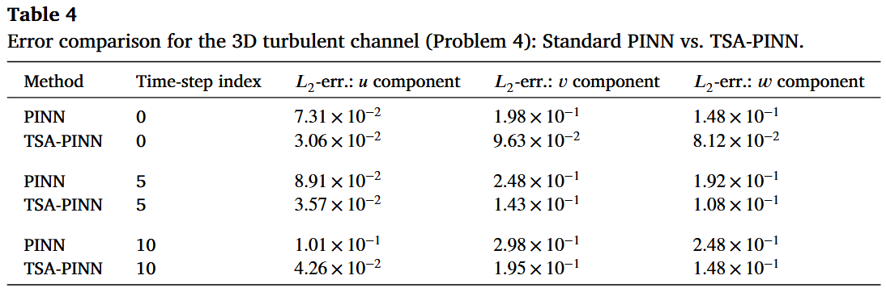

### 三维时间相关湍流通道流动：覆盖更大范围

作为案例 4 的延伸，这个最终验证和测试场景（案例 5）涉及一个显著更大的域，覆盖了信道高度的一半。该子域 $[12.47,12.66] × [−1.00,−0.0031] × [4.61,4.82]$ ，分别针对 $x$、$y$ 和 $z$ 进行分析，涵盖了 8 个离散时间步的分析。更大的领域促进了不同尺度涡流之间的相互作用，带来了显著的计算挑战。这些不同尺度带来的复杂性需要更多的损耗评估点，从而对计算资源和功耗产生更高的需求。在每个时间增量中，模型损失的评估包含 $40,000$ 个配置点、$26,048$ 个边界条件点和 $147,968$ 个初始条件点，位于第一个时间步。所使用的计算架构由 $10$ 个隐藏层组成，每个层有 $300$ 个神经元。ADAM 优化器采用分段递减的学习率策略，初始 $100$ 轮的学习率为 $10^{-3}$，随后依次递减至 250 轮的 $10^{-4}$，另外 $250$ 轮的 $10^{-5}$，另外 $250$ 个时代的衰减 $5×10^{-6}$，最后 $150$ 轮的衰减率降至 $10^{-6}$。 每轮维持 150 次迭代。

值得一提的是，壁面法线和跨度方向的速度相比流速表现出更大的相对 $L^2$ 误差。这是因为流向速度相对于另外两个分量远大于流向速度。图 15 展示了参考 DNS 方案与 TSA-PINN 近似在四个不同时间段内瞬时速度场的比较。TSA-PINN 的近似值与参考解高度契合，尤其是在训练范围内的时间框架内。最后一个时间步长 $t = 12 × 0.0065$ ，超出了 $t \in [0， 8 × 0.0065]$ 的训练范围。因此，TSA-PINN 的预测在插值域内高度准确，并在外推阶段保持可接受的准确性。

	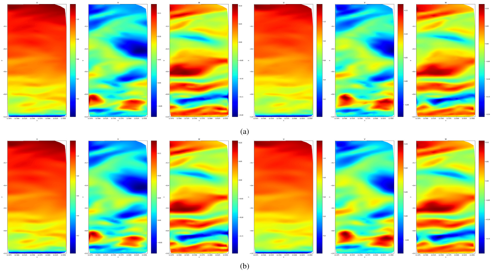
	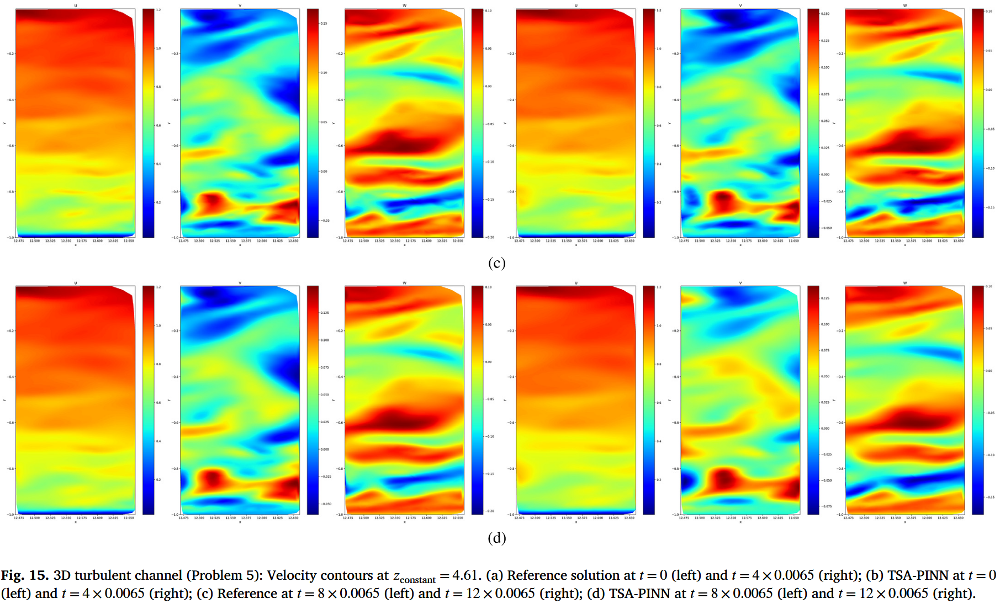

图 16 和表 5 定量证实了这一观察，将模型数值近似相关的误差 $L^2$ 范数与参考数据进行比较。在插值域内，TSA-PINN 的近似与参考解高度一致，$u$ 的误差保持在 $10^{-3}$ 以下，$v$ 和 $w$ 的误差在 $10^{-2}$ 以下。在训练域之外，如图 16 中 $0.06$ 秒处的垂直虚线所示，所有速度分量的错误率均增加。该误差在插值区域内保持较低，但在外推后急剧增加。误差的增加凸显了将数据泛化到训练数据时间范围之外的挑战。尽管标准 PINN 表现出类似趋势，但 TSA-PINN 表现更好，证明了其更优越的效率和有效性。这些分析显示了 TSA-PINN 相较于标准 PINN 的优势，特别是其更强的复杂流体动力学捕捉能力。

	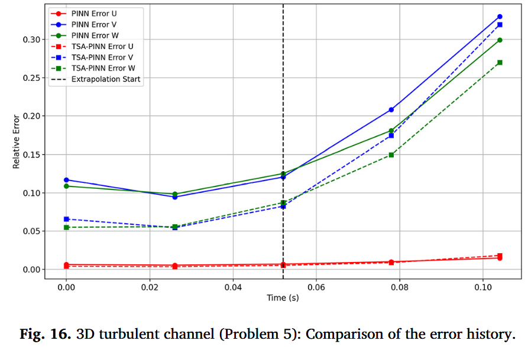
	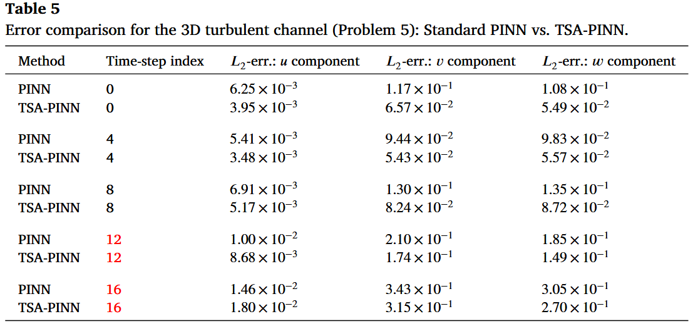

## 结论

在本研究中，我们引入了一种变革性方法，利用一种新颖的物理知情神经网络模型，结合可训练正弦激活函数（TSA-PINN）来近似纳维-斯托克斯方程的解。我们方法的核心是整合创新的可训练神经元正弦激活机制和动态斜坡恢复机制。激活频率与目标函数的初始对齐，加上其可训练特性，使得训练期间能够持续优化，确保模型动态收敛至最优设置。坡度恢复机制是我们模型的补充，实时调整激活函数的频率，稳定梯度流动，防止梯度消失或爆炸等问题。这导致收敛速度更快，增强模型的稳健性。我们的数值实验涵盖了从稳态二维到高雷诺数的时变三维湍流。在第一次和第二次验证实验中——盖子驱动的腔体流动，$Re = 100$ 和 $Re = 3200$ ——TSA-PINN 与参考解高度吻合，相较标准 PINN 实现了更高的准确性和更有效的收敛。第三个测试案例是气缸尾迹问题，展示了 TSA-PINN 在目标现象表现出振荡行为的场景中更高效。这种效率归因于激活函数的正弦函数（正弦和余弦函数的组合）以及可调导频率，使模型能够动态适应流动动力学的振荡性质。我们超越了“规范”问题，研究了较少被探索、更具挑战性和现实性的模型，而其他方法常常难以找到准确的近似。这使我们能够证明 TSA-PINN 相较于 PINN 模型有改进。TSA-PINN 能够动态调整神经元特异性正弦激活函数的频率，使其能够有效捕捉通常具有挑战性的流动动力学，尤其是在其他模型常常失败的高维混沌系统中。我们的发现表明，TSA-PINN 不仅提供了更优越的准确性，而且与其他方法相比，训练周期更短。具体来说，我们将 TSA-PINN 应用于三维、时间依赖湍流通道流，展示了它们捕捉复杂现象的能力，如墙体附近快速变化的行为（如第四个测试案例所示）以及不同涡流尺度下出现的非线性行为（如第五个测试案例所示）。未来工作将重点进一步优化 TSA-PINN 的架构和训练流程，并扩大应用范围以研究更多物理系统。这项研究不仅推动了基于物理的机器学习领域的发展，也为更复杂、高效和更准确的模型铺平了道路，利用先进且动态的激活函数应用于科学计算和工程模拟。
