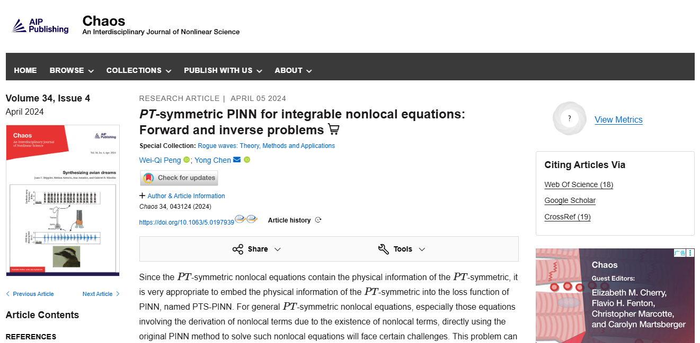
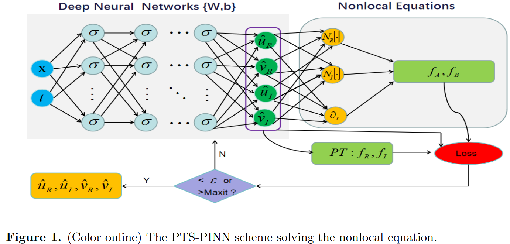
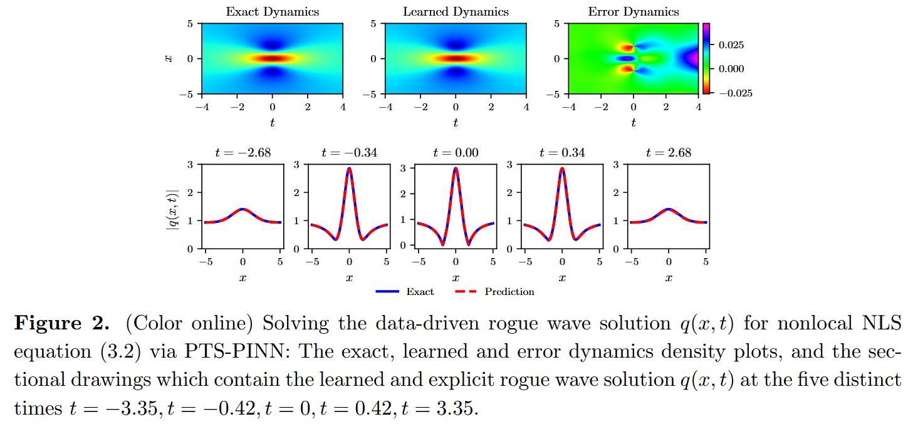
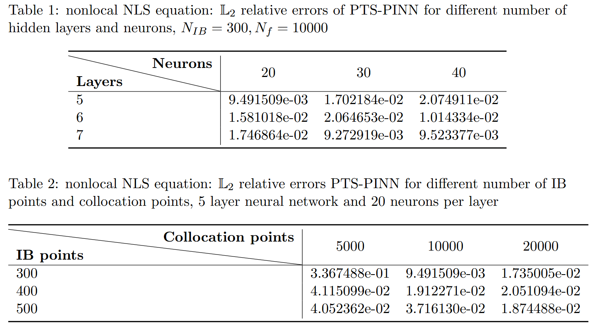

这是一篇使用 PINN 和 PT 对称解决可积非局部方程逆问题和正问题的论文。

# PT Symmetric PINN for integrable nonlocal equations: Forward and inverse problems

我们先来看看这篇论文的摘要：

## 摘要

英文原文：

Since the P T -symmetric nonlocal equations contain the physical information of the P T -symmetric, it is very appropriate to embed the physical information of the P T -symmetric into the loss function of PINN, named PTS-PINN. For general P T -symmetric nonlocal equations, especially those equations involving the derivation of nonlocal terms, due to the existence of nonlocal terms, directly using the original PINN method to solve such nonlocal equations will face certain challenges. This problem can be solved by the PTS-PINN method which can be illustrated in two aspects. First, we treat the nonlocal term of the equation as a new local component, so that the equation is coupled at this time. In this way, we successfully avoid differentiating nonlocal terms in neural networks. On the other hand, in order to improve the accuracy, we make a second improvement, which is to embed the physical information of the P T -symmetric into the loss function. Through a series of independent numerical experiments, we evaluate the efficacy of PTS-PINN in tackling the forward and inverse problems for the nonlocal nonlinear Schr ̈odinger (NLS) equation, the nonlocal derivative NLS equation, the nonlocal (2+1)-dimensional NLS equation, and the nonlocal three wave interaction systems. The numerical experiments demonstrate that PTS-PINN has good performance. In particular, PTS-PINN has also demonstrated an extraordinary ability to learn large space-time scale rogue waves for nonlocal equations.

翻译：

由于 PT -对称非局部方程包含 PT -对称的物理信息,因此将 PT -对称的物理信息嵌入 PINN 的损耗函数 PTS-PINN 中非常合适。对于一般的 PT -对称非局部方程,尤其是涉及非局部项推导的方程,由于非局部项的存在,直接使用原始 PINN 方法求解此类非局部方程会面临一定挑战。这个问题可以通过 PTS-PINN 方法解决,方法可以通过两个方面说明。首先,我们将方程的非局部项视为新的局部分量,因此此时方程是耦合的。通过这种方式,我们成功地避免了在神经网络中区分非局部项。另一方面,为了提高准确性,我们做了第二项改进,即将 P、T 对称的物理信息嵌入到损失函数中。通过一系列独立数值实验,我们评估了 PTS-PINN 在解决非局部非线性施尔·奥丁格(NLS)、非局部导数 NLS 方程、非局部(2+1)维 NLS 方程以及非局部三波相互作用系统的前向和逆问题方面的效能。数值实验表明 PTS-PINN 表现良好。特别是,PTS-PINN 还展现出了学习非局部方程中大规模时空尺度流氓波的非凡能力。

<!-- truncate -->

第一个可积非局部方程是由 Ablowitz 等人[5]提出的非局部非线性 Schrodinger(NLS)方程,记为

$$
iq_t(x,t)+q_{xx}(x,t)+\frac{1}{2}q^2(x,t)q^*(-x,t)=0,\tag{1.1}
$$

其中,星号 $∗$ 表示复共轭, $q^∗(−x, t)$ 表示非局部项。值得注意的是,非局部 NLS 方程 $(1.1)$ 包含了 PT-对称势能 $V(x,t) = q(x,t)q^∗(−x,t)$ ,证明了在 $x \to −x$ 变换和复共轭下保持不变性。因此,如果 $q(x,t)$ 是解,那么 $q^∗(−x,t)$ 也是一个解。PT-对称性最初由 Bender 及其同事在量子力学中提出,假设非厄米哈密顿量表现出一个完全真实的谱[6]。值得注意的是,PT-对称系统近年来在光学及其他物理领域中引起了广泛关注[7, 8]。参考文献[9]报告了 PT-对称 NLS 方程在非常规磁系统中的应用。在参考文献[10]中,提出了 IST 方法用于研究非局部 NLS 方程(1.1)的柯西问题,并给出了孤子解。在[11–13]中推导出了一般的高阶孤子、怪波和有理解。非局部 NLS 方程的非简并和二孤立子解是通过使用非标准的广田法获得的[14]。在引入非局部 P-对称 NLS 方程后,记录了大量新的非局部可积方程。

流氓波,也称为杀手波,近年来在海洋环境和光纤领域引起了广泛关注[15, 16]。此外,流氓波的理论预测和实验观测也被记录下来[17, 18]。Peregrine 提出的 NLS 一阶有理解在解释流氓波现象方面起到了关键作用[19]。随后,分析流氓波解已为许多可积系统推导出,如 AB 系统[20]、三波相互作用方程[21]、Kundu-Eckhaus(KE)方程[22]等。之前大多数导出的流氓波都涉及局部可积方程。相比之下,非局部可积方程中的流氓波是一个有趣且新颖的研究领域,已被生成用于多种非局部可积方程,包括非局部 P T -对称 NLS 方程[23]、非局部导数 NLS 方程[24]、非局部 Davey-Stewartson(DS)系统[25,26]等。

本文通过使用 PINN 深度学习方法,研究数据驱动解,特别是流氓波解,应用于多个可积非定域方程。作为典型的具体例子,我们关注非局部 NLS 方程 $(1.1)$ ,即非局部导数 NLS 方程[27]

$$
iq_t(x,t)-q_{xx}(x,t)-(q^2(x,t)q^*(-x,t))_x=0,\tag{1.2}
$$

非局部(2+1)维 NLS 方程[28,29]

$$
\begin{aligned}
	iq_t+q_{xy}+qr=0,\\ \tag{1.3}
	r_y=[q(x,y,t)q(-x,-y,t)^*]_x,\\
\end{aligned}
$$

以及非局部三波相互作用系统[30]

$$
\begin{aligned}
	q_{1t}+aq_{1x}-q_2(-x,-t)q_3(-x,-t)&=0,\\
	q_{2t}+bq_{2x}-q_1(-x,-t)q_3(-x,-t)&=0,\\ \tag{1.4}
	q_{3t}+cq_{3x}+q_1(-x,-t)q_2(-x,-t)&=0.\\
\end{aligned}
$$

对于非局部导数 NLS 方程,孤子解此前已通过 IST[31]提出。此外,利用 DT 对其周期波解和双周期背景下的流氓波进行了研究[24,27]。在非局部(2+1)维 NLS 方程的背景下,高阶有理解和相互作用解通过广义 DT 得出[32]。此外,利用长波极限法,还探索了非局部(2+1)维 NLS 方程中流氓波和半有理解的分析[28,29]。对于非局部三波相互作用系统,a、b、c 是常数参数。三波相互作用方程的反散射变换被详细研究,并推导出其孤子解[30]。

在计算机计算能力日益增长的背景下,深度学习已成为解决偏微分方程(PDE)的高效技术工具。值得注意的是,Raissi 等人借助一般近似定理[33]和自动微分技术[34],提出了基于物理约束的深度学习框架,用于高效求解偏微分方程,称为物理信息神经网络(PINN)[4]。PINN 的基本思想是将偏微分方程嵌入神经网络的损失函数中,从而通过相对于损失函数的梯度下降实现偏微分方程的数值求解,同时结合初始条件和边界条件。与传统数值方法相比,PINN 展示了在有限数据下求解偏微分方程的能力,同时便于方程参数的发现。随后,PINN 在多个领域引起了广泛关注。在可积系统领域,陈教授团队率先利用 PINN 方法构建数据驱动的孤子解、呼吸波、流氓波和流氓周期波,适用于多种非线性演化方程,包括 KdV 方程、导数 NLS 方程、陈利刘方程和变量系数模型等[35–40]。与此同时,其他学者也提出了数据驱动方程的显著成果,如 Gross-Pitaevskii 方程、Boussinesq 方程、NLS 方程、耦合 NLS 方程、Benjamin-Ono 方程、具有 PT -对称势的饱和 NLS 方程等[41–52]。尽管迄今取得显著成功,PINN 在解决需要更高精度和效率的更复杂问题时仍面临挑战。因此,开发了增强版 PINN 的方案。值得注意的改进包括将残余偏微分方程的梯度信息嵌入损失函数,从而引入了梯度增强的 PINN[53]。此外,林和陈通过将守恒量纳入均方误差损失,引入了两阶段 PINN[54]。引入了自适应激活函数[55]和自适应损耗平衡 PINN[56]等技术,以加快网络训练并提高准确性。对称增强物理信息神经网络的发展通过将李氏对称性或偏微分方程的非经典对称性纳入损失函数,进一步提升了准确性[57]。

非局部可积方程区别于局部方程,其具有独特的空间和/或时间耦合,带来新的物理效应并激发创新应用。值得注意的是,非局部可积方程具有 PT -对称性质,可以嵌入损耗函数中以提高 PINN 算法求解非定域可积方程的精度。因此,应用 PINN 对于研究此类非局部可积方程变得至关重要。然而,由于存在非局部项,直接采用原始 PINN 方法处理此类非局部方程存在特殊挑战。本文介绍了 PTS-PINN 来求解一般的 PT -对称非局部方程,特别是具有非局部项导数的非局部方程。PTS-PINN 的基本概念涵盖两个关键方面。首先,我们将方程的非局部项视为一个新的局部分量,从而导致方程的耦合。这种方法实际上消除了在神经网络中区分非局部项的需求。其次,为了提高准确性,我们将 PT -对称性物理信息纳入损失函数,实现了第二个改进。

本文大纲组织如下：第二部分简要介绍 PTS-PINN 的主要思想。在第三部分,我们给出了非局部 NLS 方程、非局部导数 NLS 方程和非局部(2+1)维 NLS 方程的多组独立实验,以展示 PTS-PINN 的有效性。数据驱动的流氓波解、周期波解、呼吸波解通过 PTS-PINN 方案进行研究。此外,应用 PTS-PINN 方法,第 4 节讨论了非局部(2+1)维 NLS 方程和非局部三波相互作用系统的数据驱动参数发现。结论见最后一节。

## PT -对称性 PINN 的主要思想

本节简要介绍了 PT -对称性 PINN 在处理非局部复偏微分方程中的应用。考虑一个一般的非局部复偏微分方程,其形式如下：

$$
\left\{ \begin{array}{l}
	iq(\mathbf{x},t)_t+\mathcal{N} [q(\mathbf{x},t),q(-\mathbf{x},t)]=0,\quad \mathbf{x}\in \Omega ,\quad t\in [T_0,T_1],\\
	q(\mathbf{x},T_0)=h_0(\mathbf{x}),\quad \mathbf{x}\in \Omega ,\\ \tag{2.1}
	q(\mathbf{x},t)=h_{\Gamma}(\mathbf{x},t),\quad \mathbf{x}\in \partial \Omega ,\quad t\in [T_0,T_1],\\
\end{array} \right.
$$

其中,变量 $\mathbf{x}$ 表示一个 $N$ 维向量,记作 $\mathbf{x} = (x_1,x_2, \dots ,x_N)$ ,$\mathbf{x}$ 属于空间域 $\Omega$,$t$ 属于时间区间 $[T_0,T_1]$ 。$N[·]$ 表示非线性微分算子,表示 $q(\mathbf{x},t)$ 、$q(−\mathbf{x},t)$ 及其 $\mathbf{x}$ 导数的光滑函数,最高可达 $r$ 阶。空间域 $\Omega$ 的边界记作 $\partial \Omega$ , $(2.1)$ 中的最后两个方程分别对应初始值条件和狄利克雷边界条件。$q = q(\mathbf{x},t)$ 表示方程的复值解。为了方便区分方程 $(2.1)$ 中的实部和虚部,我们将 $q(\mathbf{x},t)$ 表示为 $u_R(\mathbf{x},t)+ iu_I(\mathbf{x},t)$ ,其中,$u_R$ 和 $u_I$ 分别是实部和虚部。

一个广泛认可的事实是,具有 PT -对称性的非局部方程由 PT 势能 $V(\mathbf{x},t) = q(\mathbf{x},t)q^∗(−\mathbf{x},t)$ 描述。在光学语境中,$V(\mathbf{x},t)$ 的实分量(记作 $V_R(\mathbf{x},t)$ 作为折射率分布,而虚分量 $V(\mathbf{x},t)$ 表示增损分布,定义为 $V_I(\mathbf{x},t)$。基于 $V_R(\mathbf{x},t) = V_R(−\mathbf{x},t)$ 和 $V_I(\mathbf{x},t)= −V_I(−\mathbf{x},t)$,可以设计一个 PT -对称系统。为了将 PT -对称性质应用于 PINN 损耗函数,设 $q(−\mathbf{x},t) = v_R(\mathbf{x},t) + iv_I (\mathbf{x},t)$ 。则有

$$u_R(\mathbf{x},t)=v_R(-\mathbf{x},t),\qquad u_I(\mathbf{x},t)=v_I(-\mathbf{x},t).\tag{2.2}$$

将 $q(\mathbf{x},t) = u_R(\mathbf{x},t) + iu_I(\mathbf{x},t)$ 和 $q(−\mathbf{x}, t) = v_R(\mathbf{x},t) + iv_I(\mathbf{x},t)$ 代入方程 $(2.1)$ ,得到两个实方程

$$
\left\{ \begin{array}{l}
	(u_R)_t+\mathcal{N} _R[u_R,u_I,v_R,v_I]=0,\\ \tag{2.3}
	(u_I)_t+\mathcal{N} _I[u_R,u_I,v_R,v_I]=0.\\
\end{array} \right.
$$

在 PINN 的开创性工作基础上,我们定义了解 $(u_R(\mathbf{x}, t), u_I(\mathbf{x}, t), v_R(\mathbf{x}, t), v_I (\mathbf{x}, t))$ 的神经网络近似,定义为 $(\hat{u}_R(\mathbf{x}, t; θ), \hat{u}_I (\mathbf{x}, t; θ), \hat{v}_R(\mathbf{x}, t; θ), \hat{v}_I (\mathbf{x}, t; θ))$ ,其中 $θ$ 代表一组网络参数。特别地,我们考虑一个包含 $M$ 层的神经网络,包含一个输入层、$(M−1)$ 个隐藏层和一个输出层。第 $m$ 层 $(m = 1, 2,\dots, M-1)$ 包含 $N_m$ 神经元,表示将 $N_m$ 维输出向量传输到第 $(m + 1)$ 层作为输入数据。两层之间的联系通过线性变换 $\mathcal{T}_m$ 和非线性激活函数 $\sigma(·)$

$$
{\mathbf{X}}^{[m]}=\mathcal{T} _m(\mathbf{X}^{[m-1]})=\sigma ({W}^{[m]}\mathbf{X}^{[m-1]}+{b}^{[m]}),\tag{2.4}
$$

其中，$\mathbf{X}^{[m]}$ 表示第 $m$ 层节点的状态向量，特别强调数据 $\mathbf{X}^{[0]}$，即向量 $(x_1,x_2,\dots,x_N,t)$ 的转置。第 $m$ 层的权重矩阵和偏置矢量分别记为 $\mathbf{W}^{[m]}\in \mathbb{R}^{N_m×N_{m−1}}$ 和 $b^{[m]} \in \mathbb{R}^{N_m}$。参数集 $θ = {W[m],b[m]}_{1 \le m \le M} $ 包含了层中涉及的所有权重矩阵和偏置向量。双曲切线（tanh）函数作为神经网络中用于求解偏微分方程的常用激活函数而突出。同时，采用泽维尔初始化方法初始化权重矩阵和偏置向量。为了表达偏微分方程的残差，可以将 $\hat{u}_R(\mathbf{x},t;θ),\hat{u}_I(\mathbf{x},t;θ),\hat{v}_R(\mathbf{x},t;θ),\hat{v}_I(\mathbf{x},t;θ)$ 代入方程(2.3)：

$$
\left\{ \begin{array}{l}
	f_A(\mathbf{x},t;\theta ):=\frac{\partial}{\partial t}\hat{u}_R(\mathbf{x},t;\theta )+\mathcal{N} _R[\hat{u}_R(\mathbf{x},t;\theta ),\hat{u}_I(\mathbf{x},t;\theta ),\hat{v}_R(\mathbf{x},t;\theta ),\hat{v}_I(\mathbf{x},t;\theta )],\\
	f_B(\mathbf{x},t;\theta ):=\frac{\partial}{\partial t}\hat{u}_I(\mathbf{x},t;\theta )+\mathcal{N} _I[\hat{u}_R(\mathbf{x},t;\theta ),\hat{u}_I(\mathbf{x},t;\theta ),\hat{v}_R(\mathbf{x},t;\theta ),\hat{v}_I(\mathbf{x},t;\theta )].\\ \tag{2.5}
\end{array} \right.
$$

利用对 $\hat{u}_R(\mathbf{x},t;θ),\hat{u}_I(\mathbf{x},t;θ),\hat{v}_R(\mathbf{x},t;θ),\hat{v}_I(\mathbf{x},t;θ)$ 的自动微分机制，我们得到了 PINN 的残差 $f_A(x,t;θ),f_B(x,t;θ)$。然而，必须注意的是，偏微分方程的残差（2.5）并不包含其他固有的物理属性，如（2.2）中详细描述的 PT -对称性，这些在神经网络训练过程中并未被明确考虑。因此，合理地将（2.2）纳入 PINN 的损耗函数，旨在进一步提升神经网络的准确性。这导致了另外两个残差的表述：

$$
\left\{ \begin{array}{l}
	f_R(\mathbf{x},t;\theta ):=\hat{u}_R(\mathbf{x},t;\theta )-\hat{v}_R(-\mathbf{x},t;\theta ),\\
	f_I(\mathbf{x},t;\theta ):=\hat{u}_I(\mathbf{x},t;\theta )-\hat{v}_I(-\mathbf{x},t;\theta ).\\
\end{array} \right. \tag{2.6}
$$

随后，采用多隐藏层深度神经网络训练与潜在函数 $\hat{u}_R(\mathbf{x},t;θ),\hat{u}_I(\mathbf{x},t;θ),\hat{v}_R(\mathbf{x},t;θ),\hat{v}_I(\mathbf{x},t;θ)$ 及残余网络 $f_A,f_B,f_R,f_I$ 相关的网络参数。为了获得最佳训练结果，我们制定了以下损失函数，并利用 LBFGS 优化方法进行最小化[58]

$$
\begin{aligned}
	Loss_{\theta}=Loss_{\hat{u}_R}+Loss_{\hat{u}_I}+Loss_{\hat{v}_R}+Loss_{\hat{v}_I}\\
	+Loss_{f_A}+Loss_{f_B}+Loss_{f_R}+Loss_{f_I},\\ \tag{2.7}
\end{aligned}
$$

以及

$$
\left\{\begin{array}{l}
\operatorname{Loss}_{\hat{u}_{R}}=\frac{1}{N_{I B}} \sum_{i=1}^{N_{I B}}\left|\hat{u}_{R}\left(\mathbf{x}_{I B}^{i}, t_{I B}^{i} ; \theta\right)-u_{R}^{i}\right|^{2}, \\
\operatorname{Loss}_{\hat{u}_{I}}=\frac{1}{N_{I B}} \sum_{i=1}^{N_{I B}}\left|\hat{u}_{I}\left(\mathbf{x}_{I B}^{i}, t_{I B}^{i} ; \theta\right)-u_{I}^{i}\right|^{2}, \\
\operatorname{Loss}_{\hat{v}_{R}}=\frac{1}{N_{I B}} \sum_{i=1}^{N_{I B}}\left|\hat{v}_{R}\left(\mathbf{x}_{I B}^{i}, t_{I B}^{i} ; \theta\right)-v_{R}^{i}\right|^{2}, \\
\operatorname{Loss}_{\hat{v}_{I}}=\frac{1}{N_{I B}} \sum_{i=1}^{N_{I B}}\left|\hat{v}_{I}\left(\mathbf{x}_{I B}^{i}, t_{I B}^{i} ; \theta\right)-v_{I}^{i}\right|^{2}, \\
\operatorname{Loss}_{f_{A}}=\frac{1}{N_{f}} \sum_{j=1}^{N_{f}}\left|f_{\hat{u}}\left(\mathbf{x}_{f}^{j}, t_{f}^{j}\right)\right|^{2}, \\
\operatorname{Loss}_{f_{B}}=\frac{1}{N_{f}} \sum_{j=1}^{N_{f}}\left|f_{\hat{v}}\left(\mathbf{x}_{f}^{j}, t_{f}^{j}\right)\right|^{2}, \\
\operatorname{Loss}_{f_{R}}=\frac{1}{N_{f}} \sum_{j=1}^{N_{f}}\left|f_{R}\left(\mathbf{x}_{f}^{j}, t_{f}^{j}\right)\right|^{2}, \\
\operatorname{Loss}_{f_{I}}=\frac{1}{N_{f}} \sum_{j=1}^{N_{f}}\left|f_{I}\left(\mathbf{x}_{f}^{j}, t_{f}^{j}\right)\right|^{2}, \tag{2.8}
\end{array}\right.
$$

其中，$\{x^i_{IB},t^i_{IB}, u^i_R,u^i_I,v^i_R,v^i_I\}^{N_{IB}}_{i=1}$ 表示采样初始边界（IB）值训练数据点。此外，$\{x^j_f, t^j_f \}^{N_f}_{j=1}$ 表示 $f_A,f_B,f_R,f_I$ 的共配点。

相反，PINN 也证明了解决与非局部可积偏微分方程相关的逆问题的有效性，即未确定参数和数值解同时学习。在方程（2.1）中存在未知参数的情况下，这些参数可以通过在标记训练点 $\{x^i_{l},t^i_{l}, u^i_R,u^i_I,v^i_R,v^i_I\}^{N_{l}}_{i=1}$ 集合中加入额外的测量值 $\(\hat{u}_R(\mathbf{x},t;θ),\hat{u}_I(\mathbf{x},t;θ),\hat{v}_R(\mathbf{x},t;θ),\hat{v}_I(\mathbf{x},t;θ)\)$ 来获得。这涉及引入额外的数据丢失项

$$
\begin{aligned}
	Loss_l=\frac{1}{N_l}\sum_{i=1}^{N_l}{\left[|\hat{u}_R(\mathbf{x}_{l}^{i},t_{l}^{i};\theta )-u_{R}^{i}|^2+|\hat{u}_I(\mathbf{x}_{l}^{i},t_{l}^{i};\theta )-u_{I}^{i}|^2 \right.}\\
	\left. +|\hat{v}_R(\mathbf{x}_{l}^{i},t_{l}^{i};\theta )-v_{R}^{i}|^2+|\hat{v}_I(\mathbf{x}_{l}^{i},t_{l}^{i};\theta )-v_{I}^{i}|^2 \right] ,\\ \tag{2.9}
\end{aligned}
$$

因此，偏微分方程的逆问题的损失函数为

$$
\begin{aligned}
	Loss_{\theta}=Loss_l+Loss_{\hat{u}_R}+Loss_{\hat{u}_I}+Loss_{\hat{v}_R}+Loss_{\hat{v}_I}\\
	+Loss_{f_A}+Loss_{f_B}+Loss_{f_R}+Loss_{f_I}.\\ \tag{2.10}
\end{aligned}
$$

为方便起见，$IB$ 的训练点也可以被视为标记训练点的一部分。因此，最终损失函数可以写成

$$
Loss_{\theta}=Loss_l+Loss_{f_A}+Loss_{f_B}+Loss_{f_R}+Loss_{f_I}. \tag{2.11}
$$

与原始 PINN 不同，PTS-PINN 的优化目标是最小化损失函数，该函数现在除了 PINN 损失函数外，还包括 PT -对称残差。这一优化过程包括更新权重和偏差。为了全面概述 PTS-PINN 方法论，我们在图 1 中展示了示意图。

## 前向问题的数值实验

本节主要考虑若干类非局部方程的正问题，包括非局部 NLS 方程、非局部导数 NLS 方程和非局部（2+1）维 NLS 方程。这里，我们使用 Tensorflow 实现神经网络，所有数值实验均在配备 2.10 GHz 8 核 Xeon Silver 4110 处理器和 64GB 内存的 DELL Precision 7920 塔式计算机上运行。估计的准确性通过相对 L2 误差来评估，这一指标是衡量算法有效性的可靠指标。精确值 $q(\mathbf{x}_k,t_k)$ 和训练近似 $\hat{q}(\mathbf{x}_k,t_k)$ 在数据点 ${\mathbf{x}_k， t_k}^N_{k=1}$ 处推断，然后误差可定义为

$$
\mathrm{Error}=\frac{\sqrt{\sum_{k=1}^N{\left| q(\mathbf{x}_k,t_k)-\hat{q}(\mathbf{x}_k,t_k) \right|^2}}}{\sqrt{\sum_{k=1}^N{\left| q(\mathbf{x}_k,t_k) \right|^2}}}. \tag{3.1}
$$

### 非局部 NLS 方程

非局部 NLS 方程及狄利克雷边界条件为[59]

$$
\left\{ \begin{array}{l}
	iq_t(x,t)+q_{xx}(x,t)+\frac{1}{2}q^2(x,t)q^*(-x,t)=0,\qquad x\in [-5,5],\quad t\in [-5,5],\\
	\\
	q(x,-5)=e^{-\frac{5i}{2}}(1-\frac{4(1-5i)}{x^2+26}),\\ \tag{3.2}
	\\
	q(-5,t)=q(5,t)=e^{\frac{it}{2}}(1-\frac{4it+4}{t^2+26}).\\
\end{array} \right.
$$

本节主要考虑若干类非局部方程的正问题，包括非局部 NLS 方程、非局部导数 NLS 方程和非局部（2+1）维 NLS 方程。这里，我们使用 Tensorflow 实现神经网络，所有数值实验均在配备 2.10 GHz 8 核 Xeon Silver 4110 处理器和 64GB 内存的 DELL Precision 7920 塔式计算机上运行。估计的准确性通过相对 L2 误差来评估，这一指标是衡量算法有效性的可靠指标。精确值 $q(\mathbf{x}_k,t_k)$ 和训练近似 $\hat{q}(\mathbf{x}_k,t_k)$ 在数据点 $\{x_k,t_k\}_k^{N=1}$ 处推断，误差可定义为。解析解为 $q(x,t) = e^{\frac{it}{2}}(1 − \frac{4it+4}{t^2+x^2+1})$ ，即流氓波解。我们的目标是利用 PTS-PINN 推导流氓波解 $q(\mathbf{X},T)$ ，采用一个 5 层全连接神经网络，每隐藏层 20 个神经元，并采用双曲切线（TANH）激活函数。在 MATLAB 中，采用传统的有限差分法，通过将空间区域 $[−5,5]$ 的解析解离散化为 512 个点，将时间区域 $[−5,5]$ 离散化为 400 个点，生成初始训练数据。原始训练数据包括 IB 数据和内点。使用拉丁超立方体抽样（LHS）方法[60]，$N_{IB} = 300$ 个数据点从原始 IB 数据中随机提取，Nf = 10000 个点作为内层点的配址点。使用该训练数据执行 PTS-PINNs 方案后，数据驱动的流氓波解 $q(\mathbf{x},t)$ 以 L2 范数误差为 9.491509e-03 学习，相较于精确解。整个学习过程包含 30,149 次迭代，耗时约 968.9108 秒。相应的动态行为如图 2 所示，展示了沿 x 轴和密度图的波传播模式。图 2 中，学习动力学与真实动态之间的误差范围为-0.025 至 0.025，显示了 PTS-PINN 的有效性。此外，我们分析了不同隐藏层数、每层神经元数、IB 点和配位点的相对 L2 误差，见表 1、表 2。这些表格中呈现的结果表明了一个显著结果：PTS-PINN 的 L2 相对误差始终稳定地达到 e-02 甚至 e-03。总之，PTS-PINN 的优越性能显而易见。

### 非局部导数 NLS 方程

带有狄利克雷边界条件的非局部导数 NLS 方程[27]

$$
\left\{ \begin{array}{l}
	iq_t(x,t)-q_{xx}(x,t)-(q^2(x,t)q^*(-x,t))_x=0,\qquad x\in [-5,5],\quad t\in [0,1],\\
	q(x,0)=\frac{(8-8i)(ie^{-3ix}-16e^{-ix})}{(ie^{-2ix}+16)^2},\\ \tag{3.3}
	q(-5,t)=\frac{(8-8i)(ie^{i(t+15)}-16e^{i(t+5)})}{(ie^{10i}+16)^2}, q(5,t)=\frac{(8-8i)(ie^{i(t-15)}-16e^{i(t-5)})}{(ie^{-10i}+16)^2}.\\
\end{array} \right.
$$

## 补充材料以及原文链接

📌 **欢迎关注 FEMATHS 小组与山海数模,持续学习更多数学建模与科研相关知识！**

论文链接在这里：[https://www.sciencedirect.com/science/article/pii/S0010465525001742](https://www.sciencedirect.com/science/article/pii/S0010465525001742)
