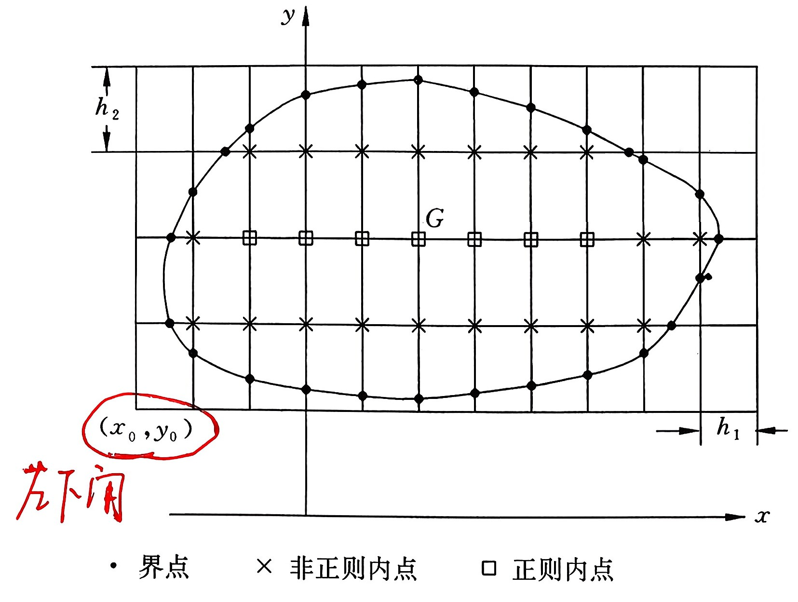

# 差分法

有限差分法（Finite Difference Method，FDM）是一种求解微分方程数值解的近似方法，其主要原理是对微分方程中的微分项进行直接差分近似，从而将微分方程转化为代数方程组求解。有限差分法和有限元法是求微分方程近似解的两种重要的数值方法，它们的**共同特点**是**将连续的问题和区域进行各种形式的离散，最后化为有限形式的线性代数方程组**。有限差分法与有限元法的**最大区别**在于前者的处理直接施加于所给的微分方程本身，而后者则需要先把微分方程化成其他形式的数学问题再加以处理。它们的共同点决定了这两种方法在总的处理思路和大的步骤上有不少相同或类似之处，而它们的不同点又导致了这两种方法的具体操作实施具有无法比拟的各自的特殊性。

先从比较简单的两点边值问题的差分法讲起。

## 解两点边值问题的差分方法

考虑最简单的常微分方程边值问题

$$
{\rm L} u \equiv-\frac{\mathrm{d}^{2} u}{\mathrm{~d} x^{2}}+q u=f, \quad x \in(a, b), \tag{1}
$$

$$
u(a)=\alpha_{0}, u^{\prime}(b)+\beta u(b)=\alpha_{1},\tag{2}
$$

其中, $q, f \in C^{0}([a, b]), q \geqslant 0, \alpha_{0}, \alpha_{1}, \beta$ 为给定常数 $(\beta>0)$ 。(1)式中 $\rm L$ 为微分算子（ $\rm L$ 用白正体字母表示，今后同）。

用差分法求解边值问题(1)的过程可以分成 5 步。本小节先讨论前三步，其后的两步不太相同。

第一步，区域的离散

将区间 $[a, b]$ 分成 $N$ 等分，分点为

$$
x_{i}=a+i h, \quad i=0,1, \cdots, N,
$$

这里,$h=\frac{b-a}{N}, x_{i}$ 被称为网格上的结点，$h$ 称为步长。
第二步，微分方程离散。
由 Taylor 展开公式，在结点 $x_{i}$ 处，成立

$$
\begin{array}{c}
u^{\prime \prime}\left(x_{i}\right)=\frac{1}{h^{2}}\left[u\left(x_{i+1}\right)-2 u\left(x_{i}\right)+u\left(x_{i-1}\right)\right]-\frac{h^{2}}{12} u^{(4)}\left(\xi_{i}\right) \\
x_{i-1} \leqslant \xi_{i} \leqslant x_{i+1}.\tag{3}
\end{array}
$$

记余项

$$
R_{i}(u)=-\frac{h^{2}}{12} u^{(t)}\left(\xi_{i}\right),\tag{4}
$$

则在 $x_{i}$ 处可将方程(1)写成

$$
-\frac{u\left(x_{i+1}\right)-2 u\left(x_{i}\right)+u\left(x_{i-1}\right)}{h^{2}}+q\left(x_{i}\right) u\left(x_{i}\right)=f\left(x_{i}\right)+R_{i},\tag{5}
$$

舍去余项，便得到逼近方程(1)的差分方程：

$$
\begin{array}{r}
L_{\mathrm{h}} u_{i} \equiv-\frac{u_{i+1}-2 u_{i}+u_{i-1}}{h^{2}}+q_{i} u_{i}=f_{i}, \\
i=1,2, \cdots, N=1,\tag{6}
\end{array}
$$

其中, $q_{i}=q\left(x_{i}\right), f_{i}=f\left(x_{i}\right)$ ,而 $u_{i}$ 是 $u(x)$ 在 $x_{i}$ 处的近似值，也就是所要寻找的差分解。(6)式中 $\mathrm{L}_{\mathrm{h}}$ 为差分算子（ $\mathrm{L}_{\mathrm{h}}$ 用白正体字母表示，今后同）。

利用差分算子 $\mathrm{L}_{\mathrm{h}}$ ,(5)可写成：

$$
{\rm L_{h}} u\left(x_{i}\right)=f\left(x_{i}\right)+R_{i},
$$

所以, $ R*{i} $ 就是差分算子 $\mathrm{L}*{\mathrm{h}}$ 代替微分算子 $\rm L$ 所引起的截断误差，它的阶是 $O\left(h^{2}\right)$ 。

第三步，边界条件的处理。
在(6)式中出现了 $N+1$ 个未知量 $u_{0}, u_{1}, \cdots, u_{N-1}, u_{N}$ ，但只有 N-1 个方程，所缺的两个方程可以通过对边界条件的处理来获得。

**对于第一类边界条件**，如在左端 $x=a$ 处，只要直接将函数值代入就行了，即取

$$
u_{0}=u(a)=\alpha_{0}
$$

**对于第三类边界条件**，如在右端 $x=b$ 处，就需要处理 $u(x)$ 的导数值。容易想到的是取它的一阶差商，如取

$$
u^{\prime}(b) \approx \frac{u_{N}-u_{N-1}}{h},
$$

但这样做将使得边界点上的截断误差(为 $O(h)$ )低于内点的截断误差；而由于 $x_{N}$ 是端点，又不能采取具有 $O\left(h^{2}\right)$ 精度的中心差分，所以在实际中常常采用二阶 Gear 公式。由前面章节，有

$$
u(x+2 h)-\frac{4}{3} u(x+h)+\frac{1}{3} u(x)=\frac{2 h}{3} u^{\prime}(x+2 h)+O\left(h^{2}\right) .\tag{7}
$$

令 $x+2 h=x\_{N}$ ，舍去余项，即有近似式：

$$
u^{\prime}(b) \approx \frac{1}{2 h}\left(3 u_{N}-4 u_{N-1}+u_{N-2}\right),
$$

于是，(2)式的后一个条件可处理成

$$
\frac{1}{2 h}\left(3 u_{N}-4 u_{N-1}+u_{N-2}\right)+\beta u_{N}=\alpha_1.\tag{8}
$$

区间的剖分和边界条件的处理可采取多种多样的形式。比如，若 $u(x)$ 能够被光滑地延拓到区间 $[a, b]$ 之外，则可取分点

$$
x\_{j}=a+\left(j-\frac{1}{2}\right) h, \quad j=0,1,2, \cdots, N,\tag{9}
$$

其中 $h=\frac{b-a}{N-1}$ ，这时分点 $x_{0}=a-\frac{h}{2}$ 和 $x_{N}=b+\frac{N}{2}$ 将在 $[a, b]$ 之外。

对于结点 $x_{0}, x_{1}, \cdots, x_{N}$ ，同样可以列出（3．6）式所示的 $N-1$ 个方程，不足的两个方程可由边界条件来提供。利用

$$
\frac{1}{2}\left[u\left(x_{1}\right)+u\left(x_{0}\right)\right]=u(a)+\frac{h^{2}}{8} u^{\prime \prime}(\xi), \quad x_{0}<\xi<x_{1},
$$

和

$$
u^{\prime}(b)=\frac{1}{h}\left[u\left(x_{N}\right)-u\left(x_{N-1}\right)\right]-\frac{h^{2}}{24} u^{\prime \prime \prime}(\eta), \quad x_{N-1}<\eta<x_{N},
$$

可给出两个方程：

$$
\left\{\begin{array}{l}
u_{1}+u_{0}=2 \alpha_{0}, \\
\frac{1}{h}\left(u_{N}-u_{N-1}\right)+\frac{\beta}{2}\left(u_{N}+u_{N-1}\right)=\alpha_{1} .
\end{array}\right.\tag{10}
$$

将(10)式与(6)式联立就可以得到一个由 $N+1$ 个方程组成的含有 $n+1$ 个未知量的线性方程组，其中每一个方程所略去的余项都是 $O\left(h^{2}\right)$ 。

通常遇到的方程当然要比方程(1)复杂得多，然而不管怎样，导出线性方程组的思想是类似的。如对二阶自共轭方程

$$
-\frac{\mathrm{d}}{\mathrm{~d} x}\left(p \frac{\mathrm{~d} u}{\mathrm{~d} x}\right)+q(x) u(x)=f(x), \quad a<x<b,\tag{11}
$$

其中, $p(x) \in C^{1}([a, b]), p(x) \geqslant p_ {min}>0, q, f \in C^{0}([a, b]) 且 q(x) \geqslant 0$ 。取结点为

$$
a=x_{0}<x_{1}<\cdots<x_{i}<\cdots<x_{N}=b,
$$

记小区间

$$
I_{i}=\left[x_{i-1}, x_{i}\right], \quad i=1,2, \cdots, N,
$$

记 $h_{i}=x_{i}-x_{i-1}$ 是 $I_{i}$ 的长度， $h=\max_i h_{i}$ 为最大步长。
取相邻结点的中点 $\frac{1}{2}\left(x_{i-1}+x_{i}\right)$ ，将它记为 $x_{i-\frac{1}{2}}$ ，这些点被称为半整数点，由这些半整数点全体和端点

$$
a=x_{0}<x_{\frac{1}{2}}<x_{\frac{3}{2}}<\cdots<x_{i-\frac{1}{2}}<\cdots<x_{N-\frac{1}{2}}<x_{N}=b
$$

又作成了 $[a, b]$ 的一个网格剖分，它被称为原剖分的对偶剖分。如图 1 所示，打＂－＂号的是原剖分结点，打＂$\times$＂号的是对偶剖分结点。

<figcaption style={{ fontSize: '90%', color: 'black', fontStyle: 'Times New Roman', marginTop: '4px', textAlign: 'center' }}>
图 1 对区间 $[a, b]$ 的剖分
</figcaption>

接着用差商代替微商的方法将方程(1)在内点 $x_{i}$ 处离散。

$$
\begin{aligned}
-\left.\frac{\mathrm{d}}{\mathrm{~d} x}\left(p \frac{\mathrm{~d} u}{\mathrm{~d} x}\right)\right|_{x_{i}} & =\frac{\left.\left(p \frac{\mathrm{~d} u}{\mathrm{~d} x}\right)\right|_{x_{i}-\frac{1}{2}}-\left.\left(p \frac{\mathrm{~d} u}{\mathrm{~d} x}\right)\right|_{x_{i}+\frac{1}{2}}}{\left(h_{i+1}+h_{i}\right) / 2}+O(h), \\
\left.\left(p \frac{\mathrm{~d} u}{\mathrm{~d} x}\right)\right|_{x_{i-\frac{1}{2}}} & =p\left(x_{i-\frac{1}{2}}\right) \frac{u_{i}-u_{i-1}}{h_{i}}+\left.\frac{h_{i}^{2}}{24}\left(p \frac{\mathrm{~d}^{3} u}{\mathrm{~d} x^{3}}\right)\right|_{z_{i}}
\end{aligned}
$$

记 $p_{i-\frac{1}{2}}=p\left(x_{i-\frac{1}{2}}\right), q_{i}=q\left(x_{i}\right), f_{i}=f\left(x_{i}\right)$ ，可得方程

$$
\begin{array}{r}
-\frac{2}{h_{i}+h_{i+1}}\left[p_{i+\frac{1}{2}} \frac{u_{i+1}-u_{i}}{h_{i+1}}-p_{i-\frac{1}{2}} \frac{u_{i}-u_{i-1}}{h_{i}}\right]+q_{i} u_{i}=f_{i} \\
i=1,2, \cdots, N-1,\tag{12}
\end{array}
$$

用(12)式代替(11)式的截断误差的阶为 $O(h)$。而所缺的两个方程同样可由边界条件得到。
Step4: 是研究这个线性代数方程组的性态，即解的存在性、唯一性以及当 $h \rightarrow 0 $ 时差分解的极限性质，也就是收敛性。(略)

Step5:求解得到的线性代数方程组。

在差分方程组中，将由两个边界条件得到的等式代入 $i=1$ 和 $i=N-1$ 两个方程中消去 $u_{0}$ 和 $u_{N}$ ，便得到了关于 $\boldsymbol{u}=\left(u_{1}, u_{2}, \cdots\right.  ，  \left.u_{N-1}\right)^{T}$ 的 $N-1$ 维的线性代数方程组

$$
Au=f
$$

这里 $A$ 是一个三对角矩阵：

$$
A=\left[\begin{array}{ccccc}
b_{1} & c_{1} & & & \\
a_{2} & b_{2} & c_{2} & & \\
& \ddots & \ddots & \ddots & \\
& & & a_{N-1} & b_{N-2}
\end{array}\right]
$$

而 $ f=\left(f*{1}, f*{2}, \cdots, f*{N-1}\right)^{T} $（这里的 $ f*{N-1}$ 不同于方程组（3．13）中的 $f_{N-1}$ ），我们来考察它的解法。

它的第一个方程是 $u_{1}$ 与 $u_{2}$ 的相互关系，最后一个方程是 $u_{N-2}$ 和 $u_{N-1}$ 的相互关系，而其他方程是 $u_{i-1}, u_{i}, u_{i-1}$ 三者之间的关系。于是，从第一个方程可得到 $u_{1}$ 用 $u_{2}$ 的表示，代入第二个方程，消去 $u_{1}$ ，则可得到 $u_{2}$ 用 $u_{3}$ 的表示，如此等等，直到第 $N-2$ 个方程，可得到 $u_{N-2}$ 用 $u_{N-1}$ 的表示，将这个表示关系代入最后一个方程中消去 $u_{N-2}$ ，便可求出 $u^{N-1}$ 。然后，利用已经建立的 $u_{N-2}$ 用 $u_{N-1}$ 的表示式求出 $u_{N-2}$ ，这样逐个上溯，求出 $u_{N-3}, u_{N-1}, \cdots, u_{2}$ ，最后可通过 $u_{1}$ 用 $u_{2}$ 的表示式算出 $u_{1}$ ，从而解出全部 $u_{i}$ 。

现在来推导计算的具体步骤。设

$$
u_{j}=s_{j} u_{j+1}+t_{j},
$$

将它代入第 $j+1$ 个方程 ($j \geqslant 1$) ，有

$$
a_{j+1}\left(s_{j} u_{j+1}+t_{j}\right)+b_{j+1} u_{j+1}+c_{j+1} u_{j+2}=f_{j+1},
$$

从而

$$
\begin{aligned}
u_{j+1} & =-\frac{c_{j+1}}{b_{j+1}+a_{j+1} s_{j}} u_{j+2}+\frac{f_{j+1}-a_{j+1} t_{j}}{b_{j+1}+a_{j+1} s_{j}} \\
& \equiv s_{j+1} u_{j+2}+t\_{j+1},
\end{aligned}
$$

于是可知

$$
\left\{\begin{array}{l}
s_{j+1}=-\frac{c_{j+1}}{b_{j+1}+a_{j+1} s_{j}}, \quad j=1,2,3, \cdots, N-3, \\
t_{j+1}=\frac{f_{j+1}-a_{j+1} t_{j}}{b_{j+1}+a_{j+1} s_{j}},
\end{array}\right.
$$

显然，当 j=0 时，有

$$
s_{1}=-\frac{c_{1}}{b_{1}}, \quad t_{1}=\frac{f_{1}}{b_{1}},
$$

当 $j=N-2$ 时，即可视上面式中 $c_{N-1}=0$ ，于是

$$
u_{N-1}=\frac{f_{N-1}-a_{N-1} t_{N-2}}{b_{N-1}+a_{N-1} s_{N-2}}=t_{N-1}
$$

这样，整个计算公式可归结为

$$
\left\{\begin{array}{ll}
a_{1}=0, s_{0}, t_{0} \text { 任意, } & \\
s_{j+1}=-\frac{c_{j+1}}{b_{j+1}+a_{j+1} s_{j}}, & j=0,1, \cdots, N-3 \\
t_{j+1}=\frac{f_{j+1}-a_{j+1} t_{j}}{b_{j+1}+a_{j+1} s_{j}}, & j=0,1,2, \cdots, N-2 \\
u_{N-1}=t\_{N-1}, & j=N-2, N-3, \cdots, 1 .\tag{13}
\end{array}\right.
$$

求 $s_{j}$ 和 $t_{j}$ 时的下标由小到大，这被称为＂追＂的过程；求 $u_{j}$ 时恰恰相反，下标由大到小，这被称为＂赶＂的过程，所以(13)式被称为解三对角方程组的**追赶法**。

## 算例

### 算例 1

$$
\left\{\begin{array}{l}
\frac{\mathrm{d}^{2} u}{\mathrm{~d} x^{2}} = \frac{(1-x)u+1}{(1+x)^2}, \quad x \in(0, 1), \\
u(0)=1, u(1)=0.5,
\end{array}\right.
$$

真实解为

$$
u=\frac{1}{1+x}
$$

我们设置时间步长为 $\frac{1}{64},\frac{1}{128},\frac{1}{256}$,我们可以得到如下实验结果：

  <figure style={{ width: '49%', textAlign: 'center', margin: 0 }}>
    
    <figcaption style={{ fontSize: '90%', color: 'black', fontStyle: 'Times New Roman', marginTop: '4px' }}>
      图 1：算例1差分法不同步长与精确解的比较
    </figcaption>
  </figure>
  <figure style={{ width: '49%', textAlign: 'center', margin: 0 }}>
    
    <figcaption style={{ fontSize: '90%', color: 'black', fontStyle: 'Times New Roman', marginTop: '4px' }}>
      图 2：算例1差分法不同步长绝对误差的比较
    </figcaption>
  </figure>

### 算例 2

$$
\left\{\begin{array}{l}
\frac{\mathrm{d}^{2} u}{\mathrm{~d} x^{2}} -\frac{\mathrm{d}u}{\mathrm{~d}x} + u = e^x - 3sinx, \quad x \in(0, \pi), \\
u(0)=-2, u(\pi)=e^{\pi} +3,
\end{array}\right.
$$

真实解为

$$
u=e^x-3cosx.
$$

我们设置时间步长为 $\frac{1}{64},\frac{1}{128},\frac{1}{256}$,我们可以得到如下实验结果：

  <figure style={{ width: '49%', textAlign: 'center', margin: 0 }}>
    
    <figcaption style={{ fontSize: '90%', color: 'black', fontStyle: 'Times New Roman', marginTop: '4px' }}>
      图 3：算例2差分法不同步长与精确解的比较
    </figcaption>
  </figure>
  <figure style={{ width: '49%', textAlign: 'center', margin: 0 }}>
    
    <figcaption style={{ fontSize: '90%', color: 'black', fontStyle: 'Times New Roman', marginTop: '4px' }}>
      图 4：算例2差分法不同步长绝对误差的比较
    </figcaption>
  </figure>

### 算例 3

$$
\left\{\begin{array}{l}
\frac{\mathrm{d}^{2} u}{\mathrm{~d} x^{2}} -x\frac{\mathrm{d}u}{\mathrm{~d}x} + u = -2xcosx +x, \quad x \in(0, \pi), \\
u(0)=0, u(\pi)=\pi,
\end{array}\right.
$$

真实解为

$$
u=x+2sinx.
$$

我们设置时间步长为 $\frac{1}{64},\frac{1}{128},\frac{1}{256}$,我们可以得到如下实验结果：

  <figure style={{ width: '49%', textAlign: 'center', margin: 0 }}>
    
    <figcaption style={{ fontSize: '90%', color: 'black', fontStyle: 'Times New Roman', marginTop: '4px' }}>
      图 5：算例3差分法不同步长与精确解的比较
    </figcaption>
  </figure>
  <figure style={{ width: '49%', textAlign: 'center', margin: 0 }}>
    
    <figcaption style={{ fontSize: '90%', color: 'black', fontStyle: 'Times New Roman', marginTop: '4px' }}>
      图 6：算例3差分法不同步长绝对误差的比较
    </figcaption>
  </figure>

## 解椭圆边值问题的差分方法

### 矩形网格

这里以 Poisson 方程

$$
-\Delta u=f(x, y), \quad(x, y) \in G,\tag{3.20}
$$

的边值问题为例来讨论如何构造相应的差分方程组。

为简单起见，设 $G$ 是 $O-xy$ 平面上的一个有界单连通区域，其边界 $\Gamma$ 是分段光滑曲线，方程(3.20)的定解条件通常有以下三类：

- （1）第一类边值条件： $\left.u\right|_{\Gamma}=\alpha(x, y)$;
- （2）第二类边值条件： $\left.\frac{\partial u}{\partial n}\right|_{\Gamma}=\beta(x, y)$;
- （3）第三类边值条件： $\left.\left(\frac{\partial u}{\partial n}+k u\right)\right|\_{\Gamma}=\gamma(x, y) $,

其中 $\alpha(x, y), \beta(x, y), \gamma(x, y), k(x, y)$ 是定义在 $\Gamma$ 上的已知函数， $k(x, y) \geqslant 0$ 且不恒为零， $n$ 表示 $\Gamma$ 的单位外法线方向（但习惯上，在方向导数中它就表示为标量形式）。求方程(3．20)满足边值条件(3．21)、 (3．22)、(3．23)的解相应地称为解第一、第二、第三边值问题。

用差分法求解椭圆型方程边值问题与前面叙述的用差分方法解常微分方程边值问题一样，在于构造一个含有若干个未知数的线性方程组，这个方程组的唯一解是所求的微分方程定解问题的解函数 $u(x, y)$ 在某个点集 $\left\{\left(x_{i}, y_{j}\right)\right\}$ 处的值 $\left\{u\left(x_{i}, y_{j}\right)\right\}$ 的近似值。

因此，边值问题离散化的第一步是用一个离散的点集来代替有界区域 $\bar{G}=G \cup \Gamma$ ，这里先介绍矩形网格。

取定沿 $x$ 方向和 $y$ 方向的步长分别为 $h_{1}$ 和 $h_{2}$ ，记 $h=\sqrt{h_{1}^{2}+h_{2}^{2}}$ ，从某个定点 $\left(x_{0}, y_{0}\right)$ 开始作**两族与坐标轴平行的直线**：

$$
\begin{array}{ll}
x=x_{0}+i h_{1}, & i=0,1,2, \cdots, N_{1} \\
y=y_{0}+j h_{2}, & j=0,1,2, \cdots, N_{2}
\end{array}
$$

让区域 $\bar{G}$ 包含在区域 $\left\{(x, y) \mid x_{0} \leqslant x \leqslant x_{0}+N_{1} h_{1}, y_{0} \leqslant y \leqslant\right. \left.y_{0}+N_{2} h_{2}\right\}$ 中。两族直线的交点 $\left(x_{0}+i h_{1}, y_{0}+j h_{2}\right)$ 称为**网格结点**，记为 $\left(x_{i}, y_{j}\right)$ 或 $(i, j)$ 。属于 $G$ 的结点称为**内点**，用 $G_{h}=\left\{\left(x_{i}, y_{j}\right) \in G\right\}$ 表示内点全体组成的集合。网线与 $\Gamma$ 的交点称为**界点**，用 $\Gamma_{n}$ 来记界点全体所组成的集合。若两个结点 $\left(x_{i_{1}}, y_{j_{1}}\right),\left(x_{i_{2}}, y_{j_{2}}\right)$ 满足

$$
\left|i_{1}-i_{2}\right|+\left|j_{1}-j_{2}\right|=1,\tag{3.24}
$$

图 3.2 界点、非正则内点、正则内点

则称这两个结点是相邻的。于是， $G_{h}$ 中的点又可以分成两类：一类是其四个邻点都属于 $G_{h}$ ，这种点称为正则内点，其全体组成的集合记为 $G_{h}^{\prime}$ ；另一类是其四个邻点中至少有一个不属于 $G_{h}$ ，这种点被称为非正则内点，其全体组成的集合记为 $G_{h}^{\prime \prime}$ （如图 3.2 所示）。于是有

$$
G_{h}^{\prime}=G_{h}^{\prime} \cup G_{h}^{\prime \prime}, \quad G_{h}^{\prime} \cap G_{h}^{\prime \prime}=\varnothing .
$$

此外，用 $\bar{G}_{h}$ 表示内点与界点的并集，即

$$
\bar{G}_{h}=G_{h} \cup \Gamma_{h}=G_{h}^{\prime} \cup G_{h}^{\prime \prime} \cup \Gamma_{h}
$$

记 $u_{h}(x, y)$ 是定义在 $\bar{G}_{h}$ 上的**网函数**， $u_{h}\left(x_{i}, y_{j}\right)=u_{i j}$ 是 $u(x, y)$ 在 $\left(x_{i}, y_{j}\right)$ 处的近似值，下面先就 $\left(x_{i}, y_{j}\right)$ 是正则内点时导出 $u_{i j}$ 所满足的方程。

沿 $x, y$ 方向分别用两阶中心差商代替两阶偏导数，得到

$$
\begin{aligned}
-\Delta_{h} u_{i j} & \triangleq-\left[\frac{u_{i+1, j}-2 u_{i j}+u_{i-1, j}}{h_{1}^{2}}+\frac{u_{i, j+1}-2 u_{i, j}+u_{i, j-1}}{h_{2}^{2}}\right] \\
& =f_{i j}
\end{aligned}
\tag{3.25}
$$

这里 $f_{i j}=f\left(x_{i}, y_{j}\right)$, f 是 $\bar{G}$ 上的连续函数。由于差分方程（3．25）式中出现的只是结点 $\left(x_{i}, y_{j}\right)$ 及其四个邻点上的网函数值，故通常称之为 ＂**五点差分格式**＂。

利用 Taylor 展式，当 $u(x, y)$ 充分光滑时，有

$$
\begin{aligned}
& \frac{u\left(x_{i+1}, y_{j}\right)-2 u\left(x_{i}, y_{j}\right)+u\left(x_{i-1}, y_{j}\right)}{h_{1}^{2}} \\
= & \frac{\partial^{2} u\left(x_{i}, y_{j}\right)}{\partial x^{2}}+\frac{h_{1}^{2}}{12} \frac{\partial^{4} u\left(x_{i}, y_{j}\right)}{\partial x^{4}}+\frac{h_{1}^{4}}{360} \frac{\partial^{6} u\left(x_{i}, y_{j}\right)}{\partial x^{6}}+O\left(h_{1}^{6}\right),
\end{aligned}
\tag{3.26}
$$

和

$$
\begin{aligned}
& \frac{u\left(x_{i}, y_{j+1}\right)-2 u\left(x_{i}, y_{j}\right)+u\left(x_{i}, y_{j-1}\right)}{h_{2}^{2}} \\
= & \frac{\partial^{2} u\left(x_{i}, y_{j}\right)}{\partial y^{2}}+\frac{h_{2}^{2}}{12} \frac{\partial^{4} u\left(x_{i}, y_{j}\right)}{\partial y^{4}}+\frac{h_{2}^{4}}{360} \frac{\partial^{6} u\left(x_{i}, y_{j}\right)}{\partial y^{6}}+O\left(h_{2}^{6}\right),
\end{aligned}
\tag{3.27}
$$

因而五点差分格式的截断误差为

$$
\begin{aligned}
R_{i j}(u) & =\Delta u\left(x_{i}, y_{j}\right)-\Delta_{h} u\left(x_{i}, y_{j}\right) \\
& =-\left.\frac{1}{12}\left(h_{1}^{2} \frac{\partial^{+} u}{\partial x^{4}}+h_{2}^{2} \frac{\partial^{+} u}{\partial y^{4}}\right)\right|\_{(i, j)}+O\left(h^{4}\right)
\end{aligned}
\tag{3.28}
$$

特别，若取正方形网格， $h_{1}=h_{2}=h$ ，则差分方程(3．25)化为

$$
-\diamond u_{i j}=f_{i j},\tag{3.29}
$$

这里

$$
\diamond u_{i j} \triangleq \frac{1}{h^{2}}\left(u_{i+1, j}+u_{i-1, j}+u_{i, j+1}+u_{i, j-1}-4 u_{i j}\right).\tag{3.30}
$$

表示用网格结点 $(i, j)$ 及其四个邻点（在菱形的端点）的 $u$ 的值的线性组合来表示 $(\Delta u)_{i j}$ 的差分逼近。

很自然地会想到，是否可以用其他点上的 $u$ 值的线性组合（比如矩形的端点）来表示 $(\Delta u)_{i j}$ 的差分逼近？进一步，能否利用更多的结点上的 $u$ 的值的线性组合去得到 $(\Delta u)_{i j}$ 的具有更高精度的差分逼近？在一定条件下，对上述问题的回答是肯定的。

比如，对正方形网格，只要把网格旋转 $45^{\circ}$ 就可以得到近似代替㥕分方程 $(3.20)$ 的另一种差分形式：

$$
-\square u_{i j}=f_{i j}, \tag{3.31}
$$

这里

$$
\begin{aligned}
\square u_{i j}= & \frac{1}{2 h^{2}}\left(u_{i+1, j+1}+u_{i+1, j-1}+u_{i-1, j+1}\right. \\
& \left.+u_{i-1, j-1}-4 u_{i j}\right)_{0}
\end{aligned}
\tag{3.32}
$$

容易知道，其对于方程 $(3.20)$ 的截断误差为

$$
R_{i j}^*(u)=-\frac{h^{2}}{12}\left(\frac{\partial^{4} u}{\partial x^{4}}+6 \frac{\partial^{4} u}{\partial x^{2} \partial y^{2}}+\frac{\partial^{4} u}{\partial y^{4}}\right)_{i j}+O\left(h^{4}\right) .
\tag{3.33}
$$

将 $(3．29)$ 式与 $(3.31)$ 式结合起来，可以得到逼近 $\Delta u$ 的差分算子

$$
\begin{aligned}
\boxplus u_{i j}= & \frac{2}{3} \diamond u_{i j}+\frac{1}{3} \square u_{i j} \\
= & \frac{1}{6 h^{2}}\left[u_{i+1, j+1}+u_{i+1, j-1}+u_{i-1, j+1}+u_{i-1, j-1}\right. \\
& \left.+4\left(u_{i+1, j}+u_{i-1, j}+u_{i, j+1}+u_{i, j-1}\right)-20 u_{i j}\right]
\end{aligned}
\tag{3.34}
$$

$(3.24)$ 式用到了以 $(i, j)$ 为中心的上下左右共九个结点上的 $u$ 的值，所以称为＂**九点差分格式**＂。如果 $u(x, y)$ 足够光滑，可以用 Taylor 展开式证明其截断误差为

$$
\begin{aligned}
R_{i j}(u) & =\Delta u\left(x_{i}, y_{i}\right)-\boxplus u_{i j} \\
& =-\left[\frac{2}{4!} h^{2}\left(\Delta^{2} u\right)+\frac{2}{6!} h^{4}\left(\Delta^{3} u+2(\Delta u)_{x(x y y)}\right)\right]_{i j}+O\left(h^{5}\right),
\end{aligned}
$$

因此，用差分方程

$$
\begin{aligned}
-\boxplus u_{i j} & \triangleq-\frac{2}{3} \diamond u_{i j}+\frac{1}{3} \square u_{i j} \\
& =f_{i j}+\frac{h^{2}}{12}(\Delta f)_{i j}+\frac{h^{4}}{360}\left(\Delta^{2} f+2 f_{x x y y}\right)_{i j}
\end{aligned}
$$

近似代替一 $\Delta u=f $ ，逼近的阶为  $O\left(h^{6}\right)$ ，若舍去右边的第三项，逼近的误差也可达到 $O\left(h^{4}\right)$ 。

五点差分格式也可以通过方程(3.20)的积分守恒形式

$$
-\oint_{\Gamma} \frac{\partial u}{\partial n} \mathrm{~d} s=-\iint_{D} \Delta u \mathrm{~d} x \mathrm{~d} y=\iint_{D} f \mathrm{~d} x \mathrm{~d} y, \quad \forall D \subset G
$$

来导出。推导(3.37)式时利用了 Green 公式， $n$ 是 $\Gamma$ 上单位外法线方向。

在图 3.2 所示的网格上引进＂半线＂（图 3.3 中的虚线）：

图 3.3 对偶剖分

$$
\begin{array}{l}
x=x_{i+\frac{1}{2}}=x_{0}+\left(i+\frac{1}{2}\right) h_{1}, \quad i=0,1,2, \cdots, N_{1}-1, \\
y=y_{j+\frac{1}{2}}=y_{0}+\left(j+\frac{1}{2}\right) h_{2}, \quad j=0,1,2, \cdots, N_{2}-1,
\end{array}
$$

这些＂半线＂形成了另一套网格，与原网格相辅相成，它们被称为原网格的**对偶剖分**。对任一正则内点 $(i,j)$ ，取(3.37)式中的区域 $D \equiv D_{i j}$ 为 $(i, j)$ 四周的四个对偶结点 ABCD 所组成的正方形区域，由(3.37)式，有

$$
-\int_{\overbrace{ABCDA}} \frac{\partial u}{\partial n} \mathrm{~d} s=\iint_{D_{i j}} f \mathrm{~d} x \mathrm{~d} y
\tag{3.38}
$$

用中矩形公式代替沿四边的线积分，再用中心差商代替外法向导数，则

$$
\begin{aligned}
\int*{\hat{A B}} \frac{\partial u}{\partial n} \mathrm{~d} s & =\int*{x*{i-\frac{1}{2}}}^{x*{i+\frac{1}{2}}} \frac{\partial u}{\partial y} \mathrm{~d} x \approx\left(\frac{\partial u}{\partial y}\right)_{i, j+\frac{1}{2}} \cdot h_{1} \\
& \approx \frac{u*{i, j+1}-u*{i, j}}{h*{2}} h*{1}
\end{aligned}
$$

同理可得沿其他三边的线积分，所以

$$
\begin{aligned}
\int \widehat{A B C D .} \frac{\partial u}{\partial n} \mathrm{~d} s \doteq & \frac{u*{i, j-1}-u*{i j}}{h*{2}} h*{1}+\frac{u*{i+1, j}-u*{i j}}{h*{1}} h*{2} \\
& +\frac{u*{i, j+1}-u*{i j}}{h*{2}} h*{1}+\frac{u*{i-1, j}-u*{i j}}{h*{1}} h*{2}
\end{aligned}
$$

代入(3.38)式，即有差分格式：

$$
-\Delta*{h} u*{i j}=\frac{1}{h*{1} h*{2}} \iint*{D*{i j}} f \mathrm{~d} x \mathrm{~d} y\_{0}
\tag{3.39}
$$

若右边的二重积分用中矩形公式代替，则它与(3.25)式完全一致。

### 边界条件处理

设 $\bar{G}_{h}$ 中正则内点的个数为 $M_{1}$ ，非正则内点的个数为 $M_{2}$ ，则对于第一类边值问题，未知量共有 $M_{1}+M_{2}$ 个，而对于第二、三类边值问题，未知量一般也是 $M_{1}+M_{2}$ 个。前面已在正则内点上建立了 $M_{1}$ 个方程，因此还必须补充若干个方程。

#### 第一类边值条件

显然，需要对非正则内点集合 $G_{h}^{\prime \prime}$ 中的每一个点补充一个方程，这样正好增加了 $M_{2}$ 个方程。

为了保证计算的精度，需要根据不同情况采用不同的近似处理方法，通常有如下三种。

- （1）零次插值：

由于 $u(x, y)$ 在 $\Gamma$ 上的值是已知的，因此对点 $P=\left(x_{i}, y_{i}\right) \in G_{h}^{\prime \prime}$ ，取距 $P$ 最近的 $\Gamma$ 上的点 $P^{\prime}=\left(x_{i}^{\prime}, y_{j}^{\prime}\right)$ ，令

$$
u_{i j}=\alpha\left(x_{i}^{\prime}, y_{j}^{\prime}\right)
$$

也就是点 P 用点 $P^{\prime}$ 处的值作零次插值。对光滑函数，这么做的误差是 $O(h)$ 。实际应用中，由于最近的点 $P^{\prime}$ 不易获得，常用 x （或 y ）方向上处于同一条网线上的点 $Q_{1}$ （或 $Q_{2}$ ）来代替（图 3．4）。

- （2）一次插值：这是一种较为精确的方法。设 $P=\left(x_{i}, y_{j}\right) \in G_{h}^{\prime \prime}$ 的

图 3.4 零次插值点的选取邻点 N, E 在区域 G 之外，记 $N^{\prime}$ 和 $E^{\prime}$ 分别是线段 $\overline{P N}$ 和 $\overline{P E}$ 与 $\Gamma$ 的交点（即界点）， S 和 W 是内点，于是可以利用 $N^{\prime}$ 和 S （或 $E^{\prime}$ 和 W ）沿 y 方向（或 x 方向）作线性插值。例如，沿 y 方向的插值公式为

$$
u_{i j}=\frac{h_{2} u\left(N^{\prime}\right)+h_{2}^{\prime} u(S)}{h_{2}+h_{2}^{\prime}}
$$

这里 $h_{2}^{\prime}$ 表示 P 与 $N^{\prime}$ 的距离。这么做的误差是 $O\left(h^{2}\right)$ （图 3．5）。

  <figure style={{ width: '49%', textAlign: 'center', margin: 0 }}>
    
    <figcaption style={{ fontSize: '90%', color: 'black', fontStyle: 'Times New Roman', marginTop: '4px' }}>
      图 3.4：零次插值点的选取
    </figcaption>
  </figure>
  <figure style={{ width: '49%', textAlign: 'center', margin: 0 }}>
    
    <figcaption style={{ fontSize: '90%', color: 'black', fontStyle: 'Times New Roman', marginTop: '4px' }}>
      图 6：沿y方向（或x方向）的插值
    </figcaption>
  </figure>

#### 第二、三类边值条件

第二、三类边值条件可统一写成

$$
\left( \frac{ \partial u}{ \partial n}+ku \right) \left| \right._{r}= \gamma \left( x,y \right),k \left( x,y \right) \geq 0,
$$

当 $k(x,y)\equiv 0$ 时即为第二类边值条件。

对于非正则内点 P ，可在 $\Gamma$ 上取一点 $P^*$ 使之与 $P$ 的距离最近，然后利用 $P^{*}$ 处的边界条件来列出点 $P$ 的方程。从图 3．6 可以看到（下面讨论 $h_{1}=h_{2}=h$ 的情形）：

$$
 \left.\quad \frac{\partial u}{\partial n}\right|_{P^*}\left.\doteq \frac{\partial u}{\partial n}\right|_{P} \doteq \frac{u(P)-u(Q)}{h} \cos \alpha+\frac{u(P)-u(R)}{h} \cos \beta ,
$$

这里 $\alpha$ 和 $\beta$ 分别是 $P^{\prime}$ 处的外法线方向与 $x$ 和 $y$ 轴的夹角，于是点 $P$ 的线性方程可以写成

$$
\frac{u_{P}-u_{Q}}{h} \cos \alpha+\frac{u_{P}-u_{R}}{h} \cos \beta+k\left(P^*\right) u_{P}=\gamma\left(P^*\right) .
$$

图 3.6 $P^*$ 点外法向

图 3.7 曲边三角形 $\widetilde{\triangle}ABC$

当 $P$ 恰为界点时，只要将上式看成 $P^{*}=P$ 就可以了（这时方程组的阶数将大于 $M_{1}+M_{2}$ ）。

点 P 的方程也可以利用微分方程的积分守恒形式 (3.37) 式来导出。利用前述的“对偶剖分”的思想，在点 P 周围截出由线段 $AB$, $BC$ 和 $\Gamma$ 上的一段弧 $\hat{AC}$ 所围成的曲边三角形 $\widetilde{\triangle ABC}$ （图 3.7），记它的边界为 $\partial \widetilde{\Delta}$，对这个小区域使用 Green 公式，得

$$
-\int_{\partial \widetilde{\Delta}} \frac{\partial u}{\partial n} \mathrm{~d} = \int_{\widetilde{\Delta} \cdot A B C} d x d y
$$

用差商代替外法向导数，得

$$
\int_{\overline{A B}} \frac{\partial u}{\partial n} \mathrm{~d} s \doteq \frac{u_{Q}-u_{P}}{h} \cdot|\overline{A B}|,
$$

## 算例

### 算例 1

设 G 是以原点为中心的单位正六边形的内部，用 $h=\frac{1}{8}$ 的正方形网格进行剖分，用五点差分格式求方程：

$$
\left\{\begin{matrix}
-\Delta u=1, (x,y) \in G, \\
u=0, (x,y) \in \Gamma.
\end{matrix}\right.
$$

既然是 Poisson 方程进行离散之后就按照前面的格式，因为 $\Delta u = f =1$，就离散为

$$
\frac{u_{i+1,j}+u_{i-1,j}+u_{i,j+1}+u_{i,j-1}-4u_{i,j}}{h^2} = f_{i,j} =1
$$

我们给出 $h=\frac{1}{3}$ 时的情况，一个一个方程写出来，首先我们给所有的未知点编个号如 7 图所示，我们还取了不同步长，包括$h=\frac{1}{8}$ 和 $h=\frac{1}{100}$ 的情况如图所示，我们发现网格越密集效果就越好，但是我们不知道真实解，所以不能给出误差。

  <figure style={{ width: '49%', textAlign: 'center', margin: 0 }}>
    
    <figcaption style={{ fontSize: '90%', color: 'black', fontStyle: 'Times New Roman', marginTop: '4px' }}>
      图 7：内部点编号
    </figcaption>
  </figure>
  <figure style={{ width: '49%', textAlign: 'center', margin: 0 }}>
    
    <figcaption style={{ fontSize: '90%', color: 'black', fontStyle: 'Times New Roman', marginTop: '4px' }}>
      图 8：当步长取 $h=\frac{1}{3}$ 的情况
    </figcaption>
  </figure>

  <figure style={{ width: '49%', textAlign: 'center', margin: 0 }}>
    
    <figcaption style={{ fontSize: '90%', color: 'black', fontStyle: 'Times New Roman', marginTop: '4px' }}>
      图 9：内部点编号
    </figcaption>
  </figure>
  <figure style={{ width: '49%', textAlign: 'center', margin: 0 }}>
    
    <figcaption style={{ fontSize: '90%', color: 'black', fontStyle: 'Times New Roman', marginTop: '4px' }}>
      图 10：当步长取 $h=\frac{1}{3}$ 的情况
    </figcaption>
  </figure>

## 总结

我们可以看到边界处都能够算好，中间好像不能算好，算例 3 不知道怎么回事反正是照着书上照抄出来的，好像该方法并没有考虑时间上的变化，就是一个瞬态方程。
