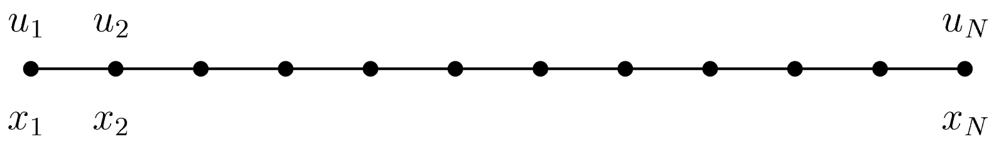
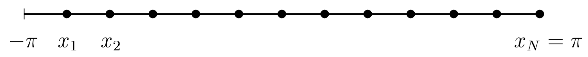

# 谱方法

谱方法（Spectral Method）起源于 20 世纪 60 年代，最早由 Orszag 等人提出并系统化，用于求解流体力学和气象学中的偏微分方程问题。其核心思想是将待求解函数展开为一组全局正交基函数（如 Fourier 三角函数或 Legendre、Chebyshev 多项式）的线性组合，通过求解系数来近似原函数的解。这种方法与传统的有限差分方法（Finite Difference Method, FDM）和有限元方法（Finite Element Method, FEM）有本质区别：有限差分方法通常通过局部网格点的函数值逼近导数，有限元方法通过局部分片多项式近似解，而谱方法采用全局展开，使得在求解平滑问题时可以达到指数级收敛（spectral accuracy），在相同的自由度下精度远超传统方法。

由于其高精度和计算效率，谱方法在求解光滑解的偏微分方程、流体力学、波动方程以及量子力学等领域得到广泛应用。近年来，随着数值线性代数和高性能计算的发展，谱方法逐渐成为求解高维复杂问题的重要工具，为科学计算提供了一种与传统方法互补的新途径。

本网页内容主要参考了两本谱方法领域的重要著作：Lloyd N. Trefethen 的 Spectral Methods in MATLAB（2000），系统介绍了谱方法的基本理论与 MATLAB 实现；以及 Jie Shen、Tao Tang 和 Li-Lian Wang 合著的 Spectral Methods: Algorithms, Analysis and Applications（2011），详细讨论了谱方法的算法设计、误差分析及在偏微分方程中的应用。基于这两本书，本文将对谱方法的理论背景、数值实现及应用进行简明介绍。

<div style={{ display: 'flex', justifyContent: 'center', gap: '2%', marginTop: '10px' }}>
  <figure style={{ width: '49%', textAlign: 'center', margin: 0 }}>
    
    <figcaption style={{ fontSize: '90%', color: 'black', fontStyle: 'Times New Roman', marginTop: '4px' }}>
      图 1：Spectral Methods: Algorithms, Analysis and Applications（2011）
    </figcaption>
  </figure>
  <figure style={{ width: '49%', textAlign: 'center', margin: 0 }}>
    
    <figcaption style={{ fontSize: '90%', color: 'black', fontStyle: 'Times New Roman', marginTop: '4px' }}>
      图 2：Spectral Methods in MATLAB（2000）
    </figcaption>
  </figure>
</div>

我们先来阅读 Spectral Methods in MATLAB（2000），因为这本书比较基础，Spectral Methods: Algorithms, Analysis and Applications（2011）阅读起来会比较困难，他适合有一定计算数学基础的人阅读。

## Chapter 1 微分矩阵

我们的出发点是一个基本问题。给定一组网格点 $\{x_j\}$ 和相应的函数值 $\{u(x_j)\}$，我们如何使用这些数据来近似 $u$ 的导数？可能立即想到的方法是某种有限差异公式。正是通过有限差分格式，这是谱方法的动机。

考虑均匀网格 $\{x_1,\dots,x_N\}$ ，每个 $j$ 的 $x_{j+1} - x_j = h$，以及一组对应的数据值 $\{u_1,\dots,u_N\}$：



让 $w_j$ 表示 $u\prime(x_j)$ 的近似值，即 $x_j$ 处的 $u$ 的导数。标准的二阶恒距近似值为

$$
w_j=\frac{u_{j+1}-u_{j-1}}{2h},\tag{1.1}
$$

这可以通过考虑 $u(x_{j+1})$ 和 $u(x_{j-1})$ 的泰勒展开来推导。为简单起见，让我们假设问题是周期性的，并取 $u_0 = u_N$ 和 $u_1 = u_{N+1}$。然后我们可以将离散二叶化过程表示为矩阵-向量乘法，有

$$
\left(\begin{array}{c}w_{1}\\ \\ \\ \vdots\\ \\ w_{N}\end{array}\right) = h^{-1}\left(\begin{array}{ccccc}0&\frac{1} {2}&&&-\frac{1}{2}\\ -\frac{1}{2}&0&&\ddots&&\\ &&&\ddots&&\\ &&&\ddots&0&\frac{1}{2}\\ \frac{1}{2}&&&-\frac{1}{2}&0\end{array}\right)\left(\begin{array}{c}u_{1}\\ \\ \\ \vdots\\ \\ u_{N}\end{array}\right). \tag{1.2}
$$

（此处和本书中其他稀疏矩阵中省略的条目为零。观察该矩阵是 Toeplitz 矩阵，沿对角线具有恒定的条目，即 $a_{ij}$ 仅依赖于 $i$ 和 $j$ 。事实上，它也是**循环**的，这意味着 $a_{ij}$ 仅依赖于 $i$ 和 $j$ $(mod N )$。对角线“环绕”矩阵。

推导 (1.1) 和 (1.2) 的另一种方法是通过以下局部插值和分配过程：

For $j=1,2,...,N$

- 设 $p_j$ 是 $p_j（x_{j-1}） = u_{j-1},p_j（x_j） = u_j,p_j（x_{j+1}）= u_{j+1}$ 的次数 ≤2 次唯一多项式。
- 设 $w_j=p\prime_j(x_j)$

很容易得到，对于固定的 $j$ ，插值 $p_j$ 由下式给出

$$
p_{j}(x)=u_{j-1} a_{-1}(x)+u_{j} a_{0}(x)+u_{j+1} a_{1}(x),
$$

其中， $a_{-1}(x) = (x - x_{j})(x - x_{j+1}) / 2 h^{2}, a₀(x) = -(x-x_{j-1})(x-x_{j+1}) / h²$, 以及 $a₁(x) = (x-x_{j-1})(x-x_j) / 2 h²$. 对数式求导并在 $x=x_{j}$ 处取值，即可得到 $(1.1)$。

同理可以得到四阶矩阵为

$$
\left(\begin{array}{c}w_{1}\\ \\ \\ \\ \vdots\\ \\ \\ \\ w_{N}\end{array}\right) = h^{-1}\left(\begin{array}{ccccc}&&\ddots&& \frac{1}{12}&-\frac{2}{3}\\ &&\ddots-\frac{1}{12}&&&\frac{1}{12}\\ &&\ddots&\frac{2}{3}&\ddots&\\ &&\ddots&0&\ddots&\\ &&\ddots&-\frac{2}{3}&\ddots&\\ -\frac{1}{12}&&&\frac{1}{12}&\ddots&\\ \frac{2}{3}&-\frac{1}{12}&&&\ddots&\\ \end{array}\right) \left(\begin{array}{c}u_{1}\\ \\ \\ \\ \vdots\\ \\ \\ u_{N}\end{array}\right).\tag{1.3}
$$

这次我们有一个五对角线而不是三对角线循环矩阵。
(1.2)和(1.3)的矩阵是二元化矩阵的例子。它们的精度分别为二级和四级。也就是说，对于通过对光滑函数 $u$ 进行采样获得的数据 $u_j$，与 $u\prime(x_j)$ 的相应离散近似值将以速率 $O(h^2)$ 和 $O(h^4)$ 收敛为当 $h\to0$。可以通过考虑泰勒级数来验证这一点。 我们的第一个 Matlab 程序，Program 1，说明了 (1.3) 的行为。

### 实验一

我们取 $u(x) = e^{sin(x)},u\prime(x)=cos(x)e^{sin(x)}$ 并给出域 $[-\pi ;\pi ]$ 的周期性数据：



因为它使用了 Matlab 稀疏矩阵，所以这段代码在工作站上运行的时间只有几分之一秒，即使它作的维度高达 4096 的矩阵 [GMS92]。结果显示在输出 1 中，它绘制了网格上针对 N 的最大误差。四阶精度是显而易见的。这是我们第一个也是最后一个没有说明谱方法的例子！

我对书中谱方法的例子经过图例的改良得到以下程序：

```Matlab
% p1.m - convergence of fourth-order finite differences
e = exp(1);
Nvec = 2.^(3:12);

% 创建大尺寸 figure (单位：像素)
figure('Color','w','Position',[100 100 700 700])
ax = axes(); % 左下角x,y,width,height

for N = Nvec
    h = 2*pi/N;
    x = -pi + (1:N)'*h;
    u = exp(sin(x));
    uprime = cos(x).*u;

    % Construct sparse 4th-order differentiation matrix
    e1 = ones(N,1);
    D = sparse(1:N,[2:N 1],2*e1/3,N,N) - sparse(1:N,[3:N 1 2],e1/12,N,N);
    D = (D-D')/h;

    % Compute error
    error = norm(D*u-uprime,inf);
    loglog(N,error,'.','markersize',15), hold on
end

grid on
xlabel('N','FontSize',20,'FontName','Times New Roman')
ylabel('error','FontSize',20,'FontName','Times New Roman')
title('Convergence of 4th-order finite differences','FontSize',20,'FontName','Times New Roman')
semilogy(Nvec,Nvec.^(-4),'--')
text(105,5e-8,'N^{-4}','FontSize',20,'FontName','Times New Roman')

set(ax,'FontSize',20,'FontName','Times New Roman')
axis square % 保持坐标轴为正方形比例

% 保存高清图片，占满画布
exportgraphics(gcf,'p1.png','Resolution',300)

```

结果可见图 3

### 实验二

我们已经研究了二阶和四阶的二阶，很明显，考虑六阶、八阶和更高阶方案将导致带宽增加的循环矩阵。谱方法背后的想法是将这个过程发挥到极限，至少在原则上是这样，并使用无限阶和无限带宽的双分公式(即密集矩阵)[For75]。在下一章中，我们将证明在这个极限下，对于无限等距网格，人们得到以下无限矩阵：

$$
D\ =\ h^{-1}\left(\begin{array}{ccccccccc}&&&&&\vdots&&&&\\ &&&&\ddots&&&&\frac{1}{3}&&&&\\ &&&&\ddots&&&&-\frac{1}{2}&&&&\\ &&&&\ddots&&&&1&&&&\\ &&&&&&&0&&&&\\ &&&&&&&-1&&&&\ddots&&\\ &&&&&&&\frac{1}{2}&&&&\ddots&&\\ &&&&&&-\frac{1}{3}&&&&\ddots&\\ &&&&&&&\vdots&&&&\end{array}\right).\tag{1.4}
$$

这是有限托普利茨矩阵中双重偏对称 ($D^T = D$)，也称为洛朗算子 [Hal74，Wid65]。除主对角线上的条目外，其所有条目都是非零的。

当然，在实践中，人们不使用有限矩阵。对于有限网格，以下是 spectral collocation methods 的设计原则：

- 设 $p$ 是一个函数(独立于 $j$ )，使得所有 $j$ 的 $p(x_j) = u_j$。
- 设 $w_j=p\prime(x_j)$。

我们可以自由选择 $p$ 来解决手头的问题。对于周期域，自然选择是等距网格上的三角多项式，由此产生的“Fourier”方法将在第 4 章和后面的章节中断断续续地关注。对于非周期域，不规则网格上的代数多项式是正确的选择，我们将从第 5 章和第 6 章开始描述这种类型的“Chebyshev”方法。（这部分内容包括矩阵(1.5)先按下不表，后面的内容学习以后就会明白）

对于有限 N，即使为了简单起见，也取 N，这是我们将在第 3 章中推导的周期性规则网格的 $N×N$ 密集矩阵

$$

D_{N}=\left(\begin{array}{cccc}
& \ddots & \vdots & \\
\ddots & \frac{1}{2} \cot \frac{3 h}{2} & & \\
\ddots & -\frac{1}{2} \cot \frac{2 h}{2} & & \\
& \frac{1}{2} \cot \frac{1 h}{2} & & \\
& & 0 & \\
& & -\frac{1}{2} \cot \frac{1 h}{2} & \ddots \\
& \frac{1}{2} \cot \frac{2 h}{2} & \ddots \\
& & -\frac{1}{2} \cot \frac{3 h}{2} & \ddots
\end{array}\right) .\tag{1.5}
$$

```Matlab
% p2.m - convergence of periodic spectral method (compare p1.m)
e = exp(1);

% 创建大尺寸 figure
figure('Color','w','Position',[100 100 700 700])
clf

% 坐标轴占满整个图像
ax = axes(); % 左下角x,y,width,height

for N = 2:2:100
    h = 2*pi/N;
    x = -pi + (1:N)'*h;
    u = exp(sin(x));
    uprime = cos(x).*u;

    % Construct spectral differentiation matrix
    column = [0 .5*(-1).^(1:N-1).*cot((1:N-1)*h/2)];
    D = toeplitz(column,column([1 N:-1:2]));

    % Compute error
    error = norm(D*u-uprime,inf);
    loglog(N,error,'.','markersize',15), hold on
end

grid on
xlabel('N','FontSize',20,'FontName','Times New Roman')
ylabel('error','FontSize',20,'FontName','Times New Roman')
title('Convergence of spectral differentiation','FontSize',20,'FontName','Times New Roman')

set(ax,'FontSize',20,'FontName','Times New Roman')
axis square

% 保存高清 PNG，占满画布内容
exportgraphics(gcf,'p2.png','Resolution',600)
```

Program 2 与 Program 1 相同，只是 (1.3) 替换为 (1.5)。它对结果的影响是多么不同啊！图 4 中的误差会迅速减少，直到达到如此高的精度，以至于计算机上的舍入误差阻止了任何进一步的改进。这种显着的行为称为 spectral accuracy"。我们将在第 4 章中对这句话进行一些精确性，但目前需要注意的一点是它与有限方法和有限元方法的收敛率有多么不同。随着 $N$ 的增加，有限二元或有限元方案中的误差通常会像某个常数 $m$ 的 $O(N^{-m})$ 一样减小，这取决于近似阶数和解的平滑度。对于光谱方法，只要解是可精确的，则每 $m$ 的速率 $O(N^{-m})$ 可以实现收敛，并且如果解是适当的解析，则以速率 $O(c^N )(0 < c < 1)$ 实现更快的收敛。

我们描述的矩阵已经流传。循环矩阵的作用是卷积，正如我们将在第 3 章中看到的，卷积可以使用离散傅里叶变换来计算。从历史上看，正是 1965 年针对此类问题的快速傅里叶变换 （FFT） 的发现导致了 1970 年代人们对谱方法的兴趣激增。我们将在第 8 章中看到，FFT 不仅适用于等距网格上的三角多项式，也适用于切比雪夫网格上的代数多项式。然而，在没有 FFT 的情况下实现的频谱方法也很强大，在许多应用中，使用显式矩阵是相当令人满意的。本书中的大多数问题都是通过矩阵解决的。

<div style={{ display: 'flex', justifyContent: 'center', gap: '2%', marginTop: '10px' }}>
  <figure style={{ width: '49%', textAlign: 'center', margin: 0 }}>
    
    <figcaption style={{ fontSize: '90%', color: 'black', fontStyle: 'Times New Roman', marginTop: '4px' }}>
      图 3：四阶有限差分的收敛性
    </figcaption>
  </figure>
  <figure style={{ width: '49%', textAlign: 'center', margin: 0 }}>
    
    <figcaption style={{ fontSize: '90%', color: 'black', fontStyle: 'Times New Roman', marginTop: '4px' }}>
      图 4：error：谱法 （1.5） 的 “Spectral accuracy”，直到舍入误差接管 $10^{-14}$ 左右。现在矩阵很密集，但 N 的值比程序 1 中的值小得多。
    </figcaption>
  </figure>
</div>
